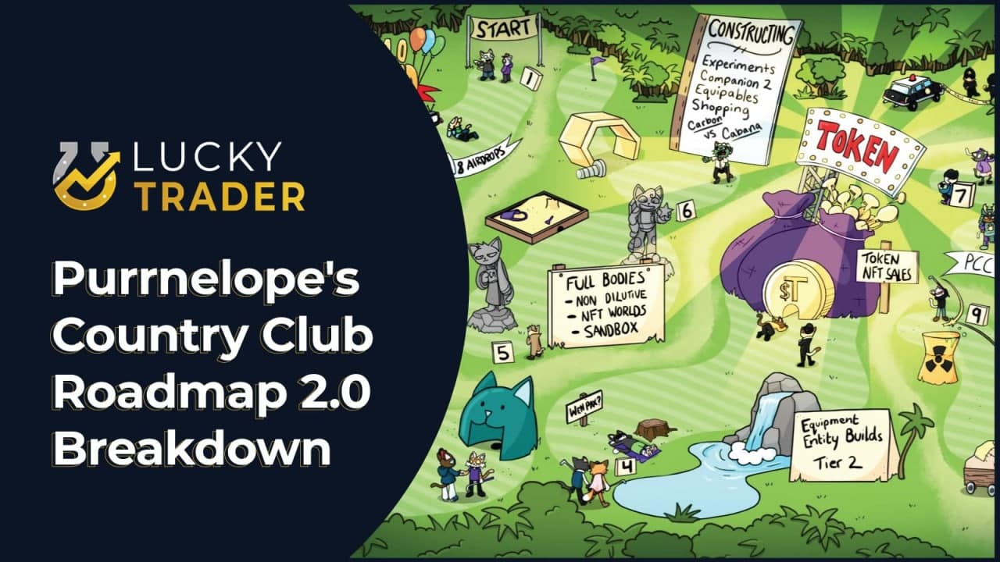
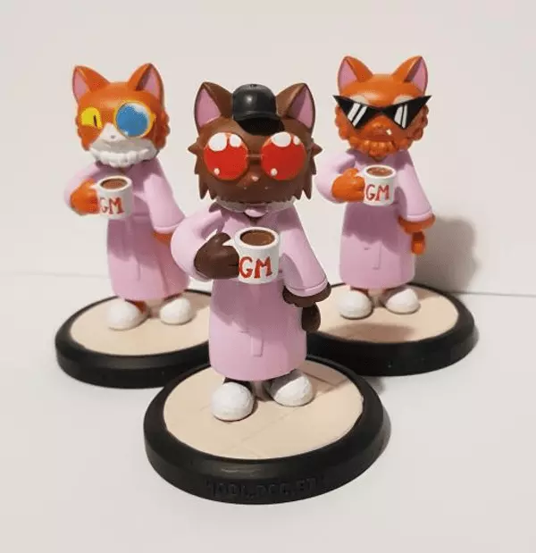

<iframe src="https://www.youtube.com/embed/V2057UnxYtA" title="YouTube video player" frameborder="0" allow="accelerometer; autoplay; clipboard-write; encrypted-media; gyroscope; picture-in-picture" allowFullScreen></iframe>

<!--truncate-->

Original Post: [Lucky Trader: Purrnelope's Country Club: Roadmap 2.0 Announced](https://luckytrader.com/articles/purrnelopes-country-club-roadmap-2)

Purrnelope's Country Club is a collection of 10,000 unique cat NFTs, granting holders a membership into the exclusive country club. Purrnelope's Country Club launched in July of last year with @Carlini8N at the helm. Today, Roadmap 2.0 was announced, including a 9-hole course with hints and explanations of what's to come.

### Hole 1: Roadmap 1.0

The first hole of Roadmap 2.0 represents everything the team has completed to date. Five of the eight monthly airdrops have been sent to holders with NFTs that represent fractions of the KittyVault. The KittyVault is a collection of over 900 ETH worth of NFTs that will be fractionalized to holders of Purrnelope assets. The KittyVault includes "blue-chip" projects like Cryptopunks, Cyberkongz, and Bored Ape Yacht Club.

### NFT Worlds

Purrnelope's Country Club has acquired an NFT Worlds plot and plan to build out a metaverse presence allowing holders to earn $WRLD tokens. The team is working with Entity Builds, who have a strong background of developing in Minecraft.

Full-body cats are in development. The full bodies will be non-dilutive, meaning there will not be additional NFTs added to the collection in this case. 3D models of your cat will be built on top of and add value to the current NFTs.

### Brand Development

Purrnelope's Country Club hired Brand Ambassadors to increase the brand and awareness of the project. An overhaul of the website, "Website 2.0," is in progress. The new website will be a one-stop-shop for all things PCC. A place for holders to redeem their physicals, manage their NFTs, or participate in community voting. Purrs Boutique will be a place for holders to dress their cats up in thematic wearables for real and virtual events.

The Purrnelope's Den is another initiative that will allow holders to pitch ideas and receive $TOKEN rewards to help build within the project.

A new governance forum will be created for members to propose ideas at the country club. The forum will allow the community to decide on ways to use the community wallet, path for $TOKEN, and provide a more advanced place for discussion than the Discord server.

### Merch, Companions, and Physicals

In April, holders will receive a second companion NFT. This companion will yield 1 $TOKEN per day once the token is launched, the same as the first companion, Purrnelope's Kittens.

Purrnelope's Country Club merch is going to be gamified. Lore and gamenomics are going to be built into the merch, starting with the hoodies that will require holders to redeem a set of NFTs that they already own, creating a deflationary asset.

Season 2.0 Physicals have also been announced. Full-body physical 3D models of your cat, shipped to your doorstep!

### $TOKEN

The airdrops will yield tokens towards KittyVault fractions. Purrnelope's Den will reward with tokens. Physicals will use tokens. But WEN $TOKEN???

The token feature is in development, but will not be released until after all the airdrops have been sent. The team wants to ensure that the tokenomics are right before releasing it to the public.

Packs will be purchasable with $TOKEN and include NFTs to assist in your cat's metaverse games. The team plans to have multiple play-to-earn games, and $TOKEN will be integrated into the whole ecosystem. The games are to include Player vs. Environment, Player vs. Player, and Player vs. Leaderboard.

The partnership with Entity Worlds and NFT Worlds allows PCC to build out a play-to-earn experience for its holders. The $WRLD token is gasless, and PCC is looking into rewarding members of the community for creating content and ideas to help the game grow.

### Conclusion

Roadmap 2.0 has a lot packed into it. The team is focused on delivering on each step of the roadmap and plans to be flexible if the NFT landscape continues to shift over time.

## Transcript

:::info

This transcript is computer generated and has not been proofread. Only a few names and words are replaced in batch.

:::

Speakers: Carlini8 (73%), @LouDogSherman (27%)

:::warning

Nothing on the show is meant as financial advice and please do your own research.

:::

#### @LouDogSherman 0:22

Welcome, today we have Carlini from Purrnelope's Country Club on and we're going to talk a little about what they're up to the project is coming out with their roadmap 2.0 tomorrow, so Carlini. How's it going today?

#### Carlini8 0:40

Hey, I guess, personally, well, but you know, in the grand scheme of things, not a great day, I suppose in the in the world, but you know, there's not really, really too much we can do about it.

#### @LouDogSherman 0:59

Yeah, unfortunately. So, first, I wanted to basically, if anyone listening isn't familiar with Purrnelope's Country Club, I wanted to sort of get a quick overview of what the project is how you guys started. So could you give a quick overview?

#### Carlini8 1:19

Yeah, of course. So Purrnelope's is kind of the the origin story kind of starts December 2020, when I started a business called NFT boxes with Pranksy. And we were just looking to do sort of art out boxes that you would receive various NFT pieces of art on a monthly sort of subscription basis. And that went that went well for two or three months. And then we sort of disagreed over how we wanted to run the business. And we were both 50/50 partners in it. So it was tricky, because no one no one had final say no one's sort of could do anything like that. Adventure just said, when we're not aligned on how we want to run it, and it's just making it tricky, cuz we've been friends for years, sort of pre 2017, even, I brought Pranksy into the NFT space. And I just said, Look, you, you can buy my 50% I'll take my two friends that are sort of lined up to hire, and will I, I've made them quit their jobs. So I needed to find something, something for them. We tossing a few ideas out there. And we just said, let's, let's do one of these projects and try and do it right what what we think NFTs should be used for what they currently can be used for. So our view is sort of that they will be used for so much more. But the technology is we're still early in that sort of respect. And we just started started working go found an artist my cousin found a Dev, someone I'd knew known before. Just sort of tried to pull it all together get the the ideas going. We've just been building for the past I guess technically eight, nine months at this point.

#### @LouDogSherman 3:34

Yeah, so we got a few people in chat Lazo, Kyle Nick. Gaming chambers gravity, the shill all these people are very we love the purrs lovely is that the hashtags and chat so far already so people are are excited about the project and what you guys have been doing so get a little glimpse of why so many people love the purrs.

#### Carlini8 4:02

tonight you have to ask them I just I just tried to do right by our collectors this this isn't a cash grab the majority of our holders have probably made more than me and if you're sitting there thinking oh I bought it at 0.7 and I'm down to you know whatever now 0.3 0.55 I'm down I'm down more i i have not made a profit on purrs I have made a loss purely because I am funding this and the goal is to make it work it's not to make my bank bigger it is to make this work and you know my net worth goes down with the ship then so be it it's the goal is to goal is to make this a good project.

#### @LouDogSherman 4:53

And so, I want to quickly go over the monthly airdrops that you guys I've been doing and it's a little different than some other projects I've been using for air drops. So can you quickly explain how your air drops are different than something like I don't know like the board eight yacht club did they're the kind of dogs they did their their meeting eight. So could you just explain how your airdrops have been different?

#### Carlini8 5:21

Yeah. So using the dogs as an example, what I didn't like is that projects were just sending out pointless NFTs. I know. You know, dogs. Last I looked. Two days or so ago, they hit 8 Ethereum, which people will say, Oh, that's not pointless. You know. They dropped me 8 ETH I love it. But it hasn't been used for anything yet. There is there is no sort of underlying value. And that's in no way a slight on bored ape yacht club. So I'm sure they will. But there's no system that automatically sort of provides the dog value. You're trusting that the team will do something down the line. Which, you know, again, I'm sure they're doing. But it's the same for other teams. Because when we were when we were sort of building out originally, we were called the Cool Cat Country Club, cool cats Country Club. We even had our internal emails at cool cats country club.com. And this was pre cool cats, the blue cats, but it was post Topshot. Cool Cats. So we had a play. I was talking to our donco Luke, about how we could AirDrop some rewards to the Top Shot cool cats people. But the Ethereum cool cats, they sent out like lollipops and Halloween baskets, and they, they just nothing, right, the NFT is an elephant, they didn't ever promised to be anything, but I didn't like that about the airdrop. So we tried to get this underlying value. And that comes in three different ways. We have the kitty vault, which is a collection of about 900 Ethereums worth last check of NFTs which when fractional 2.0 is out will be fractionalized into 100,000 pieces, and put kind of piggy bank style into nine select NFTs. So the 8 Airdrops, and your PCC all will have one of these fractions in them. And that is an underlying value you your NFT that you get dropped is kind of has a minimum value of 100th of that kitty vault, whatever we grow it to in the future. And then we also have each month has sort of a theme. And if you have enough of those air drops, because you had enough purrs or because you buy them up, you'll be able to claim something. So in the first month, it was a hoodie, which has an NFT attached to it via people at iy K. And the different thing about that NFT is I think it kind of bridges the the physical to NFT problem in quite a good way because you can only pull that NFT to you if you have the physical. Whereas I've got my fury shoes, trainers just to my left that I'm looking at. And you know that they're great if you aren't, but I've sold the NFTs they're gone. But the physicals I still have, and something just doesn't feel right about that. Whereas with the hoodie, you can only move it when you have it. So it sort of proves as proof of ownership of the hoodie. And you can claim that if you had 10 of those airdrops, because you had 10 Cats or I guess more or you had none and you've bought 10 or whatever. And the other things we've airdropped is a we've we're going to drop two companion so far, just one which is kind of like the dog, but we have said it's going to yield one of our tokens a day. When that is launched. A little physical model can be claimed a comic book, a framed vinyl, and this month which we're going to be dropping. This was probably the month we already for earliest but with the roadmap 2.0 announcement, we didn't want to do the snapshot earlier because we're like, Hey guys, welcome. We know we expect some people to join with roadmap 2.0. But we didn't want them to be, you know, over a month away until their next airdrop. So we're sort of trying to time it for that. Then we have one more companion and then one other NFT to come

#### @LouDogSherman 10:00

If so, so basically, the big thing is, you don't want someone selling their NFT. But keeping the piece, it's mostly burning. And when you're burning the tokens for those that don't know, if you have 10 tokens, you then burn them to get that, that hoodie, does that make every other one more valuable in that sense, every other token holder?

#### Carlini8 10:28

Well, firstly, we've, we've had to PR change it from burning to redeeming, just because we're worried if we say burning, and people just randomly send it to Oh, dead or whatever, and then they get rugged. But yes, the, the, the goal was to produce sort of a deflationary system, so there will only ever be 10,000 PCC, and we have set as a tier two, you know, akin to meebits or mutants that we will be releasing. And we have two companions, one of which is out, one of which is still to come. But then the will be, you know, our token that we're going to launch has a yielding factor of roughly 15 years, you know, the we're, we're thinking long term, and we fully expect the kitty vault to go up in value, because percentages from from trading goes into that. So that should grow, while the amount of NFTs should go down as we will try in the future, different the the current mechanism isn't the only one we will employ. We will try and get you to give up your NFTs to us for one reason or another. And we will not ask you to do that, we will try and incentivize you to do that and make you want to do that. Which point there are less of them. Which point, you know, deflationary sort of the market should react as you'd expect.

#### @LouDogSherman 12:10

Yeah. So then, with these tokens, I know there's been a lot of the legal side of it, not sure if you can touch on that a little bit on how you're getting around this idea of securities that a lot of these other projects are struggling with.

#### Carlini8 12:27

Yeah, so we've, we've got three three companies now. So we've got the original one in the UK, which cannot launch a token of any kind, just just legally not allowed. So we were pointed towards setting setting one up elsewhere, we've actually set 2 up. Because even though fractional would be launching their token, we've been advised to have a company that manages that so that the fractional kitty vault token will be launched from one company. And what we're currently calling, you know, dollar sign token will be launched from another company purely that manages that launch. And we have sort of directors over there, we've been given the legal Go ahead, that it won't be a security under their laws, and all of these sort of things. And we've consulted with US lawyers who have confirmed things like there is no risk to our holders legally. If there is any risk, it comes on to us, which of course, would affect your token price, if something were to happen, but it doesn't affect you, legally, you, you're safe, that would come down on us, which is why obviously we're being very cautious about it.

#### @LouDogSherman 13:51

Definitely, and I've noticed that with some other projects recently that are getting whether they get delisted on OpenSea, or just people are worried to invest in them with that security risk. So that's definitely something that a lot of people want to keep their eye on when looking at this stuff. Especially when now we're hearing things like the ape coin that's going to come out that's gonna be the big things surrounding it. So it's definitely great to hear that the team is thinking about that constantly. And I wanted to touch on the fact that Purrnelope's Country Club is really a long term, forward thinking type of team and I know you guys have made it very clear that you're paying the team for multiple years. So can you just touch on the the team itself and how you guys have been building sort of internally to keep the team together for a while?

#### Carlini8 14:50

Yeah, cool. So we're, it started off as just three of us in a pub trying to figure out what to do. Peter/Papa was customer service for lft boxes sort of every waking moment in that discourse. And he has a customer service background, I guess, in real life would be the term. So I knew he was perfect for the community management role and sort of the way OG gets thrown around at the moment he was in. He was in sort of the group of people I got into Topshot, early days, which a lot of people count as, you know, being in a while. So he's, he's been around NFTs longer than longer than most nowadays. So he's our community manager. The next hire was Jamie, who I was also going to get into NFT boxes to handle sort of the finance side of things and payroll and HR you know, just to a proper sort of company stuff because I'd I've run companies before and had to do that myself and I hated it. I definitely wanted to, to get someone else on that. And then we needed an artist. Which we got Irregular Charlie. Iregular Charlie's my cousin. So known a long time again no IRL at this point. The whole team is people I know people I've met people I trust and people I want to do good by. And then we needed a dev. Which point we brought in hodl and hodl is someone that I knew from gambling back with quite a lot of people were in in this sort of gambling slack including Pranksy, hodl myself, are Dumbo from Topshot, a couple of others Pingu one of the names people might know of. And he just knows you know he was a dev again in in the non crypto world and his transferred over really well. He's a bit of a Python Maxie and learn solidity well. And again, is someone who had met in real life so at this point are the core of the team. I'd admit everyone I knew everyone I trusted everyone. And I said look, this is what we're going to do this how we're going to do it. And we're going to work our asses off to make it a success. And then we just kept growing from there so our next sort of full time hire was another another artists so Katie you may have seen an all the update videos and and all that originally Originally she came in as a animation explainer video person. So I'd I put out a message like we need this animation and a friend who was in the crypto dads and Purrnelope's community ish, sort of said, hey, look, there's they're looking for this and she'd reached out or reached out to her account. Remember, we'd sorted out this video but she was just keen to keep going like, you've seen a doing loads and lots of it was her idea. Like she's like, I could do this as well. Alright, okay, come down. We're doing loads. Could you do this? And then eventually, we like she'd done so much that we just brought her on full time. And she's now sort of kind of remember her properties for now. She's head of art or create content

#### @LouDogSherman 18:42

in content? Eight. So

#### Carlini8 18:45

yeah, yes. She's, she's sort of managing all of that for us.

#### @LouDogSherman 18:50

Yeah, her weekly videos are great. She always has a lot of energy behind it. And there's like jokes in there as well. So that's been cool to like, follow along with those weekly updates.

#### Carlini8 19:00

Yeah, I feel like you can you can see her mad decline into insanity as too long in the country club has sent too crazy with the latest. Or was it we've had we had the cats in her house and the sort of retro dance tunes one she said to screenshots like, look how stupid I make myself look for the country club.

#### @LouDogSherman 19:30

Yeah, but I mean, that's generally what a lot of the content that's what you get the people watching and coming back. Yeah,

#### Carlini8 19:37

yeah, that's what that's what you want to see, isn't it? That's, that's odd.

#### @LouDogSherman 19:41

Yeah, so I guess now let's get a little into the future. I think that's what a lot of people are here for to hear about. So, roadmap 2.0 is going to be coming out. I'm not sure how much of it you want to exactly leak here but a question that we had from you know, A fan favorite in the chat, I'd say, from the shill, he he would love to hear about some of the biggest fears for roadmap 2.0. And in developing it

#### Carlini8 20:16

I guess the biggest fears are all external. It's things like, you know, the Ukraine and Russia situations, sort of, because right now, we've just had, you know, a year and a half of up only everyone happy, everyone sort of, you know, the SpongeBob played outside me. And while everyone looks in through the, through the shutters you know, we're building stuff that we think is great. And we want there to be lots of people to come and appreciate. But I know if it's a, you know, full on bear market happens, we will still be building roadmap 2.0. But there won't be as many people sticking around spending the time sort of to, to enjoy it. Just because, you know, I know, that's what happens, Twitter will slow down, people will stop looking in discord so much. And then they won't come and play with X, Y and Zed that we've got in this, this roadmap here. And I mean, it's some of it again, does rely on external people, not just external conditions. So we do have lead the big, the biggest thing on our roadmap does involve outsourcing to another company. And they do have to deliver by all means they have shown that they will deliver. And everyone sort of knows that they do. And everyone's very hyped whenever a project mentions, they're working with this company. But you know, they, it's okay, so I'll say, roadmap 2.0 is an image of a golf course. And it's a nine holes. And each one has sort of a different, different thing that it mentions on it. And it's it's kind of group to get it's, it's slightly chronological.

#### Carlini8 22:24

But it's grouped together more in themes. So the last hole nine, you know, the big the big one is this team will deliver on our NFT world plot. And it will be a huge country club with portals to free different games and you go through a portal and suddenly you're in a game with like stats, a leaderboard competitions. For a different game, it's completely different style of game, you go for a different portal, it's a completely different style of game. And all of these can be linked into our token or maybe world. And that sort of version one of our Metaverse the, we're very much use, say, sandbox or voxels, or wherever we will build in other places to if deemed better at a certain point. But right now, we've sort of the Minecraft, underlying open source tech NFT worlds have the clear jump on everyone. 20 years of testing by millions of people. It's almost certainly the most technically the most sold game ever, I assume. I know it was Wii Sports for a while, but I consider that free.

#### @LouDogSherman 23:58

So So what do you think about this, this idea where obviously we saw a run with NFT worlds, the past week or two. And now that's, we've seen some secondary, like world or land type projects that have been growing just off of the heels of that, do you think that model of having a world and others can use a lot of the plots of land? And then you can generate income while being on that plot of land, like no sandbox is doing that type of thing, this sort of idea of like virtual real estate, do you think that's where a lot of these NFT projects are going to be going?

#### Carlini8 24:42

Right now? I think so. Yes. Just because it works, and it's there now. Long term, I imagine projects that the big Big projects might try and do it themselves. And we're talking, you know, 5 10 years, just because then you could link it into other fit. It depends how NFT worlds goes or sandbox or decentraland. If they give the, the communities quite a lot of control. Because I can imagine you'll be doing things like there'll be, there'll be companies selling stuff from within NFT worlds where you can just go up to a counter and buy something with a token, and it gets delivered to you, or it's an NFT that gets sent to you, or it's an Access Pass, or, you know, all of these things. And I think most will do it now, because it's possible. It's one of these tech things that we can currently do to a pretty good degree. And I know all of the sort of NFT Minecraft building companies. You know, they're all very busy. There's this high demand, it's a dog eat dog world to get on those lists at the moment. So I would imagine. I would imagine, I don't know who else is doing it yet. And I think I will soon but an obviously won't be able to I'll be under an NDA. And I can't speak about that. But But I imagine it will be a lot.

#### @LouDogSherman 26:21

Yeah. And me lots are saying in chat that he's going to get a purr tattoo. I personally, I wouldn't recommend that. But I mean, you do you if you love the purrs then and wanted tattoo, you go for it. But so there's going to be nine holes as part of this roadmap. And essentially, it's the build up to Are any of the holes. Have they already happened is that part of the airdrops in the past or maybe the Companions themselves?

#### Carlini8 26:55

Whole one is complete roadmap. One point. Okay, because we have two things that we haven't done yet one, one because of a technicality. So one of them was, you know, it's almost a complete nothingness thing. It was five displays that we were going to send out, it was like our 10%. If we meant 10%, we'll send out five displays to winners. And when I was trying to make these displays, were is somewhere around here, they would only print it in medium. And it just looked so underwhelming that we reached out the NFT, Yoda had had his Henry the grape made by some stone, France, and it just looks much better. So we've ordered a sample one of those, and we'll be we'll be sending out you know, probably 10 instead, because of the delay or something like that. But it is much, much higher quality than display. And the second one is, our final piece was a short anime video, sort of the cats, maybe going around the country club. And the issue there was because we then added the airdrops artists was very busy, like, they've constantly been just constantly been working, even bringing in Katie, and she's constantly working. So we just haven't deemed it the right plan to move them off, say the air drops or the roadmap or, or any, anything else to get that part of the roadmap complete. So the first part of this roadmap is saying we will do that. We're just trying to get into a position where it makes more sense, because, like, if I'm honest, I don't really ever have anyone asked about it, where I always do have people ask about tokens. So if it's, it's more of a it's more of a important thing. And guess yes, Eric, I can read.

#### @LouDogSherman 29:03

Yeah. So now, when it comes to the sort of next steps, I know that a lot of projects in 2020, especially, has been a big focus around games, and gaming NFTs are you thinking about going down that path? I know that it's going to cost a lot more. So maybe your version of that is this this world style. But let's serve your take on how the gaming NFTs at least over the past like, let's say, three, four months. Do you think a lot of them have been lacking? Is it a place where you think is too underdeveloped and maybe that's way down the road?

#### Carlini8 29:50

I think they're all under developed. I haven't seen a single game that I would actually play and I'm a complete gaming degenerate, you know? I've been playing games all my life, and I still can't fully get my head around a gaming method that isn't going to be destroyed horrifically. So. Something, something in the NFT space is a lot of people, myself included, you know, they've their first Metaverse of search was rune scape. And one of the big issues with rune scape is botters. And there are even some issues with Venezuelan farmers, who are people who simply play the game to make in game money, and then they sell it IRL. And that's not allowed, it's against the game rules, but they do it anyway. Sometimes they get caught, they get banned, etc. But that destabilizes the economy. So you somehow have to build, you know, people say we're making the escape of, we're making the escape of NFTs or whatever. But they have to figure out a way to make the economy work with everything. Everything financially incentivized, that's the issue if we saw with xe you know, what kind of a robot country it was, but it was Philippines, fill it the Philippines. That's it. And everyone was basically, you know, farming and the way even though even these sort of videos, you could watch people with hundreds of phones, just, you know, playing them as much as they could, it was a they axie have actually released info recently saying they're trying, they're changing from play to earn to play and earn, which is obviously is better. Because my view is you'd need something like, you know, a clash of clans where instead of paying 9.99 for loads of gems, that goes to the company, you're buying the token, which is the gems, but that's dispersed between the winners of the game. So So people have to want to play it can't just be profitable to play, you need to want to play and if you're good at it, you profit not just grind because the issue is grinding and anyone can grind and if anyone can grind a buck and grind and bots are so damn smart now like if anyone is financially incentivized to but I'm talking about gaming bots not you know, the by 950 tabby cats Yeah. But you know, they can they can just be so much better than players at really complex things now, like it used to be just copied my clicks, but now it's now it's insane. So, games are the easy way to use a token in theory, because you can say the token be used in the game and you daily yield this token for the NFT and then you spend it in the game to unlock a boss or to buy some food or to buy cosmetic but people need to want that people need to want to part with their money in my opinion for that to work.

#### @LouDogSherman 33:08

Some other like a gambling aspect I knew with with say Zed, right, there's the entry fee to enter a race and then a few of the the people in the race will then get funds back are you thinking more that style where it's somewhat gambling and entry fee and then you can win at the end say it's like a hearthstone match you pay to enter in the winner gets the payment back or you're saying that it'll still get bought it too much?

#### Carlini8 33:36

Well, at the start, everything will be completely free. The the goal will be a we've spent a lot of money making this come and play it. Like we will maybe even give out token to top of the leaderboard every day or top of leaderboard every week sort of depends how active it is. Because we will have a reserve of token ourselves to try and sort of use as a social currency. So it won't be starting out with the core mechanics to try and build up token integration we will probably use it to try and build up the games to try make people want to fill play the game to come and give us feedback about what we should change. Long term. I would like to implement that and it's about how to do it right so my worry with the games we have now. axie been the furthest and they're making the change that I like to see the play and to you know, DFK a lot of bags, they're not a locked drawer, not a heroes, but I just don't have the motivation to log in however many times a day to, to fish or to to farm or to mine. Because it's not a game. That's that's magic, right? Yeah, it's you're just Working for for jewel. And, you know, that's great, but that's not great for me that's a that's not what I want to do. Some people do and that's fine. But what I don't like is what I saw in the cryptokitties world is I know that can be bought it, that sort of thing could be bought it in 2017. So I know it can be bought now. And me not having a bot and me sleeping means I've fallen behind and me falling behind demotivates me. You know, my heroes are level four or whatever. And then you see heroes level I haven't even looked at recently. So I don't know what. Yeah, it's just just like, oh, so they've got a bot and I don't so now my heroes suck. And that's the sort of thing I want to avoid. And to be honest, everything else is isn't a game. Yeah, everything else that claims to be I guess kongs have a game coming Coolcat savage game coming. But again, we are famously hates polygon. And polygon is rugging cool cats, cyber Kong's going over there as well. And, again, that sounds DFK, which we don't really know, cuz we haven't seen it fully. But so I met owl in real life who was explaining it, and I got a bit drunk. So I don't really remember it all. But I'm not sure it's fun yet. It's the thing is all of these steps in the right direction, which you have to do the gaming world did this on its own. And the issue is we are now I know, you know, games are exist out there that, uh, they look great, and they've got these great mechanics. But these are so very different when you add money into a game is so hard. And that's why we have to. That's why we have to build it this way. We have to do it slowly. We have to do it the way where people go, but you know, games are better now. Already. Why do I want to play this? Well, you know, what radio was better when the internet came out. And now it's not so it's it's that famous Bill Gates on a chat show. About he was so excited that you could listen to the commentary on the internet of I think it was a basketball game. And whoever the host, I'm sure he's really famous, some American presenter just goes if you never heard of radio, and he goes, Oh, yeah, but you can listen to it after the game as well. And he goes, have you ever heard of a tape recorder. And the point being, it's not going to be better yet. And we know this as we know this, the people building know this. But you know, the media who are just like all people are playing for this dumb game. They don't know this, because they never really properly research. And if you look at their research, they show their xe that they bought and you look and they bought it 30 days ago and did nothing. Blockchain helps, but just so we can check, check sort of what research they're putting in.

#### @LouDogSherman 38:10

It's almost like, sort of, in my mind, the games that I think could work are like what parallel alphas doing the card games, or it's almost like, the NFT can't be first. Like, the game exists in the NFT side is buying skins, or, you know, buying tokens for the game kind of like what you're mentioning earlier, maybe it's not the initial game itself. But then the, like microtransactions that we're used to and other games are tokens that are on the blockchain, instead of just in game currency. Maybe something like that could work. But I agree that like right now, a lot of these games are just clicking buttons. And they're not that fun. They're not really games yet. And games are hard to develop.

#### Carlini8 39:01

I mentioned the first one that takes off my bet is a dark forest type game. Because I did play games like that for a time called Tribal Wars. And it's, it's not the same, but it was close. And even before that way before that before I probably played any game, I played a game called utopia. And that was I think that's still going like must be 25 years later or something bad and there's no graphics is all text. And you were just sort of building up based on stats and numbers. So that sort of thing can easily be on the blockchain and manipulated from the blockchain and not need, you know, you don't need to use WASD to move around and that sort of thing. So it could be on the A cookie clicker or paperclip game, you know, a sort of idol game. Yeah. I could imagine so I think that was I think that was word of But that might be a might be 2019, we had that sort of thing.

#### @LouDogSherman 40:05

Where like, there's dungeon crawlers know that, like crypto Raiders is kind of doing it dungeon crawler. But those, therein is fun either. And I'm not sure how many people that are asking for the games are really trying to be playing games, like he said earlier, a lot of them are probably more focused on the can i earn money doing this side. And, you know, I mean, it's all different based on who the person buying in is, but it'll be interesting to watch those styles and see how it develops over time. I think, you know, five years from now, there'll be more developed games. But as of now, it seems like it's still too early in a lot of the cycles of these projects to get into that.

#### Carlini8 40:50

Yeah, this one, I'm excited for our game, just because I was speaking to the guy who sort of runs the company who's going to going to build it, and so much as possible within these games, because, like, they have been doing this for years, you the NFT part almost doesn't matter, because it's built within the NFT already in, in a base code that they've worked in, over and over, that they've done lots of things for Microsoft and in sort of Minecraft, and now it's just the same code within an NFT. The, you know, there are some hurdles for them to overcome, which they're they're working on all the time. But I when I hopped on for a meeting, and I was told all the things that could do like my mind was completely blown just because it was it was almost like he just said, what can you think of because we can do it? And I was like well

#### Carlini8 41:54

so the goal is going to be to build out our law within this game. So there is

#### @LouDogSherman 42:04

the golf floor. Or literal little both?

#### Carlini8 42:09

Well, I have no idea what golf floor is so

#### @LouDogSherman 42:13

well as as Sheila was talking about in the chat. He's wondering if this is going to be more like Wii golf, or like Tiger Woods. 99.

#### Carlini8 42:21

Honestly, for the for that I do not know I in my head. It's a bit like Mario Golf. Yeah, you know, you're in it in a Minecraft world. So don't expect, you know, non blocky graphics or non Minecraft in mechanics. But so the the other game is going to be how we sort of introduce why our tier twos are the way they are. So our tier twos, there's the two themes to our tier twos. And they will be introduced in one of the games.

#### @LouDogSherman 43:02

Okay, yeah. And then another question that we had a little earlier in the chat. Are there ways to collaborate even more with other projects that have similar visions for the metaverse and community? Other ways, like partnerships with other projects, are you exploring that much?

#### Carlini8 43:26

Yes. So that, again, that's on roadmap 2.0, we're going to be much more aggressive with working with high end sort of projects that we deemed to be doing it right. And right now we're kind of working for waiting for token, because we've token will be able to create an NFT that will yield some token every day, which we can use as sort of as a bartering chip to be like, hey, look, if we're you know, if we're punching, as such, we're punching for a higher ranked community to work with them, we could offer them a sweetener in an NFT, which yields our token. And that also connects them to us because if that yields token for 15 years, they are interested in what we are doing for the whole time. Because they can sure they can dump their bags, but they can dump them slowly. And it's in their interest to work with us and to you know, help us promote and all of this so that's that's where we're really waiting for the big collabs.

#### @LouDogSherman 44:38

Yeah, that'd be cool to watch because I know I get excited when teams and projects group up together especially if they're, like smaller projects that have similar like, obviously the community around purrs like we have plenty of people in chat that are you know, the we love the purrs and the community side of it is pretty strong. So what have you guys been doing? As far as like community events? How regular are you doing this for, for those that may not already be part of the purr community?

#### Carlini8 45:14

I think one of the key things for us is the communication. So people feel like they don't have to read our Discord every day just to keep up. And I feel that myself as I have, you know, so many NFTs are in so many different projects, they have no idea what they're doing, because they just can't keep up with that many discord. So I'm thinking about NFTs every second of the days, you know, it's my job and my hobby, and don't really go so much anymore, because it's just NFT NFT and NFT. And I can't keep up with all the projects I'm in. And I asked, you know, if I ask people like, Hey, why should I buy this? So, there's, there's been a few that I've, I've asked about recently, and people just guide, you know, they're just great man, you know, they're really professional. Like, this was one of the answers for a project that has a weird name it is pumped recently from it was like a free mint, and it's now I think it's a free flow. The team's really professional, you know, I, I appreciate that. But they weren't able to point me at anything. So I always I was Dick when I questioned these things. Someone says, Oh, they're great because of this. So can you point me an example. Maybe people just think I want to trip them up. In reality, I want to see what they've done that makes people care about their project, so I can copy it. But you know, don't tell everyone that they're really professional. Okay, can you give me an example to come to their discord? The community is really special. Oh, any examples? Yeah, come to the discord. Have a look. And I joined the discord. Because I've been told this is a project we've been asking about, maybe, you know, every fortnight for maybe two months, and he's always come to the discord always come to this. So eventually, I caved a few days ago. And it just couldn't see anything. At first glance, there's so many channels and the announcements I read maybe the last 20 and nothing seemed too special to me. It was like I just needed somewhere to go and properly see. So we I know we're not perfect, but I know there's so much more we can do. But we have the weekly YouTube videos, we have the weekly kitty vault newsletter. We have weekly medium articles. Danny's going to be doing interviews with the team and sort of community members in time sort of chat just chats like this, I guess. So put out so people can know more about us. And on roadmap 2.0. I haven't said this before because it's a web 2.0 Complete, sort of rebrand. We want the website to be somewhere people want to go with like right now. If you're in an NFT project, generally you go to OpenSea or discord. When I was in, everyone joined crypto kitties, you only went to crypto kitties, that was you know, you went there, everything was there, or the info was there. And then you chat to people on Discord about it. So we want the website to be useful. And that's that's one of the things that we really, really want

#### @LouDogSherman 48:30

even like hosting a marketplace on the the website or do you think that is a little too far out there?

#### Carlini8 48:39

I have to be honest, I've thought about that. It's not on roadmap 2.0 I'm not sure how tricky that would be. And hodl not listening. So you probably kill me just for even coming up just thinking about it. But the the benefit generally. I don't think it's there really. Like because open sea is you know, the marketing and then there are competing marketplaces coming as well. Yeah, you'd you'd have to work with Gem and Genie as work like you'd have to be able to sweep. And at that point, if it's just an aggregator anyway, our marketplace percentage is going to be an issue because I see the way this is going is as more and more marketplaces crop up more and more people use for example gem and gem will just show you the lowest percentage gems and characterised by from open sea or looksrare and it will just bake in all the percentages and eventually open sea will have to lower their fee because everyone's listing at the same price but looksrare is at 2% Maybe, you know, whatever marketplace comes out next month is 1.5 and the one after that is one

#### @LouDogSherman 49:57

a race to the bottom

#### Carlini8 49:58

it just will be because What, like OpenSea takes in so much money and they surely don't need or don't want to talk about the inner workings of their finances, but they're not they can't be spending it apart from you know, pain exploits.

#### @LouDogSherman 50:14

Yeah. And then Shill has another question for you goes down. As you've worked through roadmap 2.0, what has been the hardest decision, ie, what's the most difficult thing to cut?

#### Carlini8 50:31

I can't tell you what the most difficult thing not to put on the roadmap is because I think is really cool. And I want to do it. And if we can do it, we'll do it. So I don't want to ruin that surprise. Yeah. And you might see it with grandmas and if not, you might see it with another NFT, which we have, we have said this is coming. For a while, it's been a lot of videos as we've spoken about openly. But it could be an NFT now, as of the last week, one thing could be an NFT that originally wasn't going to be an NFT but if it could work will be a very, very cool NFT. Like, technically, like, I will look at it and be happy.

#### @LouDogSherman 51:13

Yeah, so the the thing that you've sort of cut is almost just not ready yet, or still working out

#### Carlini8 51:20

kind of too new is I don't think I've cut anything, because nothing I've cut has been hard to cut, because if I cut it, it's just because it's it's not worthy of roadmap 2.0 There is nothing sort of here. You know, I guess, on roadmap 2.0, we don't have buy a country club. I would love to buy a country club. But I'm not going to if I put it in roadmap 2.0 We're going to deliver it and there is no way that I could ever conform to saying without question, we will buy a country club because you know, it's there's there's just too much up in the air that we would need a huge raise country clubs are expensive compared to a clubhouse for example, which could just be a building whereas a country club, you know, you need fountains and a golf course and I today as we probably have paintball and court bikes that you fly off hills and stuff.

#### @LouDogSherman 52:24

And then one more sort of a burning question, not sure if he can actually answer this or not. But when token

#### Carlini8 52:33

when token token will be after all the airdrops for sure. Probably after the most of them have been delivered. Because I could I could launch token, I'd say I, I could have hodl launch token, you know, soon. It may not be perfect. But technically getting the token out there isn't the hard thing. The hard thing is doing it right thinking about the models. So you know, some, some projects they make you lock up your NFT to get token. I don't like that at all. Just because as we progress, I think you're harming the projects on an on this isn't a short term Release, release token to only get your air quotes passive income, take your NFT off the marketplace. So we pump it's it's not that the only reason to lock up and stake your NFT and not have you own it. Because if you're staking it in a contract, you can't have that as a hexagon on Twitter. You can't get into parties with your NFT you can't prove you in that it is not yours. It is in a contract that you can pull out. But it's not in your wallet. It might as well be in Coinbase for for all that matters. So we're looking at you know, it's to launch it properly in a way that I'd like it would take a bit longer than just instantly but the main thing is we want that purpose right out the gate. We don't want to release token and you're just earning it pointlessly for you know, three weeks before something comes out. And we have we have things like we have the ideas is just getting the art ready for it. And currently our artists are going hard on sort of I had we got marketing stuff coming out tomorrow. We have obviously roadmap 2.0 is a big artistic undertaking. We have the second companion that they've been working on. And then they need to work on a whole something else for token and we need to make that work. So it's just we want the purpose of token right Pat to guess maybe three months after the last air drop No, that's further than I think maybe middle of the year. It will aim for middle of the year. But I'm saying that and it's March next month. Yeah, no. So I'm not promising in a film. But we're just trying to we'll be bringing it out when I think it makes sense when Slyke said it could, we could start you daily yielding token, this month, probably, like, hodl would hate me, but I think it'd be technically technically possible. But you'd have no point. And the goal isn't to have some sort of run runway where US releasing something will pump the token. Because if you've got no purpose, then suddenly we release it. People who can see or predicts of, predicts we're about to start giving you a purpose. My, you know, buy up supply and then dump on everyone. When we saw with banana, they, they weren't ready for the babies to be born. And there was a big run up, and then the dump. And I'm trying to make sure. You know, I'm sure it's really hard to constantly have things coming out. Just just constant things for your token. And I'm sure they were working on all the babies while they were there. And then the heads because you know, I was good friends vowel because we work together on NFT boxes. And I know that they're constantly working. But if we just delay it, yeah, a bit, we can have all these systems in place ready for when it's time?

#### @LouDogSherman 56:36

Yeah, Jamie's got the suggestion that at the one year anniversary mark.

#### Carlini8 56:41

That's an exact day never give an exact day.

#### @LouDogSherman 56:45

Eric's also thanking you for not releasing a token that has nothing to spend on right now. There's all those charts on Twitter, you know, like, power token, obviously, the milk token more recently has come out. But there's a lot of these other tokens that come out. There's no reason to buy it yet. And then that sort of hurts the token overall in the ecosystem.

#### Carlini8 57:09

Yeah. Cuz you will always be at least slightly tainted by that. Right? Yeah. So that, like, we don't want that bad press that negativity? And like, what are people doing with power token right now? I assumed I'll be honest, I haven't kept up

#### @LouDogSherman 57:29

earning state yet. The meta here and those in earning the token has it down.

#### Carlini8 57:35

That just feels like because they promised that was good. Well, I say they, because beanie had promised that was coming soon, they kind of had to. And, you know, I, I'm constantly watching in this space. And I'm learning not only from my mistakes, but what I deem other companies mistakes. And, you know, I'm sure pixels are a huge, they've got so much going on, there's so many fans, and when when they do their town halls, you know, they're packed hundreds of people in there. So I'm sure they'll be completely failing and get through it. But if I know that doing something too early is going to only have negative effects and no benefits. I'm not going to promise to promise anything, how much liquidity you're providing none. I don't know how they did that. I don't Well, yeah, I know how they did it. I don't know, who's given them the Go ahead. I know they're in the US because I tried to reach out once too extreme, Tom, because I know he's in the UK, and I'm in the UK. And I was like, Hey, I know you're doing token. I'm looking to do token, you know, you wanna have a chat. And he just said to relate, sorry, I can't talk about it, which I was quite taken aback by. So I've been told by so many people that he was, you know, he's really approachable and happy to help and has had chats with people but I just think legally, you know, that that was a legal response, where there's just loads I'm sorry, I can't

#### @LouDogSherman 58:58

not say the wrong thing kind of idea.

#### Carlini8 59:00

So I think they did they burn the keys for the liquidity? Like they like they have no access to it at all is maybe how

#### @LouDogSherman 59:10

that's that's what it sounded like to me where they they can't access it. So maybe that is how they did it. They burn it. I don't know specifically but yeah, I know that was a big talk recently because all these tokens have been coming out and saying they won't provide any sort of liquidity and then they come out and now they are having liquidity. So it's a little back and forth in that sense, but

#### Carlini8 59:37

I feel like some are just on the bandwagon. You know, when when you look at Terms and Conditions on companies websites, you can tell the some have just copied overs and things like that. So I imagine I know you know, you know cool cats has had legal representation pixel vo bored apes obviously. And you know, I've said that we've gone and consulted many different countries, like lawyer, sort of specialists in certain countries. But I imagine lots of these, any, any company that launches with a token, I genuinely don't think they've taken legal advice. And it takes ages for personal experience, it takes ages to go through all these different things that you have to do. And I just don't think, you know, maybe I know, they haven't been invisible friends, you know, they've been, they've been hyping long enough that I think if they were going to they could have and that's the sort of time it takes, whereas there's no, there's no launcher of token there's done anything like that. And as I said this around the mutant cats time, because, you know, obviously, they were cats. There were there was some crossover between our communities. And I made a bet that I think I said in a month's time about our floors higher, and I lost it, they were like, still 1 Ethereum when we were 0.3 or something. And I looked the other day, and the teams left and the community has taken over, but their floor is lower than ours. So I was right. But my timeframe was, that was yeah, that was the issue there.

#### @LouDogSherman 1:01:15

Cool. Well, yeah, thanks for hopping on today. I think we got a lot of good information for this roadmap 2.0, obviously, tomorrow, for those listening. It's going to be the big announcement and all the specifics, but we've talked a little about what you can expect and, you know, hoping for a lot of good to come out of it. Obviously, like full disclosure, I do own some of the the purrs, but excited to see how this this plays out with the roadmap 2.0 Obviously, roadmap 1.0 I've been along for the ride already. So is there anything else that you wanted to plug while had you on?

#### Carlini8 1:02:03

No, not really, just, you know, we've I feel like we're one of the projects out there that has delivered and has shown that we do do new things, you know, with the kitty vault it then became quite popular after us but it was us that started that trend. ENS names you know, they came out of nowhere ENS subdomains and Brantly really tried to fuck that up for me. But I do think they're going to take you know take the year by storm eventually is you know, still February and be sort of a airdrops with fractional ownership we are doing different things and we have we will be showing that we will do whatever companies do that I think is good as well. So we're just trying to do everything right and just you know stop by stop by our discord if you want to know what's going on you go to YouTube and watch all these videos that we put out

#### @LouDogSherman 1:03:11

and I dropped a link in the chat with your your link tree and if anyone wants to check it out if you don't have any purrs even if you do have any purrs and you don't know I haven't seen the the website recently or anything like that. Definitely check that out. And we'll be sure to keep people up to date on the roadmap as well as part of our project updates. So yes is great having you on today and for those watching I'm I'm going to be on in another about 15 minutes with with Tyler to talk about the week and NFTs but we will definitely keep track of Purrnelope's and watch roadmap 2.0 Over the next few months and jokin

#### Carlini8 1:04:00

there's a lot of demand for marbles right now. I hate to say it

#### @LouDogSherman 1:04:04

you i You want a Marvel race right now

#### Carlini8 1:04:06

I'll give away a purr to win over for Marvel race for a chance go wild.

#### @LouDogSherman 1:04:14

Well now I have to set up a system for this

#### Carlini8 1:04:19

to take Beauford

#### @LouDogSherman 1:04:23

Big Brother wants to run it but earlier let's see. Okay, I'll create a little form and then someone can if they're interested, I'll just throw it in the chat. Okay. Their discord name and then get some purrs out here. We're gonna have to load up the the steam for that.

#### Carlini8 1:04:55

Guys, look what you've done.

#### @LouDogSherman 1:04:57

I know now, people like the the Marvel race. All right alright, throwing this in here enter names in Is there a specific purr that you want to throw on here I can bring it up on the screen

#### Carlini8 1:06:00

let me get to my wallet where I've got my giveaway cats do I have a special one in here

#### Carlini8 1:06:16

let's give away 3865

#### @LouDogSherman 1:06:36

Alright Jim this oh it's up plunger one

#### Carlini8 1:06:39

Yeah

#### @LouDogSherman 1:06:42

Okay wow we already have 70 people I guess you're right that people want

#### Carlini8 1:06:48

that many people watching wow I have no idea how to see how many people are watching on this

#### @LouDogSherman 1:06:53

yeah we have about 30 now

#### Carlini8 1:06:57

live all right there's a few times

#### @LouDogSherman 1:06:59

yeah, people have been coming in and out but let's see

#### @LouDogSherman 1:07:11

yeah, but the shill is wondering where plunge father is for this this plunger giveaway Okay, let's see I'll give you guys another one more minute. To enter in we're at 23 right now so 123 chance at would you say the floors it's like point three five floor right now so pretty good chance right there

#### Carlini8 1:07:47

so the plunger floor plunger floors nought point seven

#### @LouDogSherman 1:07:51

it's point seven for plunger floor

#### Carlini8 1:07:53

Yeah, all I have to do is put a point six nine and then she'll it to punch further. You get yourself free money.

#### @LouDogSherman 1:08:01

Yeah, I mean, I think I think plunge father has a few pledges if I remember correctly 11 of them yeah. Oh wow. So yeah, I'm not sure if you're gonna be getting giving it to him for

#### Carlini8 1:08:17

six packs. Yeah, he's

#### @LouDogSherman 1:08:19

already pretty packed bags. Alright, let's see All right, we're at 27 I'm gonna start entering them in and Oh, as it saying if he wins he's gonna pay it forward we'll see if that's true.

#### Carlini8 1:08:49

He's a he's a known liar.

#### @LouDogSherman 1:08:51

Oh known liar. Wow Okay, let's see. Yep, who poohbear Because these names recognize some people are throwing in their their .pcc.eth. Oh, I guess I mean, while we're while I'm entering these in could you just talk a little about the .pcc.eth I'm sure a lot of people have seen them on Twitter, but maybe don't really fully understand what it is how it's different from just an ens .eth.

#### Carlini8 1:09:32

Yeah, so it's, it's a it's a subdomain. So we have pcc.eth the company owns that. And we we sort of you know, pay to continuously have it. And what that allows is for us to then put put it as a subdomain, so I am carlini8.pcc.eth and in my view it turns your username into a profile picture in a way, you know, my profile picture is a PCC you can see that just by looking at it. But when you've got a .pcc.eth that's another way if you're in too. If you're into projects, you can show that you rep two projects, you can have one for your profile picture of PCC as you use it. It's his branding for user name. And it is that's what it is. It is a brand you're showing who you who you're with. And it's attached to your cat. So it's also proof of ownership. So you're off to the sea. You know, these Twitter bots, you get liked by BAYC 7261 Sorry, if there's anyone in the chats ape, you know, just random number. But they, they just steal a picture, they just say it. But if you've if you stole a .pcc.eth and someone tried to send you because that is your wallet that is your wallet address. So if you tried to do a deal, and you said Oh, can you send it to this address, not .pcc.eth that would be a red flag in my opinion. Because you tried to hide something you're not actually owning the a PCC, you know something along those lines. So it just turns your jumbled wallet into something you can tell people and then it also allows you to show who you hang out with or your tribe or you know, the first discord you open. And it just says More. More about you, I guess, like, the way the way I mentioned it is if bored ape do the same. How long would it be until we saw 1000 on Twitter? Two days maybe.

#### @LouDogSherman 1:11:58

Yeah, so it how is it so it's better than what Twitter has been doing with their hexagons? Because you can't just like connect it to a rant you upload a picture and then connect it because right now Twitter doesn't have to be like a verified.

#### Carlini8 1:12:14

Yeah, just adding an NFT, all the hexagon can proves is that you have an NFT, I guess. Yeah. But a .PCC if you were to then try and use it. It would instantly show up a fake

#### @LouDogSherman 1:12:29

Oh, we got Yeah, Katie is just entered in late aperion.

#### Carlini8 1:12:39

You seen Have you seen this cat? is famous. It's the third third most famous animal in London.

#### @LouDogSherman 1:12:48

Who is the cat on his profile picture?

#### Carlini8 1:12:51

Quita the kitty.

#### @LouDogSherman 1:12:53

Yeah, in the in that in the profile picture that he's using?

#### Carlini8 1:12:58

Oh, maybe Yeah. i Sorry for the PCC though it's an actual cat. You know, there's like pictures of the cat with the queen and Charles and Eiffel Tower and all this

#### @LouDogSherman 1:13:18

Alright, so the final number here is 38 so we're up to 38 Let's see Wow. 270,000 followers for Quita in TikTok. So are you getting Is this one of the partnerships perhaps

#### Carlini8 1:13:42

it's not but if we could speak to Quita's Agent

#### @LouDogSherman 1:13:52

Okay, let's see. All right, guys. start this off okay, notches and lead is not your part of the team.

#### Carlini8 1:14:17

Nope, just just a friend.

#### @LouDogSherman 1:14:23

Yeah, when when's the doodle collab going to happen. I know that a lot of similar holders in both those two projects.

#### Carlini8 1:14:30

Oh, well, I know poopie really well. We've been friends since 2017. We were talking about about something some sort of crossover. But they're just they're just so busy on space dooles like, it's insane. I've seen I've seen sort of a behind the scenes there and what they're able to do is absolutely insane. It's It's the craziest NFT imagery I've seen of any profile picture for certain, and maybe any art.

#### @LouDogSherman 1:15:06

Have you looked into the potential of non dilutive for the purrs?

#### Carlini8 1:15:13

Yo, how to find out tomorrow? Yes.

#### @LouDogSherman 1:15:17

Actually more Alpha. They're

#### Carlini8 1:15:19

just looking at the roadmap now and almost bang in the middle. It says non dilutive.

#### @LouDogSherman 1:15:25

Oh, see there's a little more Alpha gripping though we have this. Very homies just fell off the map was in the lead bear. He's got the lead. Also just flew off the map that Eric had had asked for a map that had a lot of drop off potential. So it seems like this one might, might be good for that. See off as well. Oh, man. Now fortina Not sure if you recognize this name, but has a PCC dot ETH as well. Yep. Is on here. So

#### Carlini8 1:16:02

think about .pcc.eth is you can on Twitter, if you just search .pcc.eth and go to people. You instantly have a list of the community that you can follow easily. Yeah. And if you go to latest, you can see what the community is saying. It's actually really hashtag. It's almost a Twitter hack. Oh, what is going on?

#### @LouDogSherman 1:16:26

Man? Everyone's getting stuck on this last part.

#### Carlini8 1:16:29

So savage to be at the front and literally true. Yeah.

#### @LouDogSherman 1:16:32

Oh. Oh. California love. Do you recognize that name?

#### Carlini8 1:16:38

I don't.

#### @LouDogSherman 1:16:41

Sure. California. Are you in the chat right now? Let's see. And if not, I can't find California or if he's one of those trolls, then it'll get a Fortina. Yeah, but

#### Carlini8 1:17:01

see, here's the thing I could have. If it was a .pcc.eth it could already be on the way.

#### @LouDogSherman 1:17:09

Oh, true. Let's see. California if you do not respond into the chat right now. Then I'm gonna have to give it to Fortina. Let's see. Oh, it's ra superstar. That's where I recognized the name from this is the the YouTubes that cool. So I'll, I'll get in contact with RA they. They've been a lot of our streams. They hang out in the club, enjoying my streams and the club Top Shot streams. So that's good one to win as well. I know it's not you Baltimore. You entered as well.

#### Carlini8 1:17:54

Actually, that was me.

#### @LouDogSherman 1:17:56

Yeah. Yeah. Now everyone's throwing that up. But cool. So oh, I'll get their contact info for you. And send it on. On over and then get them that purr so. Awesome. Yeah. Once again, glad to have had you on today. I think people are pretty excited for roadmap. 2.0. Very throphy. Yeah. So is that what have you noticed that in the discord as well?

#### Carlini8 1:18:28

I think it's because we don't, we just don't hype. We, my worry. With hyping is if you hype something and you're not actually delivering anything, then all you're doing is up in the floor, and then people paying higher and there's no actual additional value for people. But now, you know, we do think we're delivering something. And we're telling people that and they're like, Oh, if they if they actually think this is something that it must be big. Yeah, so yeah, pretty. Pretty excited.

#### @LouDogSherman 1:19:01

Cool. So thanks for for hopping on. Thanks for the viewers watching and interacting. We got a Marvel race out of it. Which congrats to our a superstar for winning. I know he always enters into these and I think that's the first time I've seen a win so congratulations and and we'll get the purr over to you as well. That homies is saying he was top three finisher does he win. But now we're going with just the winner there homie

#### Carlini8 1:19:30

flew off the map. I don't know what you're talking about.

#### @LouDogSherman 1:19:33

Yeah, maybe maybe Eric will send you one of His kittens. He's got like 100 of those things. So chat with him. He might be interested. I saw him talking about that earlier. But cool. So yeah, maybe we'll be able to do this again sometime further down the roadmap, a little check in and we'll chat with that because I know you're pretty connected with us with ngmi. Maybe I'll bring Danny on to talk about the purrs we can give All right well that's it for us today but thanks for watching everybody.
