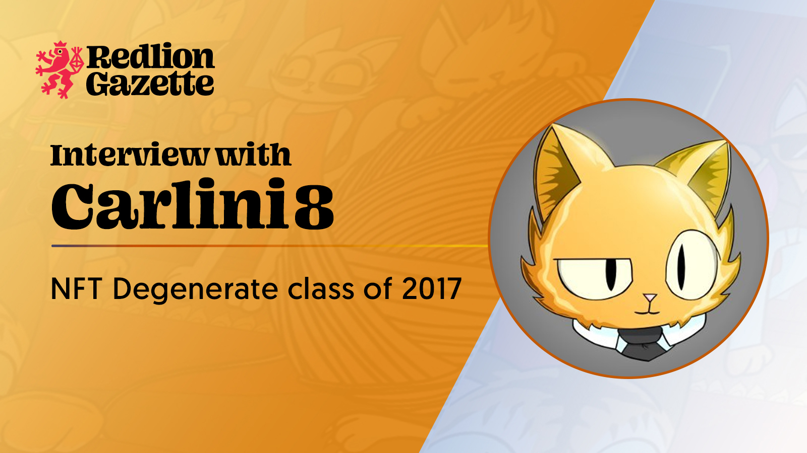
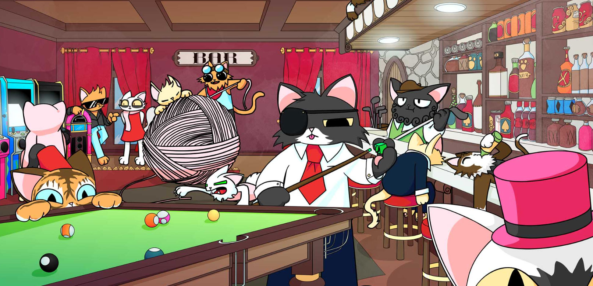
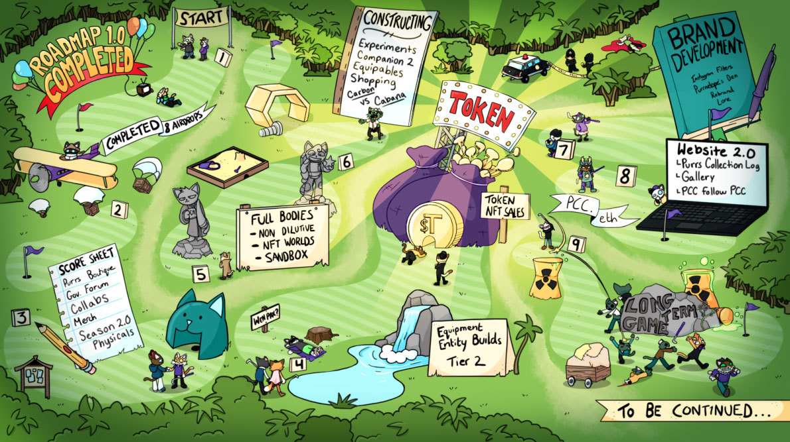

Forewarning: you’re about to learn some shit.

<!--truncate-->

Original Post: https://www.redlion.news/article/interview-with-carlini8-og-of-web3

If you don’t pay your respects to the OGs in the space, then you are doomed to get rekt. We know better than that, which is why we met up with Carlini8 to talk about his history with Pranksy, why he left NFTBoxes, and how Purrnelope’s Country Club is just getting started.

### 1) Who are you, and what’s your background in web3?

I am Carlini8. NFT Degen, turned Founder/Builder with NFTBoxes and then into Purrnelopes Country Club. I have been in the NFT space since 2017 and never left. I was hooked and still am!

### 2) Word is that you were the one who got Pranksy into NFTs. Any truth to that?

Yes, that is true! I knew him before [Cryptokitties](https://www.cryptokitties.co/) got us both in, in 2017. I found CK one night and was sucked in. I went straight to his DMs on Slack to tell him I was sure something big was going on here.

The rest, as they say, is history. We have chatted most days since then, I would say.

### 3) What made you want to start NFTBoxes, and why did you end up leaving it?

I wanted to build something in this space. December 2020, I sent a DM to Pranksy saying, hey, shall we actually do this properly?

Before that moment, I had been inspired by my friends [J1mmy](https://twitter.com/j1mmyeth) and [Natealex](https://twitter.com/NateAlexNFT). At this point, I have been in NFTs for three years. They mean a lot to me, and I know they are here to stay.

My friends are building amazing projects, and I was just thinking about how much I respected them for it, and it made me want to add to the space myself.

There was a discussion in the group chat about an idea that had been flying around a while. A few times a month, it would crop up, and nothing would ever come of it. I knew I could build it.

While I am not a dev myself, I know I could manage this thing into existence. I knew Pranksy could sell it, so I sent a DM and sold the idea of changing it to be done properly and actually making it happen.

_Why did I leave? I left because we each had different focuses. Every day I was interacting with the community as they were my side of the business. Pranksy’s side of the business was talking with artists every day._

So I wanted to prioritize the community, and Pranksy wanted to do right more for the artists. It just led to a difference of opinions on how we progress with the project, and I felt the best way was to sell my share of the company to Pranksy so that he could continue it in his vision and I could go and build mine.

I fully get it, we wanted to run the company in different ways, and I have heard horror stories of friends going into businesses, and I wanted to avoid issues down the line.

We still talk pretty much every day and are on good terms, so no bad blood or anything like that!

### 4) What made you want to start Purrnelope’s Country Club?

I had caught the building bug at NFTBoxes. I had caught the community bug. I was talking to people in the NFTBoxes discord every day for months and months, I enjoyed building it up with my friend Peter , and we just wanted to recreate that with it as the main focus of the project. From that point, there was just no way we would not be building this.

### 5) What’s something about PCC that’s unique?

We actually have a huge number of “firsts.” Maybe some are a bit too specific to really count as firsts, but many things we have done have led to “industry changes,” which we are very proud of.

For instance, community wallets, they were not in any way in the meta when we started planning them. By the time we had launched, they were very small, 10 ETH here, 20 ETH there. We launched with a whopping 200 ETH community wallet, 25% of the projects take. This was then replicated quite often.

Another was the KittyVault. We have built a mechanism in which the community jointly owns fractions of a huge wallet with a value of over 1,000 ETH. It “backs” your NFT, as in, it should always stop your NFT from going to zero as you jointly own this huge wealth of NFTs.

We have dropped eight airdrops that jointly contribute to these fractions as well as have multiple purposes. For example, one airdrop allows you to redeem a PCC comic once completed. It is backed by the KittyVault and will be a requirement to complete the collection log. We have delivered eight airdrops like this that have multiple utilities.

_We then get to the two big things of our future. The main, huge one, that everyone is sleeping on: ENS Subdomains. I could talk for hours about how these subdomains should be used for all PFP projects._

However, the real short top-level takeaway is proof of ownership is given by having a subdomain; proof of flex, as it is a given you own whatever NFT it is; an easy way to give out your wallet address, as yourbrand.your favoritebrand.eth; and the big one, it can be integrated into almost anything.

When you have someone’s wallet, proof they are in a community, and also can use old web2 APIs to prove almost anything, the possibilities are endless.

For instance, the PCC bot could hook into the Fortnite API and reward the winner of our social quest of the day, get the most kills on fortnite, with a PCC. We could have a live leaderboard showing who is where and even link it into Twitch streams.

This is very much down the line utility, but it is just one example of the crazy things that could be possible. There are so many different things that can be done. This is just one idea that came to me.

Before we get to this level, there are also some really fun and interactive things we can do that makes it almost a social game.

> We have a $TOKEN coming. Working name, $TOKEN. It will be a yielding $TOKEN akin to the CyberKongz method and slowly trickled into the community with us proving huge amounts of utility as our nine full-time staff really focus on making sure there are things to do with it.

The first, which is what we call Tier 2, our NFT that is the same level as [Meebits](https://meebits.app/), [Mutants](https://apemutantyachtclub.com/), [WowG](https://worldofwomen.art/wow-galaxy), the secondary level of the community.

These will only be mintable with $TOKEN, which should provide an interesting dynamic. There are more fun things baked in there, but I can’t give it all away.

We are working on lots of things at the same time and really aiming to deliver for the next year as we have for the past year.

### 6) As an OG in the space, where would you like to see web3 go from here?

I want usefulness. Utility doesn’t necessarily mean useful yet.

We will eventually get there. I would like it sooner rather than later, but the last two years have already done wonders for adoption and sped up the timeline that I thought we were on. I am happy to give it a little more time for us to get there! NFTs will be huge, it doesn’t necessarily mean the current ones will be, but NFTs as a technology are going on, and I am so excited to see the next big innovation in a section of the space I enjoy.
