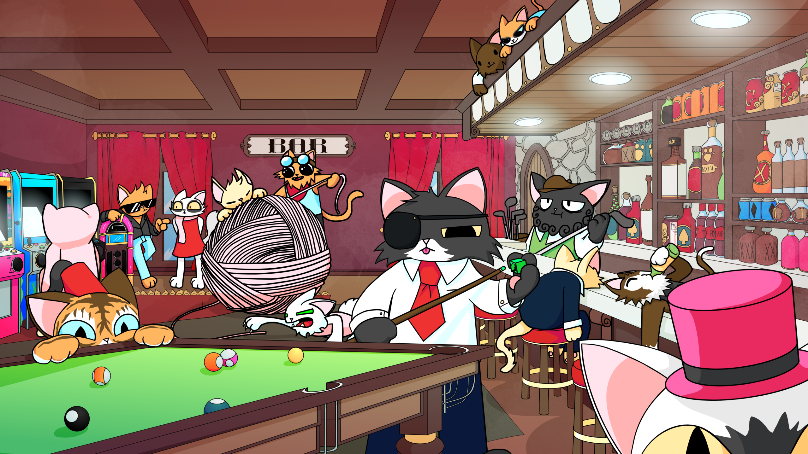
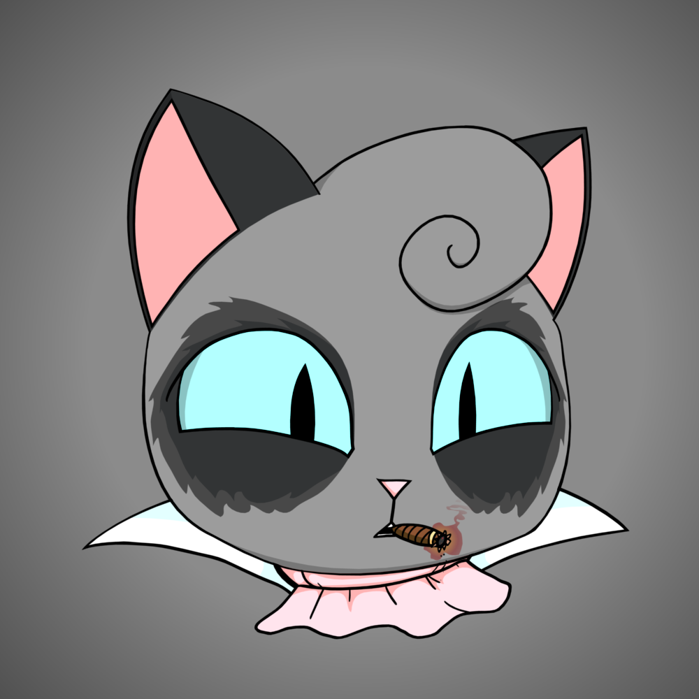

Purrnelope’s Cats chilling in the Country Club

<!--truncate-->

## Welcome to Purrnelopes Country Club

**_The 10k profile picture project with a difference_**

We aren’t the next _Punks_.

We aren’t promising you the next _WoW_ but with _NFT’s_.

We aren’t the _next big Blockbuster_ Film but with _NFT’s._

We aren’t purrely hype. We aren’t going to disappear overnight.

[Purrnelopes Country Club](https://www.purrnelopescountryclub.com/) is something else entirely. We’re the type of loyal cats that are here to stay.

Starting with [**Roadmap V1**](https://www.purrnelopescountryclub.com/#roadmap), Purrnelope’s members will be welcomed into a country club with a focus on providing _second-to-none_ commitment to community growth and longevity. Value will be constantly added — not taken. Funds will be used for growth and innovation — not to line the pockets of the team (that’s already covered, _see below_).

We believe the best NFTs are those designed to last. That means pivoting away from the cash-grab bubble NFT’s are currently experiencing and instead focusing on long term growth.

## Country Club Owners — Our Paws-itive Vision

Purrnelopes doors will open with **_4 full-time team members_** already in place, each bringing a wealth of NFT knowledge and relevant industry expertise to the table.

Pre-sale, each team member is already committed and contracted to their role for _one full year_. When we reach 4,000 holders, that is automatically extended to _two full years._

That’s one year of full-time dedication to project growth straight out of the gate, even if we only have 1 hodler. Two years if we have 4,000 hodlers. And this isn’t the ceiling. Far from it. This is the _!floor_. We’ll be extending this further if we fully sell out, and our vision is to keep working on the project, as well as grow the team further, in the years to come.

To guarantee our longevity and show our commitment to community, we’ve put together a Roadmap that we truly believe gives back more any of our ‘competitors’

## RoadMap V1

We want to bring value to the community straight away, so starting at 0% sold we’ll be nitro boosting our discord server to unlock all the best features _(why is this a 10% or 20% roadmap goal for many?)_

As we climb to 30% sold, we’ll be running giveaways and competitions for our holders. More details [here](https://www.purrnelopescountryclub.com/#roadmap).

When 30% is hit, we’ll go **completely carbon negative** (not just neutral) by over-offsetting any emissions associated with our project. That means Purrnelopes will actually _help_ _the planet_, by providing more positive offsets than it uses. We’re furthering this initiative at our 70% stage too, with a pledge of 5% of all sales to a charity chosen by the community (the list of charities will be curated and voted on post-sale)

At 40%, the team could be locked in for 2 years of full-time work and we begin work on our official merchandise.

50% — the real fun begins. A massive **100 ETH** & **25% of all subsequent sales** will be placed directly into a community controlled wallet. Far from the “token gesture” seen with other projects, the value of this wallet will reach a cool **200 ETH** when we 100% sell out. Each holder will be able to use their cats as a voting token (1 cat = 1 token) to decide what is done with the funds. Spend it on raising the floor? Donate some to charity? Fund the creation of a game that uses your NFT’s? Propose it, vote on it, and if the community agrees on it — it will be done.

Furthermore, 1.5% of all secondary market sales will go into the Community Wallet. The Opensea 2.5% is a constant we can’t change and the team will take 1% to make it a total of 5%. 2.5% on the project, 1.5% of that 2.5% going straight back to the community. The community receives a higher percentage of the ongoing revenue than the team.

## Get Paid

At 60% sold, we’ll begin **_actually paying you_** to have your Purrnelope NFT as your profile picture on Twitter and Discord. Because why should you use your personal piece of advertising space for free? Your profile picture is your first line of personal branding, afterall.

Traditionally, NFT collectors change their profile pictures as new projects are released, but they get no direct personal gain from it. We are here to change that. 5% of all sales will go towards paying those who change their Twitter and Discord avatars to your very own Purrnelope’s Country Club Cat. A percentage of the Community Wallet will be used to replenish this fund at first. However, as above, the community has the option to fully remove, lower or up this number, meaning it will evolve over time. More details about this can be seen in the Discord after the launch.

Don’t like us? That’s fine too — you can totally dump on us (screw you, though) because at 80% sold we’ll be pledging 5% of all sale funds to buying up the floor. These cats will then be used to shape our **NFT20 Liquidity Pool,** which will be launched at 90% sold and contain the purchased floor cats along with a substantial amount of Eth.

Finally, once we hit the 100% sold mark, we’ll be celebrating with the commissioning of an animation featuring **_your_**  Purrnelope cats and reaching out to the community on ideas of where to take things next.

Here at the Purrnelope Country Club for cats, we believe our community focused roadmap sets us apart. We look forward to welcoming our new members when our doors open soon.

Purrnelope is up all hours to ensure her members have a great experience

