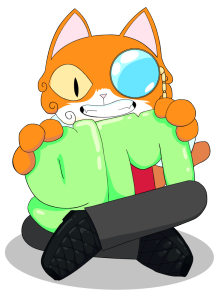
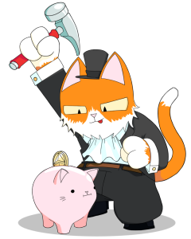
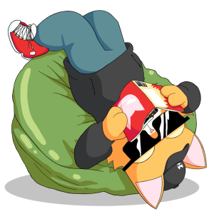

<!--truncate-->

Original: https://medium.com/@Carlini/purrnelopes-country-club-the-unanon-342ab01f0471

With the announcement from NFTBoxes that I have left the team since starting the process in March I am now in a position to reveal what I have been doing since then. I didn’t want to launch this project as myself while I was in the process of leaving NFTBoxes as we had a few API issues and the website revamp was put on hold until I left. I didn’t want it to seem I was ignoring NFTBoxes and working on something in addition when the reality was I was in the process of leaving but couldn’t tell anyone. Now that I am out of the way all of the changes can be done and the vision for NFTBoxes can be executed.

I caught the building bug starting NFTBoxes. What started with me sending a “should we do this?” DM became my life for three months. All hours of the day just working on an NFT project to really try and make it grow and reach its potential, I loved it. There was more I wanted to do but unfortunately our visions didn’t completely align so I moved on, no bad blood or anything like that as I am sure many would expect when a Co-Founder leaves a project. I wish NFTBoxes well and hope they really smash the rest of 2021.

Introducing: [https://www.purrnelopescountryclub.com/](https://www.purrnelopescountryclub.com/)

Suddenly I wasn’t working crazy hours a day and had friends really hyped to jump into a project with me. We talked over many different options ranging from crazy to farfetched. Eventually after one long company lunch we ended up on what we were calling at the time the Cool Cats Country Club (We obviously had to change this when another project smashed it out the park — shout out Cool Cats). The goal was to do a profile picture project, but right (this doesn’t mean there aren’t plenty already doing it right, not not a large percentage for sure!), and to really work on it. Everyone salaried, full time, for a year (minimum). Cash will be taken out for taxes and salary, everything else put back into the community and the project. This will be done in many ways, ranging from art assets, airdrops, physicals, merch, land, potentially a small indie game (token gated, small and fun — we aren’t promising AAA) and the one I am most excited about, The KittyBank.

Piggy Bank?

Our plan is to combine everything good we see into one high class project. We will work on this for a minimum of a year (the contracts are signed and sealed) regardless of the presale. If we sell no more cats, we will still be here 11 months after starting, grinding away. Our roadmap also has 2 years on it at a set amount of holders. These numbers are a minimum, if feasible we will be working on this for a very long time. We all love the NFT space and can’t imagine doing anything outside of it.

The community will be our focal point, we will try to bring as much value to you as we can and in return we hope you will love the PCC! It has been hard working on this anon and wanting to tell everyone about how excited we were and not being able to. We have big big plans that we will be releasing shortly that we want to get to work on right away.

Information on the Kitty Bank soon, everything else that we are about can be seen here: [Article](./2021-07-14-welcome-to-pcc.md)

The more eagled eyed of you may have figured out how Purrnelope’s are deflationary…

What if an airdrop got you a physical?

The first 2000 Purrnelope’s holders will be airdropped a fractionalized BAYC we own, the community voted, 1 cat = 1 vote, to fractionalize over give it away to a single individual in order to test our planned voting mechanisms and it worked a charm.

Any questions, do send over a DM. I will try keep on top of them for once!

Carlini8
