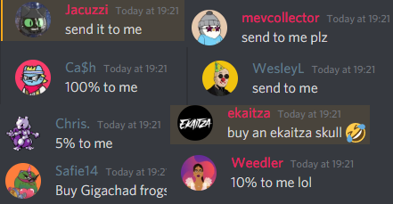
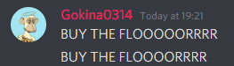
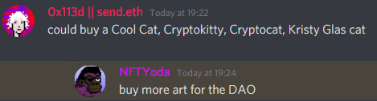
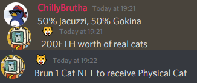
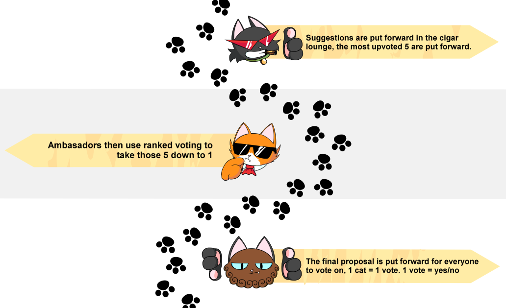

“What happens to the 200 ETH in the community wallet?”. We have seen this question asked lots of times in the… 36 hours since we sold out.

<!--truncate-->

Answer: “I dunno”.

I must say, my question was leading and the “to me” answer was baited

A community wallet is just that, ETH that is spent based on a voting system that you participate in by owning a PCC. We have a system, that I will explain shortly. First I must show you what happens when you ask people what they would spend it on.

However I didn’t add to the fires and let the community talk and some ideas that I thought to be good popped up too as they discussed.

I expected this one, I imagine it to be a frontrunner when it comes to it putting votes forward. I don’t believe it is the best thing we can do with the ETH, but it certainly beats the direct to someone above!

A suggestion I personally like better is to add to the KittyBank which I believe is what people were suggesting here:

This would add long term value to the NFTs as the NFTs are backed by the items in the KittyBank. There is an article on this to come, maybe tomorrow.

Physicals sounds like a good idea right? I am sure you would all love to get your hands on some physical merch, posters maybe even some wrapping paper?

What about physical cats and Jacuzzis?

10,000 real cats seems like a lot.

Now that we have some ideas out of the way we move onto the process. How will this ETH be spent? What are the key factors. The three pillars of our voting system. The Cigar Longue, Ambasadors and 1 cat = 1 vote.

The Cigar Lounge is a room that anyone with a PCC can access in our discord. You verify your wallet with Collab.Land and it will scan your wallet for our cat and give you a role if you have it. In the Cigar Lounge you can suggest anything you want. We know that at current this is abusable by just constantly posting ideas, we do ask you keep it to one or two and not force us into a more complex system. These ideas are then gathered and everyone with access to the room can up vote or down vote an idea. The 5 with the most combined upvotes are moved to the next stage.

The Ambasadors. If you own a cat and change your profile picture to the cat you can claim the role of Ambasador. With this role you have the ability to help decide which of these 5 proposals are put forward to our whole community. Using ranked voting the Ambasadors will vote for their favourite of the 5 proposals. The winner then moves onto the next stage.

1 cat = 1 vote. The backbone of the Purrlini. In a winner takes all vote anyone and everycat will vote yes or no on if this proposal passes. If it does pass the action will be executed as required, if it fails, we go back to the start and away we go again.

1.5% of all secondary sales go into the community wallet. We take a 2.5% cut, so that means 1% is left for the team. The community wallet takes a larger cut and will decide the fate of the project more so than us! You are so important, please get involved.

We need you in! See you at the voting booth cats.
