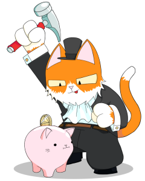
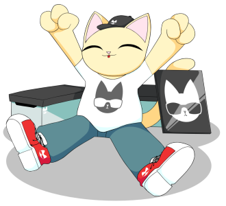

We talk about burning your cat later on, please do not consider this yet, the feature is not live!

Yes, I am about to type that word that sends people wild. No, not ‘Community’, the other one. Yes, ‘Utility’.

<!--truncate-->

I want to stress, the utility I am about to explain is on top of everything else. This is not taking away anything and only adding. Everything is as it was yesterday, plus this today. The Roadmap will be completed prettty quickly bar the 100% goal, other plans are still in place - we still build the project out fully!

I say this because I know the game. As soon as you add utility like this all people do is look at the value of that utility and only that utility to price up the NFT. In time you can all do this but don’t just yet, because as you will see it is almost an impossibility at this stage to make the base utility value mint price.

## What is the Kitty Bank?

The Kitty Bank is a fractionalised collection that all Purrnelopes Country Club Cats will have exposure to via our ‘Piggy Bank’ method.

The fraction of the collection is contained within the cat. You want to get access to the token? You have to smash (burn) the cat. This isn’t wildly different to the PUNKS Comics, except the burn window is not timed. If the price of the fractionalised wallet gets anywhere near the price of a PCC the owner may wish to burn the PCC, obtain the token and sell it. This will make the PCC deflationary as there is an incentive to lower their numbers.

## How does the Kitty Bank grow in value?

The aim is to buy NFTs that we believe are either undervalued or a very solid long term hold. The bank already contains NFTs such as 2% of the $DEAD Zombie Punk, a non fractionalised Punk, an Avastar Founder, 25 Fvckrender Crystals, Coldie and Alotta Money pieces and as of tonight, VeeFriends. This was funded from the initial sale. When we say we are putting it all back into the community, we really mean it. We had some costs before launch, we have salary we need to put aside and taxes we need to take account of. Everything else is either on our roadmap or coming back into the Kitty Bank.

It will also grow with our secondary fees. A large majority of the fees we take will go either into the community wallet or into the Kitty Bank. The company will use fees where needed for roadmap items or other ideas we believe builds the project but the rest will go into NFTs and the NFTs into the bank. We decide how this ETH is spent, if the community wants to add to the Kitty Bank via the community wallet then the community decides how to spend that ETH.

This is why I started with the disclaimer. We took in 800 ETH in the initial sale, in order for 1 token = 0.08 which is mint, the wallet would need a valuation of 800 ETH. The only way to get that so quickly would have been to abandon all other plans and put the whole 800 ETH right into the Kitty Bank. This is obviously not long term feasible (or legally, taxes, salary etc). We will get there, we will build and grow, we may find other ways to raise funds for the Kitty Bank, but right now we are focused on completing the road map and building the bank.

## Why should I HODL?

If we were to ignore the community reasons, if we were to ignore the roadmap reasons and if we were to ignore the belief in the team… Lets add a reason on top as to why you should HODL a PCC. Airdrops.

Everyone loves airdrops right? We are seeing lots of them right now accross the space. There must be something different here? Why announce it like this otherwise. These airdrops are built different, they come with the ability to also burn for the fractionalised collection token. That’s right, hold a PCC, get an airdrop, burn it for the token to the Kitty Bank. How many airdrops? 8 airdrops, one a month starting with the first in September. This encourages HODLing your PCC as you know the airdrops are on the way and that they represent a fraction of the Kitty Bank. 8 airdrops, one a month, starting in September. This takes us to April 2022 at which point all of the fractional tokens of the Kitty Bank have been released to the wild. At that point all of the airdrops are out there and every single one can be smashed for the token. Will you? How will the game theory play out? How big will the Kitty Banks value be in April 2022? The PCC and all subsequent airdrops will have the same number of tokens inside. The reason your original PCC is the kicker is all airdrops come to that, move it on, someone else will get the airdrops. Smash it, we will get the tokens as the team. I know people will be looking at the game theory as soon as this article is released. The team are getting 10% of the tokens to provide liquidity to the pool. Otherwise there would be 0 liquidity in the Kitty Bank until people smashed their PCC or their first airdrop, that would be bad so this is our solution.

The airdrops themselves we also hope to have a unisocks type mechanic, burn for a pair of socks as an example. This is still very much in the works and may not be ready by the time the first airdrop happens in September. The airdrops will vary in type, they may he a randomly assorted series of traits such as a BAKC, they could be an airdrop similar to that but the traits match your PCC, they could also be an airdrop where everyone gets the same. What will run through every airdrop are the KittyBank tokens inside. We want to make the airdrops so that you don’t want to burn it even if it makes financial sense, we will do our best!

We will have nice graphics to simplify this whole process in time, I just wanted to put pen to computer screen so you could see where we were going with our purchases.

## TL:DR  

1. The team is not here to make money and run, long haul, profits reinvested  

1. The KittyBank buys NFT with company ETH, primary and secondary sales

1. The KittyBank is fractionalized and will still be added to over time

1. You access the fractions by burning your PCC  

1. There will be 8 Airdrops, 1 a month.  

1. These airdrops also contain fractions of the KittyBank  

1. Long term HODLing is rewarded

I may edit this as questions pop up, I want to ensure everyone knows what we are doing and it is all very clear.
