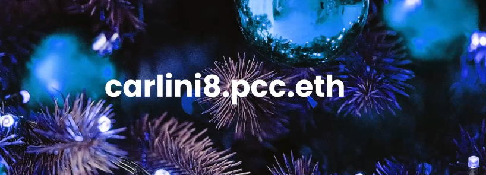
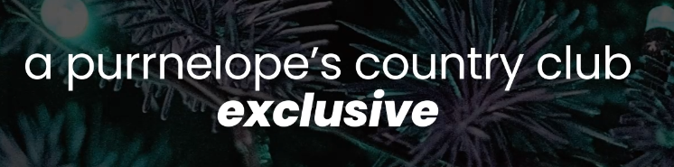
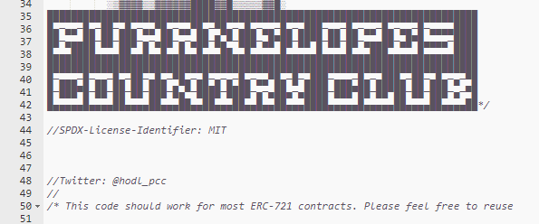

Just repping my clan tags

<!--truncate-->

Welcome back to Purrnelope’s Country Club.

We originally told you we were the 10k profile picture project with a difference, we are here to show you again why that is the case.

During our planning phase for PCC we came up with the community wallet idea, no one was doing it at the time. Between the planning and our launch, a few projects came out with it too, however they were tiny!

“If we sell out for 800 ETH, you get 10 ETH in the community wallet!” they would cry, one went as high as 20 ETH. We launched with 200 ETH into the community wallet and thankfully trends like that took on.

The KittyVault (formerly the KittyBank) — we put a huge amount of ETH into our KittyVault at the time. Again, no one was doing this. Now it is really common, we love this. What’s next you ask?

Well, you know, it is in the title of the article. ENS subdomains for all.

Why should you care?

Firstly, it is cheaper. There are plenty of people in the space priced out of an ENS name. For many it is a nominal fee, but lets not forget there are plenty of people who would love an ENS name who just can’t justify parting with the required funds at this point. Now for a free plus small gas fee you can claim one via your Purrnelopes Country Club cat.

Secondly; branding, clans, tribes, identity, flex, friendship and so much more. When I was 11 I joined my first clan online. We all changed our name in a set way to rep our clan, show everyone we were together and build that sense of community. \[TAG\] {TAG} TAG — TAG:  
There are many different ways this has been done, here comes the newest and greatest. Never before have you been able to show where you call home while it is also incredibly useful. Now you can use your clantag to bank, pay, flex, it all.

I am now carlini8.pcc.eth. That is my ETH wallet, that is my on chain history, that is my home. You can see instantly that I am in the PCC, you can see I own a cat, you can see my NFTs, you can send me an NFT or ETH with me simply telling you carlini8.pcc.eth and not 0x0d41F957181E584dB82d2E316837B2DE1738C477. Lets be real, currently we live in a world of heavy reliance on copy and paste. Where is that wallet, OK, that is the wallet, copy, paste it here. That isn’t how it should be and isn’t how it will have to be.

you can’t get .pcc anywhere else

Our job at Purrnelopes Country Club is to build the brand, make you want to rep a pcc.eth as a PCC holder and to make people without a PCC want to rep a pcc.eth. We will be working tirelessly to make that a reality, but lets be real, others will do this too. Projects will be fighting to be your subdomain of choice. Sure, yourname.eth is a flex in itself, but I truely believe coverted subdomains will be more of a flex. You can tell people more about yourself with your subdomain of choice, yourname.brand.eth.

This is web 3, we want to be very different to web 2, we think what we have done here is pretty cool. Obviously this is completely reliant on the great team over an ENS as obviously we couldn’t be offerening an ENS subdomain without them! We are helping show the way in the NFT PFP world, show what can be done with subdomains and begin the ENS subdomain <\> NFT World experiments.

Please feel free to reuse

Innovation will continue, things will change and we will adapt with these changes. Look at line 50 of our code: Please feel free to reuse. We want these changes, we want this innovation. We believe attaching a subdomain to your NFT in a proof of ownership way fits perfectly with the NFT world. This will adapt and we will be right there ready to improve.

Finally, I want to thank hodl_pcc greatly for what we have released today. His passion for bringing new and exciting things to the NFT space really shone through as he took this from 0 to 100.

Want to know more about this?

Youtube: [https://youtu.be/4h76jAVk8Ek](https://youtu.be/4h76jAVk8Ek)
