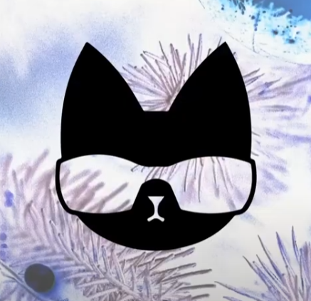

gm @everyone,

As 2021 comes to a close, we look back and think just how insane of a year it has been. I started the year building NFTBoxes, and half way through moved over to Purrnelopes all the while NFTs were going bonkers.I am not sure 2021 can be topped, but lets give it up for 2022 and hope it is a huge one for our space.

<!--truncate-->

What it will be is a huge one for is Purrs — we will be building, listening, watching, mingling, partnershipping, doing it right. There are now double digit individuals working on PCC. I hope to make more key hires in 2022, who knows what the year has in store?

Our final airdrop of the year is on the way today, unfortunately the in person explainer sketch was delayed due to covid, so keep your eyes out for that — but I will have to explain boringly by text so you aren’t just looking at an NFT in your wallet.

This month we add to our line of future physicals with a comic. Over the months we have had a comic book script written and we are working with a wonderful artist to fully flesh out the script into a fun story driven comic book. Full disclosure, it is still in production, so we can’t give as good of an ETA as we did on the models but we do hope for it to be sooner rather than later. The plan is for this to progress into a series and there is very much the scope for that with how we have planned it out so far.

We hope you have a wonderful Christmas

A quick rundown on the other physicals which are coming:

Hoodie Cat — We had quite a few shipping issues getting the hoodies originally to the screenprinters and then to IYK, the hoodies are now with them and we hope to receive the teams hoodies shortly, which means we would then be happy to open the redeem window to get hoodies to those who claim. Q1.

Model Cat — This is going wonderfully, as we said at mint the plan was to have about 50 produced per month starting in Jan. As of now, that is still the plan and boy am I excited. Want to see why? Look at the image below! Redeem window to also be opened in Q1.

We will have a full Roadmap 2.0 as they say, to come. Just a quick reminder of what we have in the works:

1. $TOKEN, ah yes $TOKEN. The legal battle is over, now the dev battle begins. Most of what we wanted to do has been given the green light, we will be working hard on ensuring it is all top of the range at launch. The token in itself would be pretty quick to get out, but the token without the ecosystem around it would lead to situations like the Wolf Game scenario. If there is nothing to use your token on right out of the bat, why have it? Lots of things in the works and after our 8 airdrops full attention will be solely on the token (as in, benefits are put onto the token, of which your PCC and companions will yield). Using it to power our ecosystem and reward our fans with it benefits the whole community as we are seeing with other projects right now.

1. Website update — Our resident Website Wizard is working hard on revamping the website. We will be working with him to really take it to the next level. We want you to have a reason to use our website instead of just the discord. We have teased the collection log often, we will have the redeemable windows open there and some other exciting ideas that I am looking forward to seeing in 2022.

1. Your second companion. It’s not just kittens that will yield one $TOKEN a day! We have another companion coming in 2022 which will be one of the 8 airdrops and will add to the lore of the country club, something we very much want to build out in 2022. I honestly can’t remember if I have leaked what this is…

1. 3D / Metaverse compatible PCCs. The exact details of these are currently not releasable, but we do want you to know that we are very much working on getting your PCC into the metaverse with…

1. Bodies.

1. The first 20 Kittens, the rest of the kittens. These will be coming out in the wild when the time is right. Potentially after the 8 airdrops, potentially when token is launched or potentially when the market is ready. It is more of a timing thing than a, here is the date.

1. More physicals, IRL, lore, collections, videos, work, art, collabs, tokenomics, game theory, KittyVault, fun, community.
   We are all in.

Here is to a great 2022.

The PCC Team

Looks Rare
