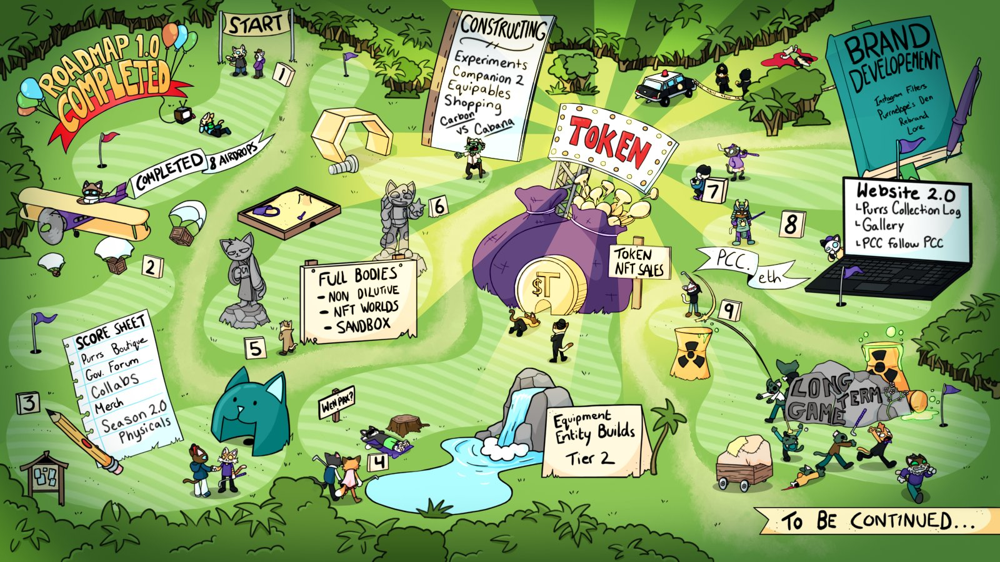
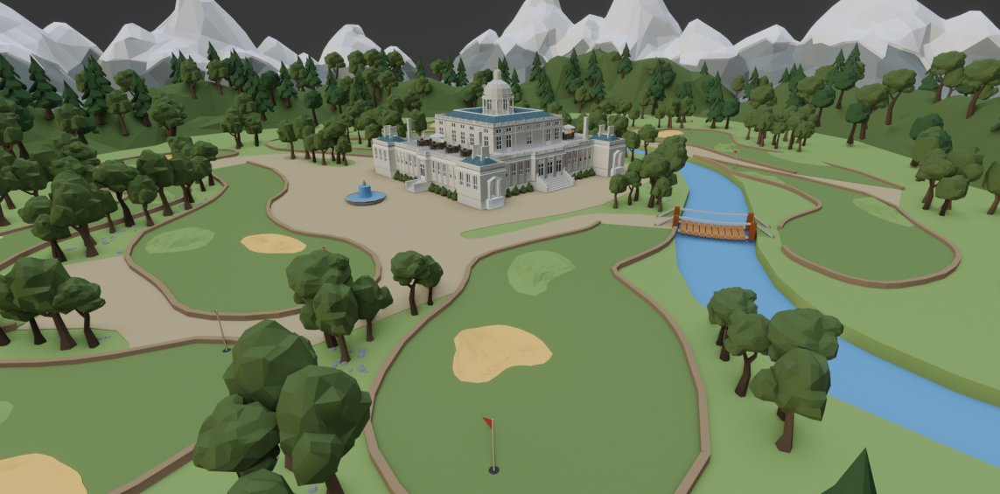
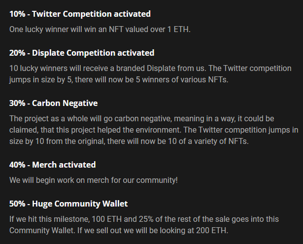
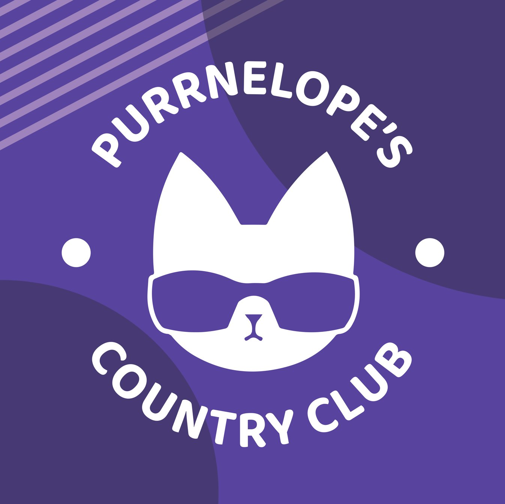
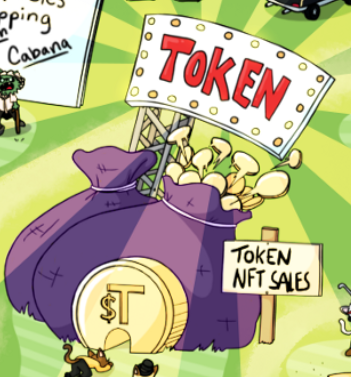
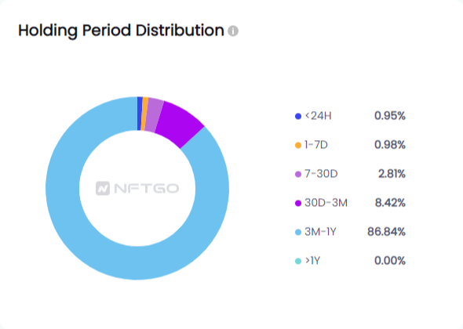
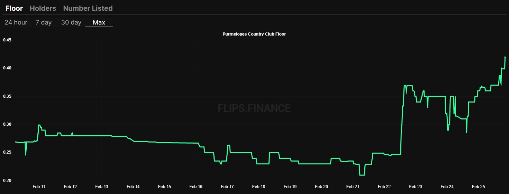

https://twitter.com/Carlini8N/status/1497315068245155845

Roadmap 2.0, [@PurrnelopesCC](https://twitter.com/PurrnelopesCC) now. We have worked so hard and this will be a big thread. But lets hook you in with the biggest hitter first

<!--truncate-->

The most ambitious? An [@nftworldsNFT](https://twitter.com/nftworldsNFT) built by [@EntityBuilds](https://twitter.com/EntityBuilds) the Country Club with four separate games, PvE, PvP, Casual and $WRLD integration

Yes, the Country Club is coming to life in [@nftworldsNFT](https://twitter.com/nftworldsNFT) thanks to my new friends at [@EntityBuilds](https://twitter.com/EntityBuilds). What they can do within the world is utterly mind blowing and we will have a fully $WRLD integrated ecosystem and will be starting, yes, starting, with 4 unique games. Concept Art.

This is not a relationship that comes to an end. We fully believe this to be a partnership that just continues to grow, we will take plenty of feedback from the community and build out what you like the most and suggest. There are certainly more plans down the line here.

If you want a huge run down of Roadmap 2, take a look at our medium article linked to this tweet, sure, we have some secrets, some things we think are huge that we aren't sharing... but we are really putting as much as we can on this it feels packed to me

https://purrnelope.medium.com/roadmap-2-0-6-months-on-from-launch-d97079395e48

Time for the rest of Roadmap 2.0, oh actually, let us remind you we have continuously built and added things on top of what we say we are doing

The KittyVault, The 8 Airdrops to all PCC, the ENS Subdomains - none of these were on Roadmap 1.0, all delivered

We do things diff.

https://twitter.com/Carlini8N/status/1497315693838188551

Hole 1 of our roadmap we go back to where it all began, Roadmap 1.0. The big item we need to complete is our short Anime video, we promised it, it will be delivered. We have had our artistic resources focused on what the community engages with up until now. We will complete R1.0

We then move over to completing the 8 airdrops we promised. The final of which is the second companion. We have kinda said what it is, not said what it is. Those of you watching closely enough will know.

We hope to have a very cool tech surprise for this, might be too early.

Interactive Metaverse Experiences - NFT Worlds, Sandbox, Full Bodies in a non-dilutive manner. You will get Metaverse ready PCCs without it diluting the current collection. These bodies will be on top of what you already have, we won't be using them for a raise, just delivering.

Increased Brand Focus - We’ve learned and evolved a lot over the last 6 months and recognise our brand could be more closely aligned with our vibe and community values. Therefore, we’re bringing on brand development hires to shake up our branding in a cohesive way.

Instagram and beyond filters, a complete website rebrand and improvement (website 2.0), Purrnelopes Den, come and pitch Purrnelope your best ideas.

We then move onto the one most people are interested in...

$TOKEN Utility - Wen Pax?!

Yes, packs will be buyable with $TOKEN. These packs will be fully integrated into the ecosystem and involve equipables for your improved PCC, skins, cosmetics, improvements, experience, it is all coming.

$TOKEN will become the center of everything we do (insert Bloot joke here). We will be using it to fuel our ecosystem and instead of taking your ETH for anything we do, we will purely focus on $TOKEN. When I say it will be everything I do in crypto, I mean it.

It will also be the primary method of access to the Tier 2 ecosystem we have been hinting at for a few months now. The value will be pushed towards the $TOKEN instead of a claim and sale. For those not in the know, Tier 2 is our version of Meebits / Mutants traditionally.

Immersion - To assist with really feeling part of the community we will be rolling out the Purrs Boutique, a Governance Forum, and Collabs that you help decide who we involve. The community always comes first and we feel we have proven that this past half year.

Our Merch is on the way. It comes with a bit of a twist. We have our first line coming out soon and this will do battle with our second line. We are building out the lore and this battle is seen in our future games story and the emergence of tier 2. Everything is connected.

We have more coming that we can't yet speak about. We really are putting everything we can speak about at this point (and some we probably shouldn't) into this Roadmap to show you where we are going. It is far, this is a huge R2.0

We have a rundown of our airdrops so far, if you want a quick 3 min catch up with a bit on info on where we are with delivery, take a look here:

https://www.youtube.com/watch?v=Un9q5d75-zU

Are you new the the #Purrs? Want to know more about us?

95% of our holders have been with us for over a month, 86.6% have been here over 3 months. We aim to foster a fun community of people who actually want to be here, we think it is working!

We are a community on the up, we celebrate new participants and as crazy as it sounds, we treat sellers the same. If you need to sell for whatever reason, you do that, only you know what is best for you.

I would suggest reading our medium article, it really is a deep dive!

A last piece I put together could give you more of a run down too:

https://twitter.com/Carlini8N/status/1479860814236504069

I want to thank our community, I want to thank everyone who minted, everyone who has bought a Purr since. You are all part of our journey and it really helps us get up and build everyday.

I am so excited to continue to build and deliver for you all.

#WeLoveThePurrs
