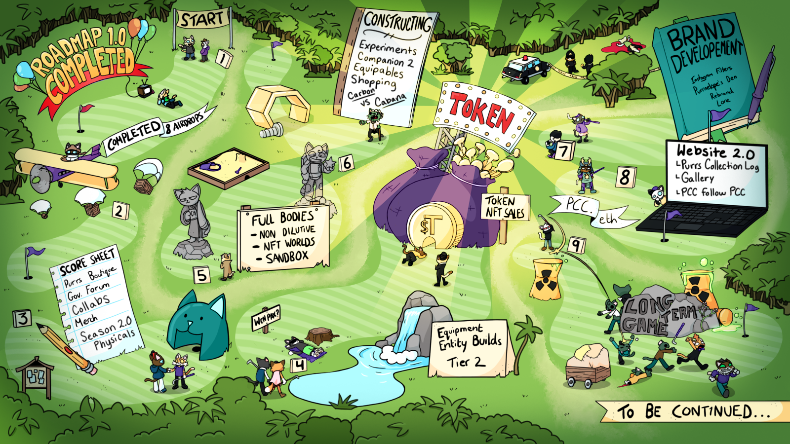
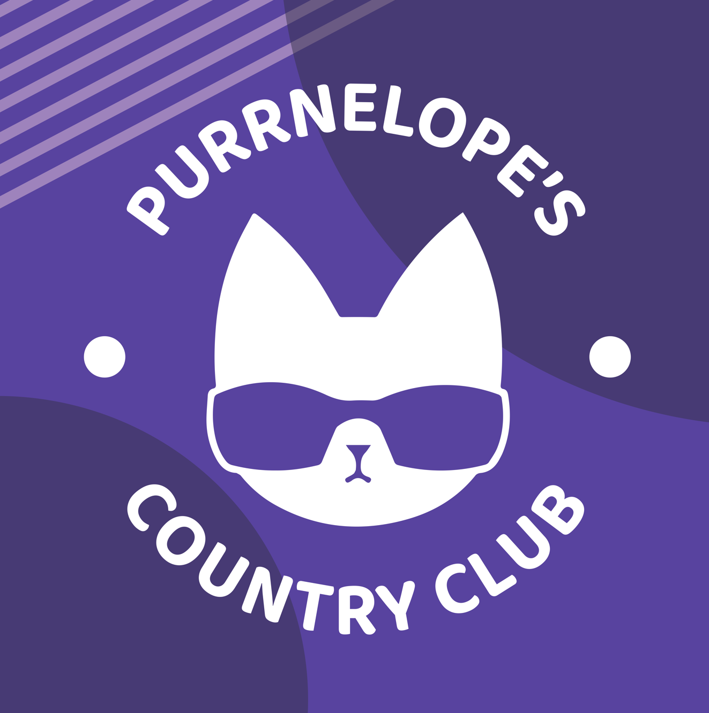
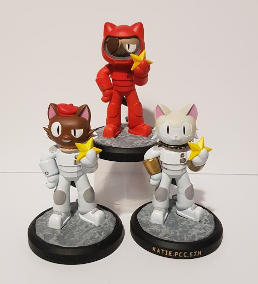
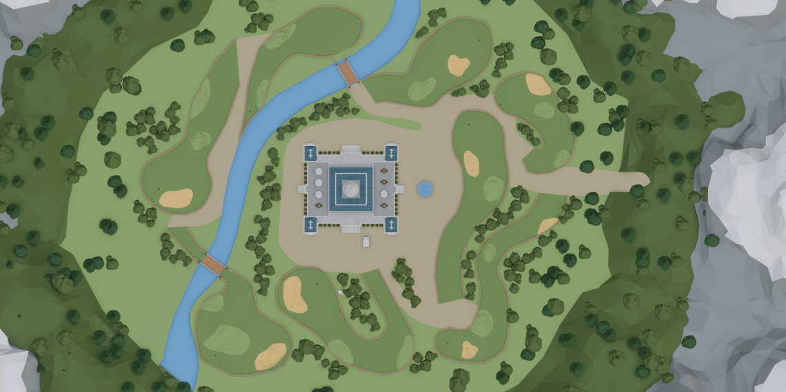
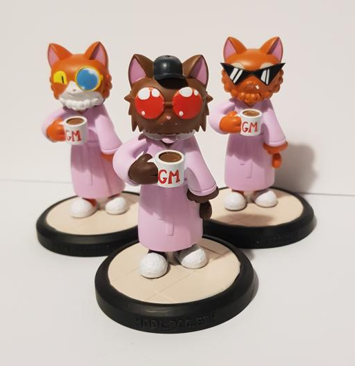
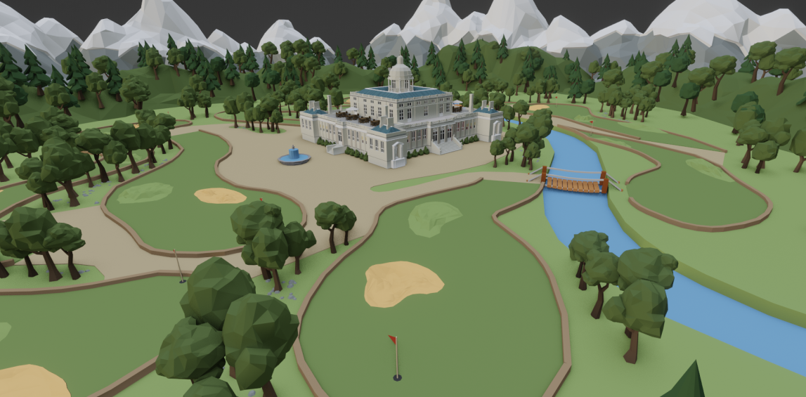

<!--truncate-->

Today is a big day at the country club, and not just because I’m allowed to drop all the alpha I want! It’s Roadmap 2.0 day!

Roadmap 2.0 is a big day for any NFT project. It demonstrates an ability to continue building long after the first sale and initial promises. Only a small percentage of projects make it this far, the rest abandoned somewhere along the cookie-cutter milestones of a Roadmap 1.0.

Of all the projects to make it to Roadmap 2.0, we believe we have one of the biggest and most inventive in the space. So big it could have filled a Roadmap 3.0 too — but where’s the fun in that!?

**TL;DR for the below text _(you’re really going to want to read this though..)_**

- Roadmap 2.0 Released
- NFT World metaverse land acquired
- Entity Builds commissioned to build 3 games into our NFT World
- Heavy focus on building out our lore
- Bodies. 3D Models. Collabs. Physicals, Website 2.0.…

**In Purrs We Trust**

We’ve already delivered above and beyond on our Roadmap 1.0 goals. The KittyVault is currently valued at over 900 ETH (we only took 800 ETH from our original sale), an initiative that wasn’t originally on our roadmap. We have so far distributed 5 of our 8 monthly NFTs, with the 6th very close. Again, not originally on our roadmap. We released a completely innovative ENS <\> NFT system which allows ENS to act as a proof of NFT ownership, brand extension and a twitter growth hack. Guess what? Not on our roadmap.

We’ve also gone to great lengths to ensure our communication is amongst the best in the NFT space. The team is ever present on Discord, we release daily TikTok videos, weekly YouTube updates, regular informative explainer videos and constant Medium updates to keep you in the know on all things Purrs and beyond. We still have plenty to learn on this front and will continue to grow and improve.

Basically, what we’re trying to say is…our 6 month history to date shows we love to build. We love to deliver. We love to communicate. We love the Purrs.

Now, we love **Roadmap 2.0**

### But First — Completing Roadmap 1.0.

A quick update on the two remaining _official_ items from 1.0:

- We’re exploring options outside of Displate to fill the branded poster goal.

- The anime short is still coming! Our artists just needed to prioritize the airdrops and companions first, which we can all agree was a better use of their time for PCC’s utility.

### What About The 8 Airdrops??

_Technically_ not a roadmap 1.0 item as we added it later, but either way this is still 100% on course. Each of the 8 airdrops represents fractional ownership of the KittyVault; the final piece of this puzzle will drop in April and will be your second Purrs companion. This companion will yield 1 $TOKEN per day when $TOKEN is launched, same as your first companion (the kittens). We are attempting to include a very innovative aspect into this drop, which is slightly akin to the arms holding the kittens.

Can anyone guess what it will be? Or what the companion will be?

### Interactive Metaverse Experiences

Purrs — get ready to rub your scent all over the metaverse!

We’ve acquired an NFT Worlds plot and are laser-focused on building out a meaningful metaverse presence for all of you, both on NFT Worlds and in The Sandbox. Building is only possible on our NFT World currently, so this is where we’re developing first and aiming to release as soon as possible. We’re excited to be working with the amazing team at Entity Builds on this corner of our metaverse, a best-in-class studio with incredible Minecraft builders, devs and designers.

If you don’t already know, NFT Worlds is a metaverse of 10,000 portal-connected plots of Minecraft land, modified by the NFT Worlds team for the metaverse with a focus on P2E experiences (more on this below..). It uses a modified Java edition of Minecraft and is compatible with Minecraft Bedrock: Edition — hello Purrs on your Xbox/Playstation!

We will also be working with 3D artists to bring YOUR PCC to life within the metaverse. Full bodies are coming, in a non dilutive manner. We won’t be adding additional NFTs to the collection for this. Instead it will build on top of what you already have to ensure value is only added to your bags, not taken away.

### Increased Brand Focus

We’ve learned and evolved a lot over the last 6 months and recognise our brand could be more closely aligned with our vibe and community values. Therefore, we’re bringing on brand development hires to shake up our branding in a cohesive way, including:

- A move away from the predominantly black-and-white branding to something more colourful and fun

- Fresh packaging for our physicals and merch

- A new approach to managing our socials

- Bespoke Instagram filters to show off your Purrs to the world

- Anything else required to provide a cohesive vision and vibe across all mediums of communication

A key part of this will be our new **Website 2.0**, which will become your central hub for all things Purrs and **_actually be useful_**. Most projects (ourselves included) primarily use Discord and Opensea to manage collections and interactions. Website 2.0 will change that for PCC. All of the essential elements of your country club experience will be accessible and managed via website 2.0 — think physical redemptions, pack and NFT management, governance, storybuilding and much more.

We will also be launching a **Purrnelope’s Den** initiative to further extend our branding and help new project startups. Similar to Dragon’s Den (or Shark Tank, if you’re from the U.S.A.), you’ll be able to come and pitch your ideas to us and receive a bundle of $TOKEN to help build your vision if it aligns with, and in some way incorporates elements of, Purrnelopes Country Club.

### $TOKEN Utility — Wen Pax?!

This feature is still in early development so we can’t release any exact details just yet. But we’re too excited about it to say nothing, so here’s the general idea…

Packs are coming! They will be purchasable using $TOKEN and include equippable NFT’s for your Purr’s adventures in the metaverse and beyond. Equippables will be usable in our games and range from being cosmetic to providing game-enhancing experiences and boosts via items and power ups. All of this will be handled on our new Website 2.0

Tier 2 are coming too. We won’t say exactly what they are, but we will say $TOKEN is heavily involved in acquiring them and they will be seen, potentially revealed, during one of our games if the timelines all match up. For reference to those who are hearing about Tier 2 for the first time here, they would be our Meebits, Mutants equivalent from Punks and BAYC. They will yield 5 $TOKEN a day once released and will very much be a part of the PCC universe and count as membership.

### Purrs Boutique

You’ll soon be able to bring your cats up to fashionable scratch with our new boutique site, where purrs can be decked out in thematic wearables as a fun way to celebrate major IRL/NFT events.

This is both a bit of right-click save fun and a way to keep your PFP relevant. Christmas time? Equip your purr with a santa hat or some reindeer antlers to show some festive spirit. A major project appearing at Christies? Get your suits on. We launch a zombie game? Give your Purr a tenth life with a new undead look featuring makeup and scars.

### Governance Forum

A new bespoke governance forum will bring added structure to the scratching post of proposals here at the country club.

The forum will be used to discuss proposals related to the community wallet, how to best utilize $TOKEN, and any other suggestions that the community deems worthy for serious consideration.

It will be a step up from our current discord methods and bring more discussions than the current methods allow.

### PCC Culture

Turn it up clowder!

Roadmap 2.0 will thrust Purrs into the wider NFT space with powerful collabs. We’ll be working with a select group of brands, projects and artists to bring as much culture and recognition to the Purrs as we possibly can.

This will include made-for-PCC Art & Music, potentially building out a record brand with music on the site, purr-based songs and bespoke paintings.

### Merch Cut From A Different Cloth

PCC merch is coming — and it’s gamified! Blending web 3.0 with the real world, PCC merch will be meaningful and have lore and gamenomics built into the products themselves. More details on the first line of our merch will be leaked soon.

There will also be **Season 2.0 Physicals**, which will make innovative use of $TOKEN and our airdrops. Think of these as the next version of the current physicals we have on the way. The ones from the KittyVault will be the First Edition, what will come next continues from where they left off.

### Lore Abiding Cat-izens

2022 is the year of all things _lore_ here at the country club. Every move we make will have an underlying purpose and tell the ever-evolving story of PCC. Our remaining airdrops, the new website, the games we create in the metaverse — absolutely everything will tie together an overarching vision that builds out the story of your NFT’s.

We believe lore building is going to play an important role in the larger NFT landscape and we’re determined to lead the way on this.

### Long Term Game

We’re already thinking far beyond Roadmap 2.0 here at Purrnelopes and are playing a long term game. Particularly when it comes to our metaverse presence and what this means for the country club.

As previously mentioned, we’re working with Entity Builds and NFT Worlds to build a huge play-to-earn experience for all Purrs holders. This will be primarily focused on creating engaging content that you want to play, with the option of using the NFT Worlds gasless $WRLD token to reward winners of the various games (perhaps on a weekly basis).

Our plans for this are borderline insane. There will be several game modes: PVE, PVP, Player vs. Leaderboard — each with multiple maps and varied experiences. There will be guns, golf clubs, skins, enemies, bosses, golf carts (ofc!), vehicles for land, air and sea…the possibilities are mind-boggling with NFT Worlds and much like Minecraft itself, the only real limit here is imagination (this Roadmap should prove we have plenty of that to play with). Tying this all together will be a huge undertaking and is something we are incredibly excited to build for all of you.

And finally, just like with the last 6 months, the list of items on this roadmap is not necessarily exhaustive. Arguably our 3 biggest value adds so far (KittyVault, 8 Airdrops, ENS subdomains) were not roadmapped but still delivered, and we’re always willing to explore new options and pivot with innovation in mind wherever it makes sense. Who knows what trends the NFT landscape will throw up next?

We love to build. Purrs will get everything on this Roadmap 2.0, and maybe (probably) more.

That’s all for now,

Mini Meow
