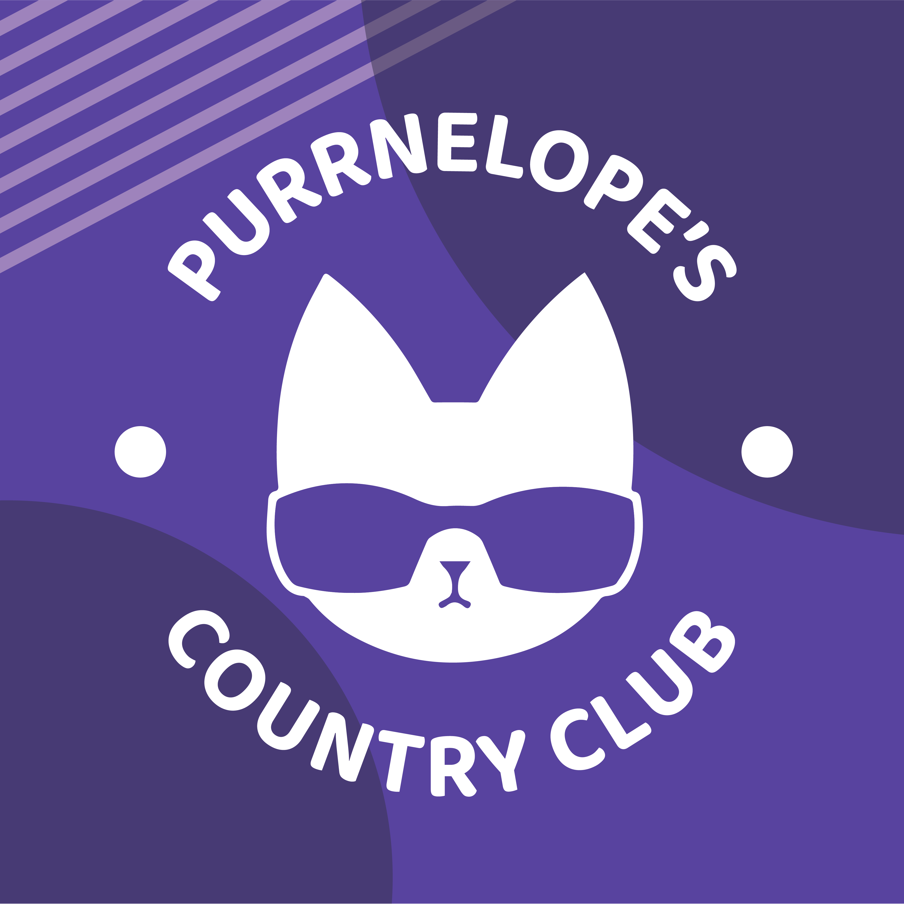
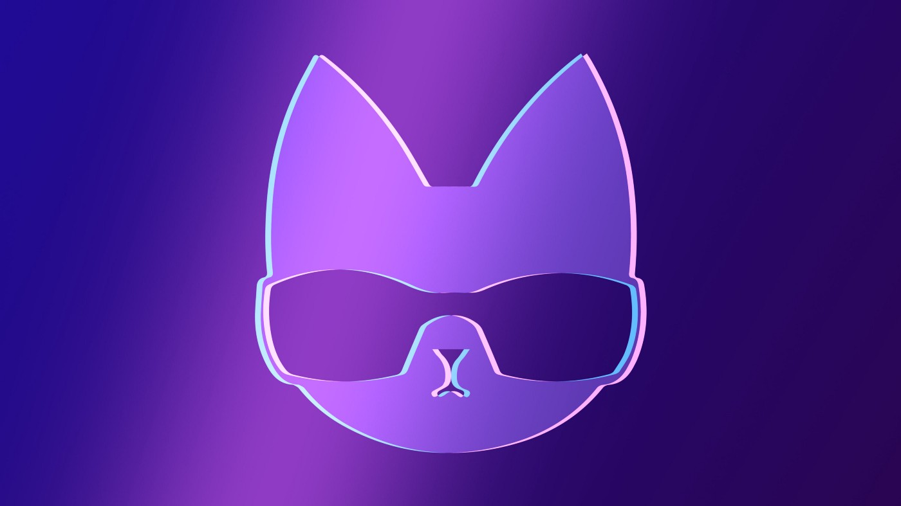
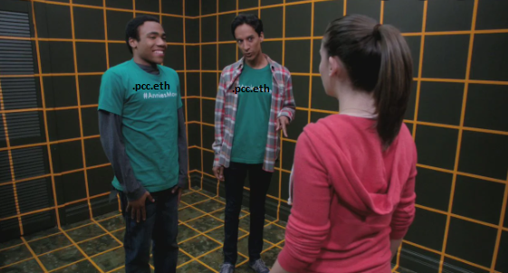

First, lets talk about why we are revamping this. The old Ambassador system had a problem, the old system was manual. Any holder could make themselves an ambassador, we then had to manually remove anyone without a PCC profile picture, this was not only a pain, it was gameable. With nitro you could change your pfp in just our server to a purr. We knew this, we even told people how to do it, we are open with systems flaws, we have just been working on changing that.<!--truncate-->

Enter, the .pcc.eth sub-domain.

With a .pcc.eth domain name, you can’t pretend to have it. You can’t mint an NFT of an image of a .pcc.eth and get a hexagon on twitter. It can’t be done, you can’t fool the ethereum block chain.

Using this information, we can then look at twitter and discord and if your name matches across all three platforms (Registered .pcc.eth, with the same name in your twitter account and discord account) you will automatically receive the new Ambassador role. We are flipping this over from the old role and we are tactically doing this while there are no perks to having the role. So we aren’t rugging you of anything, there is no discussion on funds at the moment, all other benefits are to be returned and revamped shortly, consider this transition a time to prepare.

I understand some people have been with us from the start, have had their pfp as a purr since mint and may feel they don’t want to meet the new requirements for the role. THAT IS PURRFECTLY OK. You are not a second class citizen, you are not going to be shunned by the community. The goal is very much for you to still benefit from this change, albeit, less than Ambassadors. This is a change, that if you join me in the dreamatorium, is going to change the space pretty heavily. It is the first small step, that if you can just unlock your mind ever so slightly you might peek into a world of infinite possibilities. The change was needed to push us forward and while we completely appreciate everything our Ambassadors that will not be future Ambassadors have done for us, we hope you will in time see this was a necessary change to launch PCC into the stratosphere. We really want you to stick around as a Country Club Member, I want to make that very clear — you are still very much loved!

We have seen games released by many projects of late that are: Send transaction, receive prize. What does prize do, not sure yet? Why do we see lots of these? Because this type of game is really really hard to crack and this space does not rest. The twitterverse wants everything and the twitterverse wants everything now. Projects push to get a little part of their vision to your fingertips as soon as they can leaving people underwhelmed as they are seeing a work in progress. There are many wonderful people that give their favourite projects time, the loudest people, do not.

Why are you special, why have you managed to crack it where they haven’t? Easy — I haven’t!

This was never a game, it isn’t a game. However, as we were planning the upcoming utility; how we would utilize the power that linking your wallet to proof of ownership to twitter and discord along with proof of other things, following certain people, tweeting hashtags, tweeting fan art… it unlocked the feeling a game was building.

So while no one on r/battlestations would ever consider what we are launching a game, which is the same for the current state of click simulators, I do think we are onto something. Some people may think of this as a social experiment.

Leaderboards. Leaderboards are a huge part of the psychology of gaming. We hadn’t even launched our bot for people to get a follower score yet we were bombarded with requests, people wanting to see if they followed every .pcc.eth out there.

I do want to stress a fully fledged NFTWorlds, Entity Builds built game is very much in the works. A proper thing we can call a game and be very proud to call it as such.

That won’t stop me from diving deep into the possibilites this new Ambassador program allows. We want to encourage people to register a .pcc.eth and increase that bond with your cat along with adding to its utility. Therefore, after we have fully settled into the new roles in a few weeks, we will be running an automatic weekly Kitten (/ Other Companion once out later this month), giveaway. Every week, one registered .pcc.eth will recieve a tier three, automatically — we already have your wallet! Just having a .pcc.eth enters you, nothing else required, ez pz.

For the Ambassadors we bump this up to a full on Tier 1 Purrnelopes Country Club cat. One Ambassador a week will win a PCC if they complete that week’s quest. Quest, did you just say quest, like, in a game? Yeah I did, like I said, I am leaning into it! There are plenty of things we can automatically check, are you following all .pcc.eths? Have you retweeted a certain tweet we assigned? Have you tweeted with a certain hashtag? Have you liked 10 other .pcc.eths tweets this week?

These are not the quests currently in my head, these are the examples of what can be done. Now just sit there for a few mins and really think, what is the difference between us telling you to like ten tweets from your fellow community members and a game that asks you to send a transaction to search a cave you will never really go in? Connection, communication, community building. This idea builds the strength of the community, publicly, while we reward our active community members.

My brain instantly tries to break any set up like this. We have gone through plenty of iterations breaking each system one by one.We will be careful, I am well aware one of the first things people will think, oh no, here comes the obnoxious spam. That is not the goal, I have lived in this community for nearly 5 years, I know how to interact and I know how communities look when they do certain things. Don’t worry, this power will be wielded responsibly. Retweet an important tweet of ours, like each others tweets, hurl abuse at NateAlex, only the most important of quests will be assigned.

TL:DR — We are here: [https://www.youtube.com/watch?v=gipL_CEw-fk](https://www.youtube.com/watch?v=gipL_CEw-fk)

This system isn’t better, just like the internet wasn’t better than radio + taperecorder in this clip. Like I said before, join me in the dreamatorium and suddenly you may see a similar future to me of leaderboards, quests, clans and DAOs.

I will see you on the otherside…
