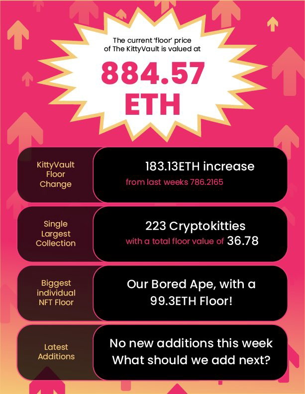

import {EmbedTweet} from '@site/src/components/Social'

<iframe src="https://www.youtube.com/embed/BoMaDh08Z3E" title="YouTube video player" frameborder="0" allow="accelerometer; autoplay; clipboard-write; encrypted-media; gyroscope; picture-in-picture" allowFullScreen></iframe>

<!--truncate-->

## Purrnelope’s Country Club Weekly Update: week of January 31st 2022

Our very own [Carlini](https://twitter.com/Carlini8N?s=20) has lost it. Really lost it this time. He’s still giving away NFTs at an alarming rate. For goodness sake [he gave 5.6 ETH worth of purrs (using current floor value of 0.28 ETH)](https://twitter.com/Carlini8N/status/1489744713527840770) to [Vest.pcc.eth](https://twitter.com/avestaa) and he keeps going!

He’s also rambling on and on about how he eats, sleeps, drinks, and bathes with $TOKEN. Maybe if you — yes, you — went and gave him some ideas about what you’d want to spend $TOKEN on he’d finally get some rest!

<EmbedTweet>
  

    Like, RT, Follow  I am giving away a
    <a href="https://twitter.com/PurrnelopesCC?ref_src=twsrc%5Etfw"
      >@PurrnelopesCC</a
    >
    everyday.   I will be rolling all the previously unrolled tweets
    tomorrow.   Can you solve the yielding token sink?  Make
    my life easy plz  What would you spend a token you yielded on from
    an NFT, instead of dumping for eth?
  

  &mdash; carlini8.pcc.eth (@Carlini8N)
  <a
    href="https://twitter.com/Carlini8N/status/1490483693131026437?ref_src=twsrc%5Etfw"
    >February 7, 2022</a
  >
</EmbedTweet>

In other news, our KittyVault has swelled to an over 840 ETH valuation! Rumor has it there’ll be a vote that may include some options for the KittyVault too! Be sure to follow the [KittyVault](https://twitter.com/KittyVault?s=20) on twitter to stay up to date!

KittyVault Newsletter Volume 7

That’s all for now, Mini Meow!
