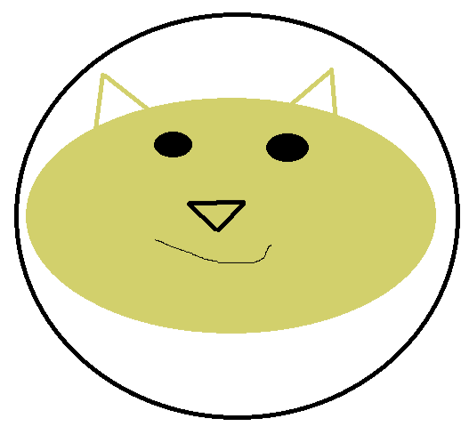
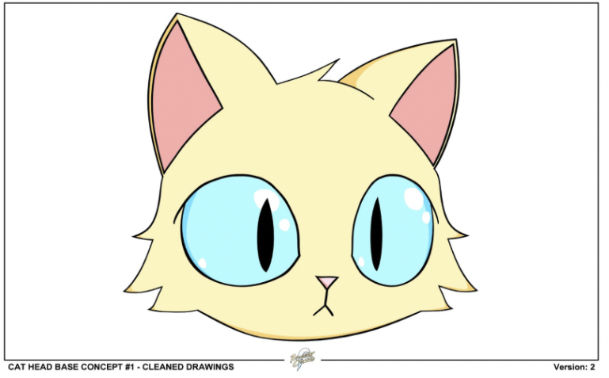

import {EmbedTweet} from '@site/src/components/Social'

<iframe src="https://www.youtube.com/embed/5DuKm15p53w" title="YouTube video player" frameborder="0" allow="accelerometer; autoplay; clipboard-write; encrypted-media; gyroscope; picture-in-picture" allowFullScreen></iframe>

<!--truncate-->

# Purrnelope’s Country Club Weekly Update: week of February 14th 2022

Last Saturday a hacker executed a phishing scam which affected 32 wallets and stole 254 NFTs. This tweet thread is a good technical rundown of how the hacker executed the scam:

<EmbedTweet>
  

    1) Sharing a technical run-down of the phishing attacks targeting
    <a href="https://twitter.com/opensea?ref_src=twsrc%5Etfw">@OpenSea</a>
    users, including some web3 technical education. 👇
  

  &mdash; Nadav Hollander (@NadavAHollander)
  <a
    href="https://twitter.com/NadavAHollander/status/1495509511179755530?ref_src=twsrc%5Etfw"
    >February 20, 2022</a
  >
</EmbedTweet>

In layman’s terms, NFT holders were tricked into signing a message which authorized the hacker to buy the users’ NFTs. On Saturday the hacker utilized those approvals to transfer NFTs to their own wallet and then sell the NFTs. A great way to protect yourself is to understand what you are signing and what to expect when you interact with websites. Please come to our [discord](https://discord.gg/purrnelopescountryclub) and ask questions so we can help you!

While our future is bright it is helpful to look backwards every once in a while. This is what Carlini sent as the original mock up for the Purrnelope Country Club NFT art:

Feel free to right click | save as that for future use.

Going from that monstrosity to this beauty…

…takes a deft hand and that’s what we have in 1rregularCharlie. We are proud that Charlie is a part of our team and is treated and compensated as an equal member. Keep an eye out because some of the next art coming out may be their best work yet!

Oh, Friday is going to be a big day. You should be following us on [twitter](https://twitter.com/purrnelopescc), in our [discord](https://discord.gg/purrnelopescountryclub), following us on [TikTok](https://www.tiktok.com/@purrnelopescountryclub) and on [YouTube](https://www.youtube.com/channel/UCDNEK69wV4wkYeIb-WTshUQ?app=desktop)!

Mini meow!
