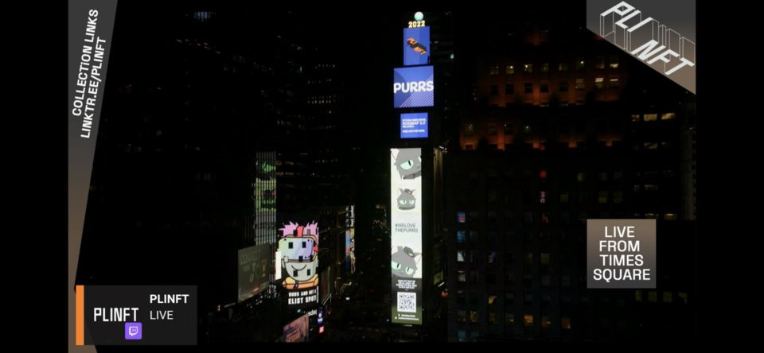

import {EmbedTweet} from '@site/src/components/Social'

<iframe src="https://www.youtube.com/embed/Tkp1RdfGbwA" title="YouTube video player" frameborder="0" allow="accelerometer; autoplay; clipboard-write; encrypted-media; gyroscope; picture-in-picture" allowFullScreen></iframe>

<!--truncate-->

# Purrnelope’s Country Club Weekly Update: week of March 7th 2022

In New York…  
Concrete jungle where dreams are made of..  
There’s nothin’ you can’t do…  
Now you’re in New York…  
But one week ago the Purrs lit up Times Square courtesy of [PLINFT](https://www.plinft.xyz/).

Thanks to all the Purrs featured in the bright lights and this is but one step on our path. We’ll give you many more ways to show off those Purrs coming up!

One other way you can showcase your Purr is in a case just like these:

<EmbedTweet>
  

    Check out these
    <a
      href="https://twitter.com/hashtag/slabbedcats?src=hash&amp;ref_src=twsrc%5Etfw"
      >#slabbedcats</a
    >. If you fancy a @niftyslab of your cat or kitten, head over to
    <a href="https://t.co/L0ZxSqP233">https://t.co/L0ZxSqP233</a> for more
    information. If you&#39;ve already slabbed your cat, show us below!
    <a
      href="https://twitter.com/hashtag/welovethepurrs?src=hash&amp;ref_src=twsrc%5Etfw"
      >#welovethepurrs</a
    >
    ♥️👇 <a href="https://t.co/fbJtgEEorF">pic.twitter.com/fbJtgEEorF</a>
  

  &mdash; Purrnelope&#39;s Country Club (@PurrnelopesCC)
  <a
    href="https://twitter.com/PurrnelopesCC/status/1503649732257849347?ref_src=twsrc%5Etfw"
    >March 15, 2022</a
  >
</EmbedTweet>

Head over to [https://niftyslabs.com/how-it-works/](https://niftyslabs.com/how-it-works/) to see how you can get your own slabs made!

**Exclusively** in our discord we hosted the great [Jay Stansfield](https://twitter.com/jaystansfield) who shared some demos of the songs featured on our vinyl airdrop and they sound awesome! But that’s not all, Jay also started writing a song featuring our collectors’ personal Purrs!

Last and certainly not least we offer the warmest welcome to Chooch74! They joined our team recently and will lead our Business Development & Strategy helping us grow like never before. Look out for some big moves from us in 2022 :)

That’s all for now,

Mini Meow!
