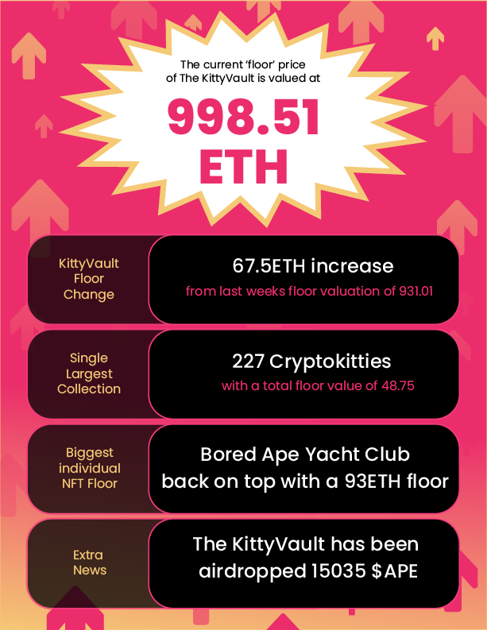

<iframe src="https://www.youtube.com/embed/H89hl27NZc8" title="YouTube video player" frameborder="0" allow="accelerometer; autoplay; clipboard-write; encrypted-media; gyroscope; picture-in-picture" allowFullScreen></iframe>

<!--truncate-->

# Purrnelope’s Country Club Weekly Update: week of March 14th 2022

🚨🚨🚨ALERT🚨🚨🚨

You aren’t following all of the twitter accounts showcasing their .pcc.eth ens subdomain!  
To remedy this error click [**_here_**](https://twitter.com/search?q=.pcc.eth&src=typed_query&f=user) and smash the follow button!

Wait, you don’t have your own **.pcc.ens** subdomain?! Go [here](https://t.co/JEdQU6poUw) to fix that critical issue. Should you run into any issues please see our discord channel #lobby-bar lobby [here](https://discord.gg/pENe5hw828).

<blockquote class="twitter-tweet">
  

    This is your daily reminder that .pcc.eth is so much stronger on twitter dot
    com than a pfp because you can search for .pcc.eth
     
     
    Go follow them: <a href="https://t.co/7dpD3JpkqD">
      https://t.co/7dpD3JpkqD
    </a>
     
     
    Go get yours: <a href="https://t.co/JEdQU6poUw">https://t.co/JEdQU6poUw</a>
     
     
    Website 2.0 on the way SoonTM
  

  &mdash; carlini8.pcc.eth (@Carlini8N){" "}
  <a href="https://twitter.com/Carlini8N/status/1505637148732674062?ref_src=twsrc%5Etfw">
    March 20, 2022
  </a>
</blockquote>

**\~\~Back to our regularly scheduled weekly news and notes\~\~**

On Sunday 3/20/22 we co-hosted a poker night on [betonline.ag](https://www.betonline.ag/) with our friends at [Knights of Degen](https://twitter.com/knightsofdegen) and [Pieland](https://twitter.com/PielandNFT). The only way to play was to hold an Purr NFT (Cat or Kitten), Knight of Degen or Pieland so be sure to [pick one up](https://opensea.io/collection/purrnelopes-country-club) if you haven’t yet!

The KittyVault has been on an absolute tear lately, up to a 998.51 ETH floor valuation as of Friday March 18th. This is a 67.5 ETH increase week over week and a sneak peek into the future, the vote to sell the KittyVault’s $APE airdrop [**passed**](https://snapshot.org/#/purrnelopescountryclub.eth/proposal/0x6f1a3689060cfb7dcb5f1bc90b526de943b72af2926a528fbfa0f62c7c386691) with 76.92% of voters voting YES. Next up we’ll have a vote on what to do with the ETH we sell the $APE for so get in our discord and share your ideas!

That’s all for now,

Mini Meow!
