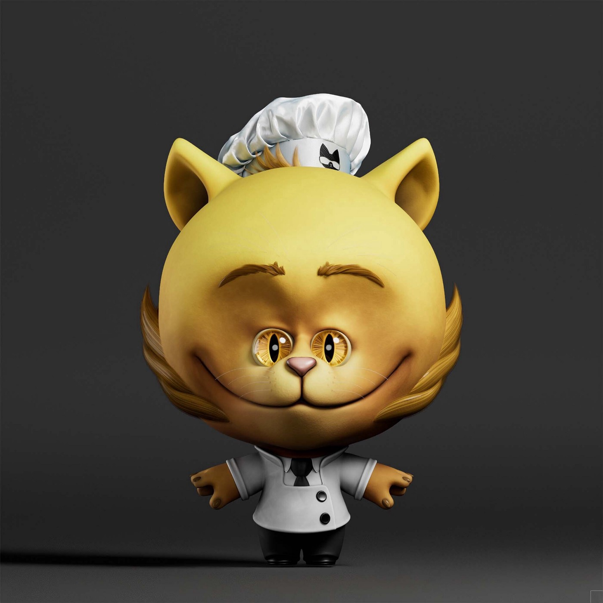

<iframe src="https://www.youtube.com/embed/-6ERsPpJPzE" title="YouTube video player" frameborder="0" allow="accelerometer; autoplay; clipboard-write; encrypted-media; gyroscope; picture-in-picture" allowFullScreen></iframe>

<!--truncate-->

Purrnelope’s Country Club Weekly Update: week of March 21st 2022
===

**GREAT NEWS!** Purrnelope’s Country Club is now an exclusive partner with [Gino’s Big Town Chef!](https://www.bigtownchef.com/) This partnership has been in the works for over a year and we’re so excited this time has come. If you don’t know Gino, he’s a world renowned chef who holds 3 Michelin stars, written 15 cook books and many many TV appearances where he both cooks and hosts.

What is Gino’s Big Town Chef? It’s a play to earn farming, trading and cook-off battle game where players will be rewarded with and use $BURP and increase their XP by participating in the game. See the [Blueprint](https://uploads-ssl.webflow.com/617b017e5f4a890aaa9706d1/62440732e2175b47813bfc3d_Gino%27s%20Big%20Town%20Chef%20%E2%80%93%C2%A0Mayor%20Burp%27s%20Blueprint.pdf) for more!

Okay okay, cool game cool project but what does it mean for me as a PCC holder? We have 200 spots for their upcoming genesis mint to give away to PCC holders! The exact mechanism for distributing these spots is to be determined but we’ll be sure to let you know [here](https://www.purrnelopescountryclub.com/) or [here](https://purrnelope.medium.com/) or [here](https://twitter.com/purrnelopescc) or [here](https://t.co/mP4iKQvS0H) or [here](https://www.tiktok.com/@purrnelopescountryclub) or [here](https://www.youtube.com/channel/UCDNEK69wV4wkYeIb-WTshUQ).

Oh, and the team at Gino’s Big Town Chef gifted Carlini an honorary!

We did it!!! The KittyVault floor valuation eclipsed 1,000 ETH this past week with the latest additions of //ESSENCE from [fvckrender](https://twitter.com/fvckrende), VeeCon Tickets for holding VeeFriends and 56 ETH from our sale of $APE. Speaking of $APE, we had a Twitter [spaces](https://twitter.com/i/spaces/1eaKbNPjyvqKX) to talk about next steps with our $APE and we are soliciting ideas on what to do with the ETH in the KittyVault. Shall we invest, keep the ETH for a rainy day? Come to our [discord](https://t.co/mP4iKQvS0H) to share your thoughts!

Closing out the week Carlini joined Jennifer Sutto and Michael Keen on their podcast [NFT Catcher](https://twitter.com/PurrnelopesCC/status/1507009355865939968) where they covered NFTs in the olden days (2017), how Carlini mints NFTs these days, wallet security, NBA TopShot and more!

That’s all for now,

Mini Meow!
