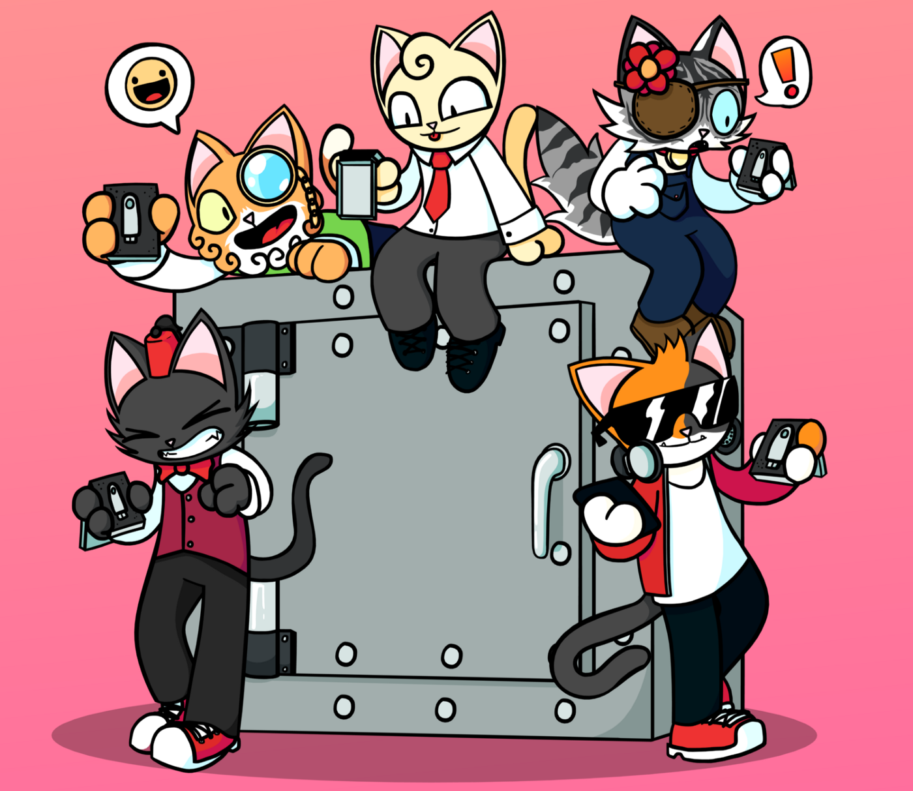

<iframe src="https://www.youtube.com/embed/V8fy5DmizJs" title="YouTube video player" frameborder="0" allow="accelerometer; autoplay; clipboard-write; encrypted-media; gyroscope; picture-in-picture" allowFullScreen></iframe>

<!--truncate-->

# Purrnelope’s Country Club Weekly Update: week of March 28th 2022

In case you missed it, OpenSea shows a new icon in an NFT Item Activity and PCC just added one such activity on Tuesday when our 7th airdrop landed in our holders’ wallets! This is the Ledger Cat which will be redeemable for a CUSTOM Purrnelope’s Country Club L[edger Nano S](https://shop.ledger.com/products/ledger-nano-s)! Once available, holders can use three Ledger Cats to receive one Ledger Nano S. Check out Katie explaining more and offering some useful hardware wallet security tips:

<iframe src="https://www.youtube.com/embed/GRRr2ZqqOE4" title="YouTube video player" frameborder="0" allow="accelerometer; autoplay; clipboard-write; encrypted-media; gyroscope; picture-in-picture" allowFullScreen></iframe>

Carlini’s media tour rolls on and this time he joined Carly Reilly on the Overpriced JPEGs podcast:

[Overpriced JPEGs: The Past & Future of NFTs with Carlini8](../3rd-party/2022-03-30-overpriced-jpegs.md)

Oh, you want the tl;dr? You should really watch it to learn more about ENS subdomains, how to fairly launch a project using a Dutch Auction

\*spoiler alert\*

few projects are using Carlini’s recommended method!

And more!

As a palate cleanser to Carlini’s fully loaded interview with Carly on Overpriced JPEGs, you can retroactively hang with Papa on this Purrcast spaces where he casually loses his mind :)

[PurrCast: SOLO ROUND - Mar 30, 2022](../purrcast/2022-03-30.md)

That’s all for now, Mini Meow!
