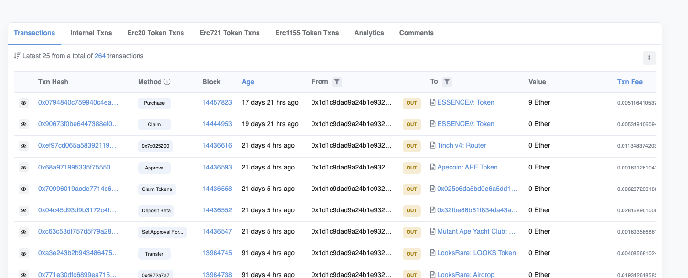
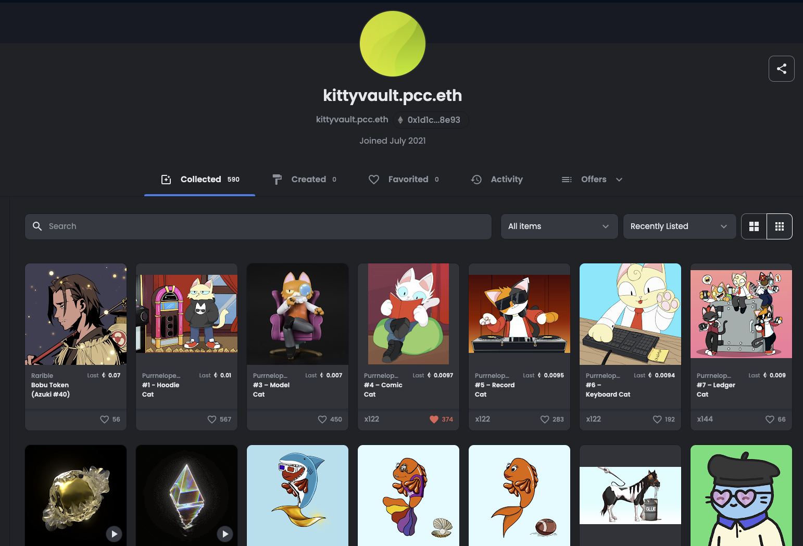
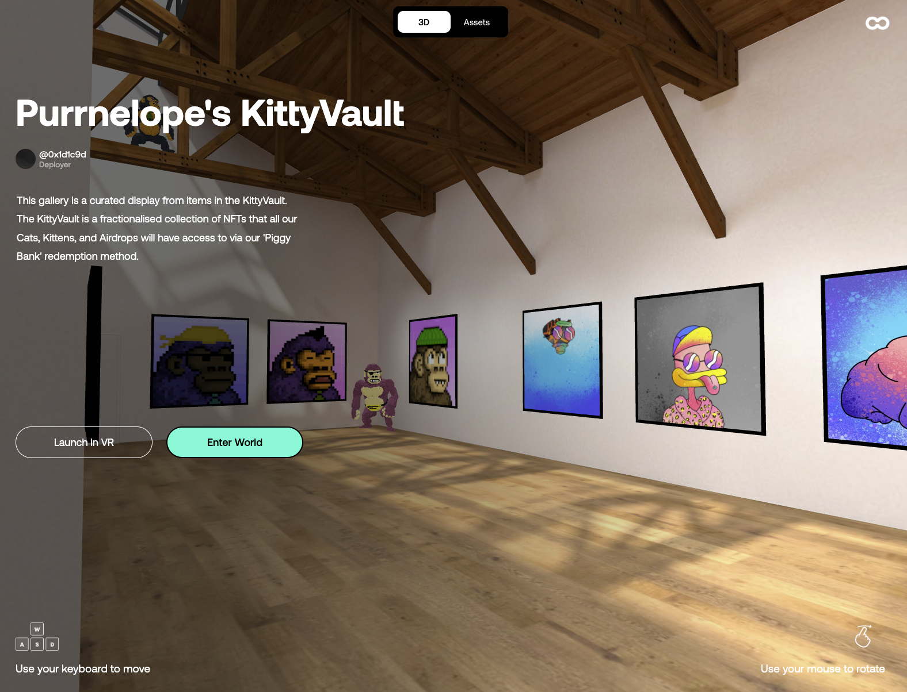

<iframe src="https://www.youtube.com/embed/oLUtdqJmAJ0" title="YouTube video player" frameborder="0" allow="accelerometer; autoplay; clipboard-write; encrypted-media; gyroscope; picture-in-picture" allowFullScreen></iframe>

<!--truncate-->

# Purrnelope’s Country Club Weekly Update: week of April 4th 2022

**Original:**

source: [https://etherscan.io/address/0x1d1c9dad9a24b1e9324605153906d584520b8e93](https://etherscan.io/address/0x1d1c9dad9a24b1e9324605153906d584520b8e93)

**Better:**

[https://opensea.io/0x1d1c9Dad9A24b1E9324605153906d584520b8e93](https://opensea.io/0x1d1c9Dad9A24b1E9324605153906d584520b8e93)

**Best:**

source: [https://oncyber.io/spaces/RKJMFEwiVG8f6V1aPL08](https://oncyber.io/spaces/RKJMFEwiVG8f6V1aPL08)

## Purrnelope's KittyVault

### Fully immersive NFT show on Cyber.

[https://oncyber.io/spaces/RKJMFEwiVG8f6V1aPL08](https://oncyber.io/spaces/RKJMFEwiVG8f6V1aPL08)

Come browse the kitty vault in an immersive gallery on oncyber.io! You can choose simple 3D or even VR to ooh and aah at our NFTs. Come for the CryptoKitties, stay for the Squiggles!

On the social media front, Papa and Katie held a spaces with our friends Matthew Lilard and Bill Whirity of Midnite Movie Club. If you were there you were offered a golden ticket (aka a presale spot!) to the Midnite Movie Club mint on 4/20. Even though you missed out on a golden ticket you can still listen to them share their vision for making movies in public using web3 and all about their project [here](https://twitter.com/i/spaces/1BdGYwWNNyvxX)!

That’s all for now,  
Mini Meow!
