PCC Team started using Purrnelope's Planner each week since Feb 7, 2022.

## 2022 Q4 Archive

### 2022 Week 42

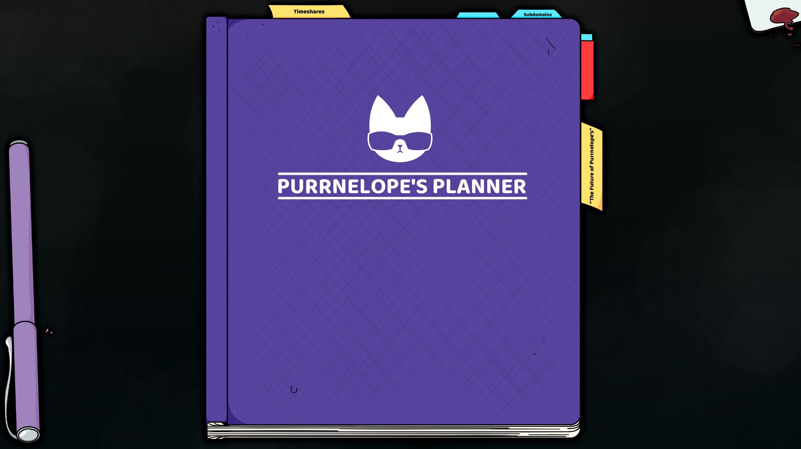

- Source: [Tweet](https://twitter.com/PurrnelopesCC/status/1582114227707203585)
- Sticky Notes:
  - Timeshares
  - Subdomains
  - The Future of Purrnelope's

### 2022 Week 41

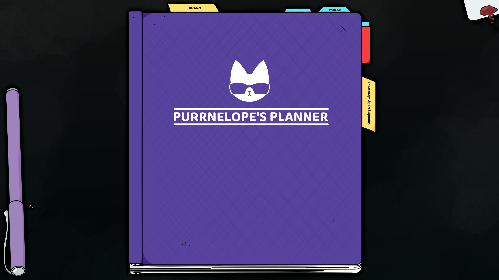

- Source: [Tweet](https://twitter.com/PurrnelopesCC/status/1579577513960841216)
- Sticky Notes:
  - DOGS?!
  - Papa 2.0
  - Questing Daily Giveaways

### 2022 Week 40

- Source: [Tweet](https://twitter.com/PurrnelopesCC/status/1577040800831066114)
- Sticky Notes:
  - NEXUS
  - Papa 2.0
  - Qué significa eso?

## 2022 Q3 Archive

### 2022 Week 39

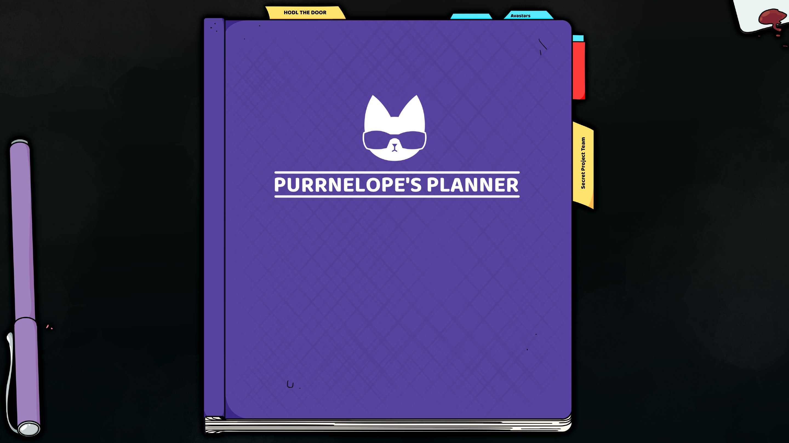

- Source: [Tweet](https://twitter.com/PurrnelopesCC/status/1574504087793582080)
- Sticky Notes:
  - HODL THE DOOR
  - Avastars
  - Secret Project Team

### 2022 Week 37

- Source: [Tweet](https://twitter.com/PurrnelopesCC/status/1569430652931416075)
- Sticky Notes:
  - REDACTED
  - REDACTED
  - REDACTED

### 2022 Week 36

- Source: [Tweet](https://twitter.com/PurrnelopesCC/status/1566893938018881537)
- Sticky Notes:
  - $TOKEN
  - The dead speak
  - JAMIEGAVEMETHISCODE

### 2022 Week 35

- Source: [Tweet](https://twitter.com/PurrnelopesCC/status/1564357223010013184)
- Sticky Notes:
  - Community Nights
  - Boarding Pass
  - Size Chart

### 2022 Week 34

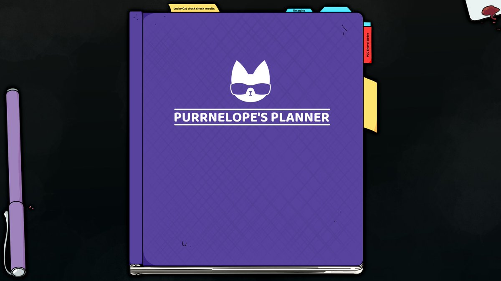

- Source: [Tweet](https://twitter.com/PurrnelopesCC/status/1561820505442844673)
- Sticky Notes:
  - Lucky Cat stock check results
  - /imagine
  - PCC Shovel Order

### 2022 Week 33

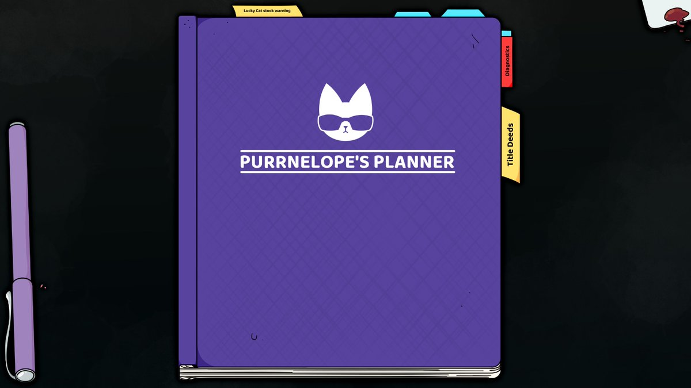

- Source: [Tweet](https://twitter.com/PurrnelopesCC/status/1559268691069571074)
- Sticky Notes:
  - Lucky Cat stock warning
  - Title Deeds
  - Diagnostics

### 2022 Week 32

- Source: [Tweet](https://twitter.com/PurrnelopesCC/status/1556747079891857408)
- Sticky Notes:
  - International Cat Day
  - Planning Permission
  - Lucky Cat Access Codes

### 2022 Week 31

- Source: [Tweet](https://twitter.com/PurrnelopesCC/status/1554195260925952000)
- Sticky Notes:
  - Quest Rewards
  - $Tokenomics
  - Metabrew Proposal

### 2022 Week 30

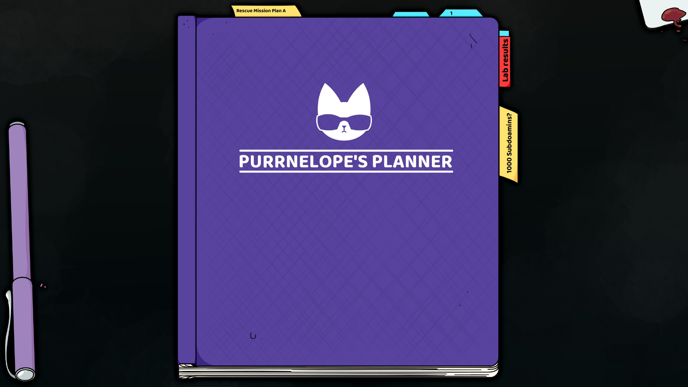

- Source: [Tweet](https://twitter.com/PurrnelopesCC/status/1551658545208332292)
- Sticky Notes:
  - Rescue Mission Plan A
  - 1
  - Lab results
  - 1000 Subdoamins?

### 2022 Week 29

- Source: [Tweet](https://twitter.com/PurrnelopesCC/status/1549123340018716672)
- Sticky Notes:
  - DANGEROUS DO NOT OPEN
  - WENMINT
  - Wave 1 Allowlist

### 2022 Week 28

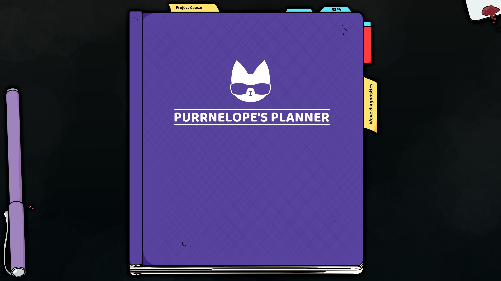

- Source: [Tweet](https://twitter.com/PurrnelopesCC/status/1546585119841869824)
- Sticky Notes:
  - Project Caesar
  - RSVP
  - Wave diagnostics

### 2022 Week 27

- Source: [Tweet](https://twitter.com/PurrnelopesCC/status/1544048402496888832)
- Sticky Notes:
  - Local Mechanics
  - Quiz answers
  - 4YEXDA8V2510

## 2022 Q2 Archive

### 2022 Week 26

- Source: [Tweet](https://twitter.com/PurrnelopesCC/status/1541511686737248265)
- Sticky Notes:
  - Beach Party invites
  - 招き猫 (Maneki-neko)
  - E5VN2ZK37XRQ

### 2022 Week 25

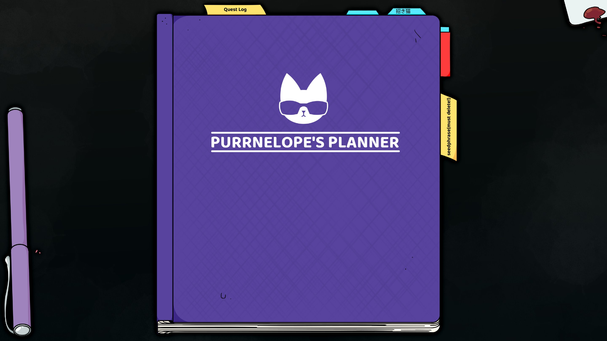

- Source: [Tweet](https://twitter.com/PurrnelopesCC/status/1538967168531898370)
- Sticky Notes:
  - Quest Log
  - 招き猫 (Maneki-neko)
  - seedphrase(must delete!)

### 2022 Week 24

- Source: [Tweet](https://twitter.com/PurrnelopesCC/status/1536431208388694017)
- Sticky Notes:
  - Reporter Cat Problem
  - Bear Plans
  - TCJ Suite Detailing

### 2022 Week 23

- Source: [Tweet](https://twitter.com/PurrnelopesCC/status/1533894745738518528)
- Sticky Notes:
  - 13k Followers?
  - Blueprints
  - Best Number?

### 2022 Week 21

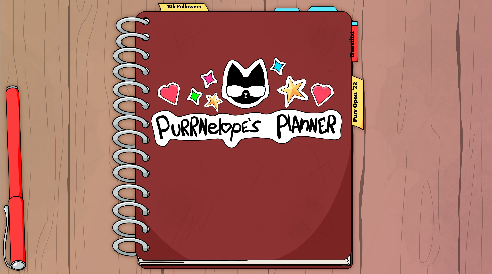

- Source: [Tweet](https://twitter.com/PurrnelopesCC/status/1528820559701635074)
- Sticky Notes:
  - 10k Followers
  - Guestlist
  - Purr Open '22

### 2022 Week 20

- Source: [Tweet](https://twitter.com/PurrnelopesCC/status/1526283846471274505)
- Sticky Notes:
  - Grandmas / [Grandmas](../../collections/grandmas/index.md)
  - Merch 2.0
  - Demo Dec '21

### 2022 Week 19

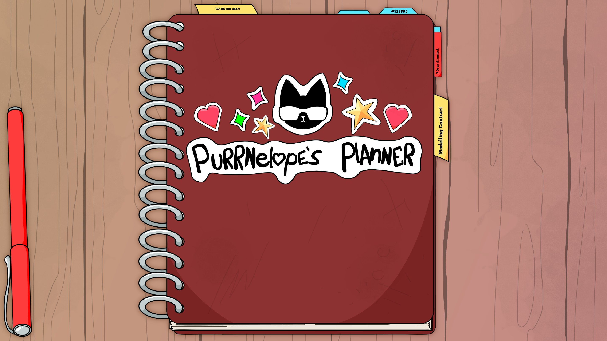

- Source: [Tweet](https://twitter.com/PurrnelopesCC/status/1523747130376138752)
- Sticky Notes:
  - EU-US size chart / [Merch](../../merch/index.md)
  - #523F95
  - 7 Days till arrival
  - Modelling Contract

### 2022 Week 18

- Source: [Tweet](https://twitter.com/PurrnelopesCC/status/1521210416247951360)
- Sticky Notes:
  - Purrtual Reality
  - #523F95
  - Ambassadorbot diagnositics
  - Raw Photoshoot jpgs

### 2022 Week 17

- Source: [Tweet](https://twitter.com/PurrnelopesCC/status/1518673700823834626)
- Sticky Notes:
  - Airdrops: Completed / [Purrks Series 1](../../collections/kittyvault-purrks/index.md#purrks-supseries-1sup-purrks)
  - PCC Phase 2
  - Shillbot3000 upgrades

### 2022 Week 16

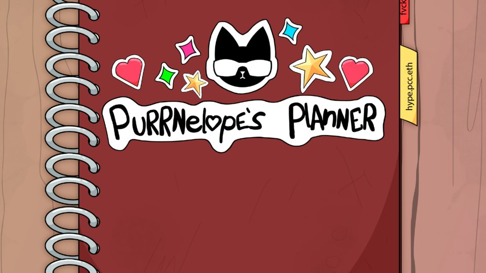

- Source: [Tweet](https://twitter.com/PurrnelopesCC/status/1516137026235547655)
- Sticky Notes:
  - fvck ...
  - hype.pcc.eth

### 2022 Week 15

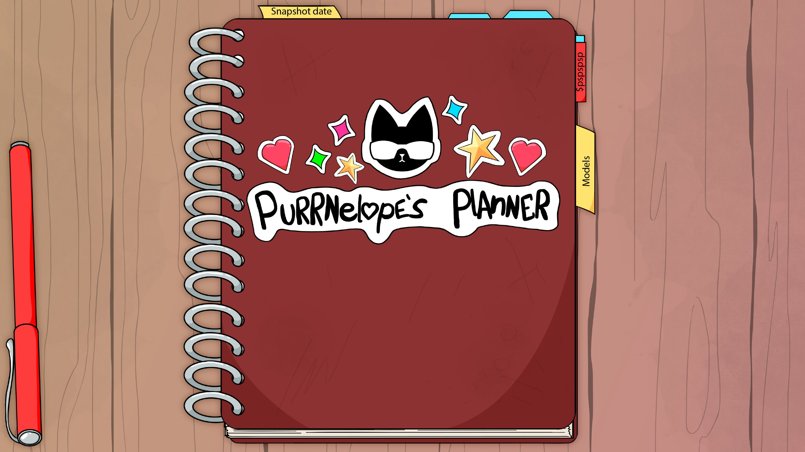

- Source: [Tweet](https://twitter.com/PurrnelopesCC/status/1513600307791544329)
- Sticky Notes:
  - Snapshot date
  - $pspspsp
  - Models / [3D Model](../../merch/pcc-model-cat.md)

### 2022 Week 14

- Source: [Tweet](https://twitter.com/PurrnelopesCC/status/1511059802444738573)
- Sticky Notes:
  - Airdrop#8 / [Grandma's Nightstand](../../collections/kittyvault-purrks/8-grandma-s-nightstand.md)
  - Roadtrip
  - Passwords

## 2022 Q1 Archive

### 2022 Week 12

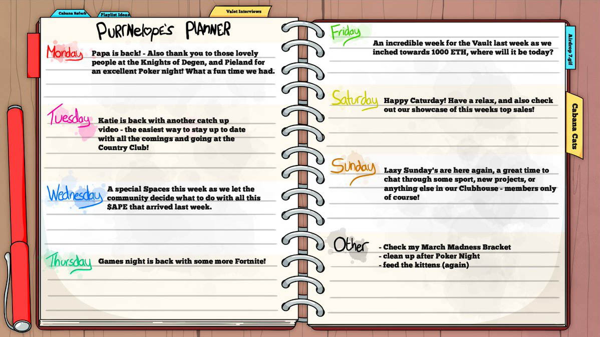

- Source: [Tweet](https://twitter.com/PurrnelopesCC/status/1505824030120726528)
- Sticky Notes:
  - Cabana Refurb
  - Playlist Ideas
  - Valet Interviews
  - Airdrop 7.gif / [Ledger Cat](../../collections/kittyvault-purrks/7-ledger-cat.md)
  - Cabana Cats

### 2022 Week 11

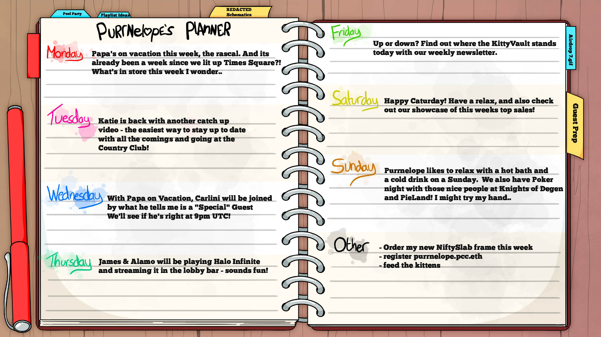

- Source: [Tweet](https://twitter.com/PurrnelopesCC/status/1503287342638981120)
- Sticky Notes:
  - Pool Party
  - Playlist Ideas
  - REDACTED Schematics
  - Airdrop 7.gif / [Ledger Cat](../../collections/kittyvault-purrks/7-ledger-cat.md)
  - Guest Prep

### 2022 Week 10

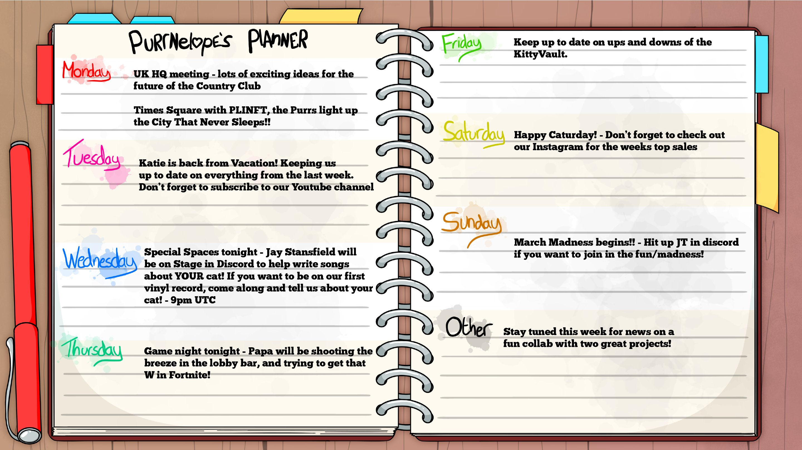

- Source: [Tweet](https://twitter.com/PurrnelopesCC/status/1500939344374345731)

### 2022 Week 9

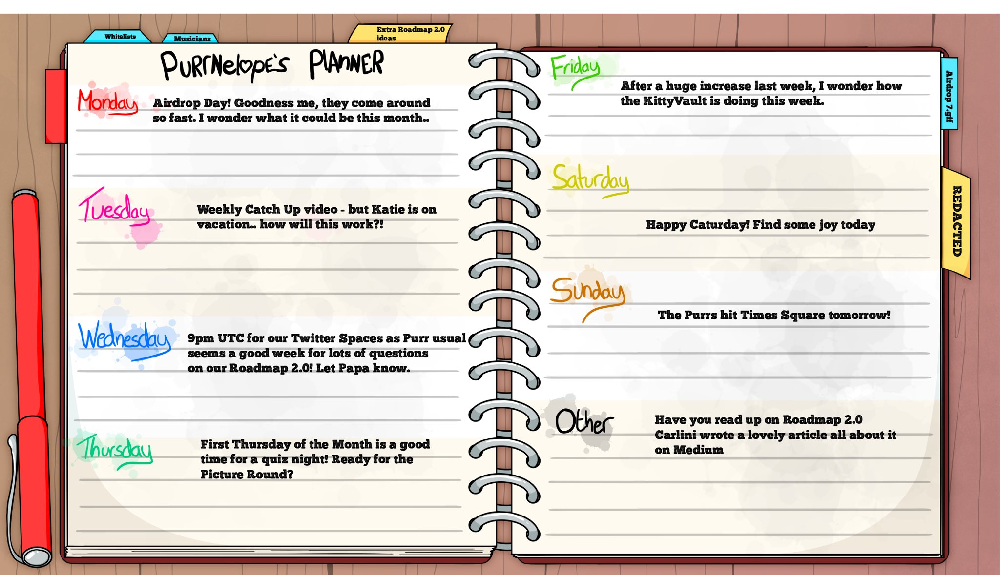

- Source: [Tweet](https://twitter.com/PurrnelopesCC/status/1498299847253934081)
- Sticky Notes:
  - Whitelists
  - Musicians
  - Extra Roadman2.0 ideas
  - Airdrop 7.gif / [Ledger Cat](../../collections/kittyvault-purrks/7-ledger-cat.md)
  - REDACTED

### 2022 Week 8

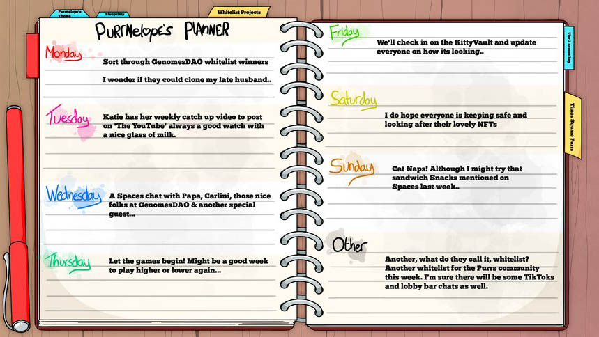

- Source: [Tweet](https://twitter.com/PurrnelopesCC/status/1495775344560939008)
- Sticky Notes:
  - Purrnelope's Theme
  - ...
  - Whitelist Projects
  - Tier ...
  - Times Square Purrs / [Video](/posts/2022/03/07/post/times-square)

### 2022 Week 7

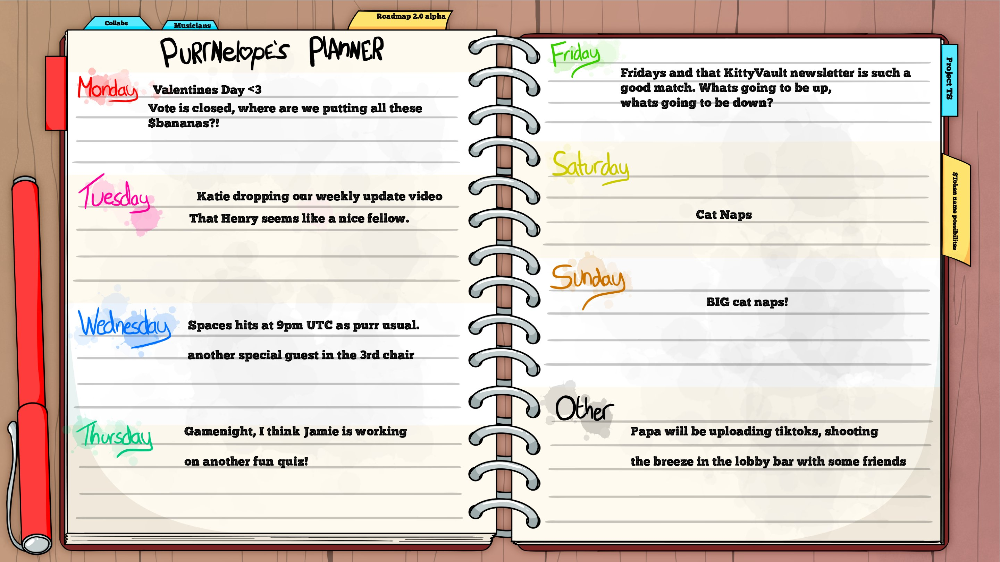

- Source: [Tweet](https://twitter.com/PurrnelopesCC/status/1493283910133837824)
- Sticky Notes:
  - Collabs
  - Musicians
  - Roadmap 2.0 alpha / [Roadmap 2.0 Post](/posts/2022/02/25/post/roadmap-2-0-6-months-on-from-launch)
  - Project TS
  - $Token name possibilites

### 2022 Week 6

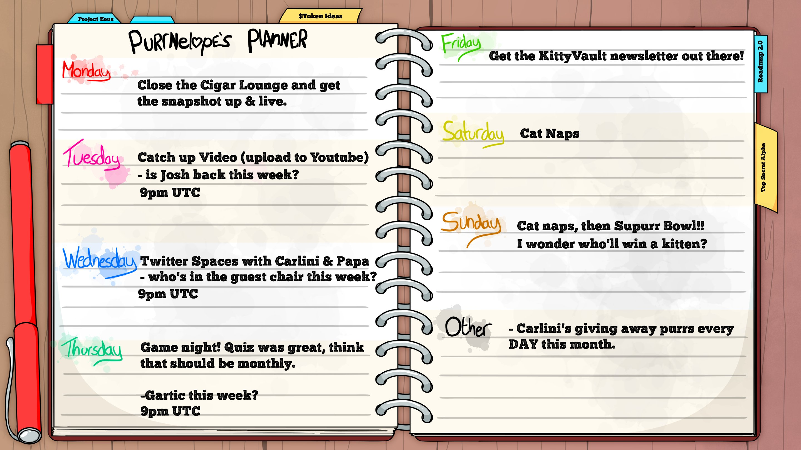

- Source: [Tweet](https://twitter.com/PurrnelopesCC/status/1490789361339797504)
- Sticky Notes:
  - Project Zeus
  - $Token Ideas
  - Roadmap 2.0 / [Roadmap 2.0 Post](/posts/2022/02/25/post/roadmap-2-0-6-months-on-from-launch)
  - Top Secret Alpha

## High-res Artwork

### Planner V1

#### Planner Cover

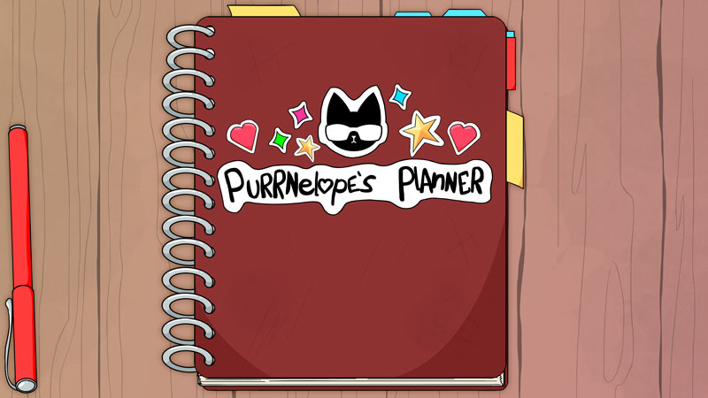

- Res: 3840 × 2160 (4K)
- Format: PNG
- [Link to file](https://assets.pcc-archive.org/purrnelopes-planner/v1-cover.png)
