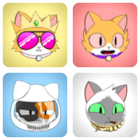
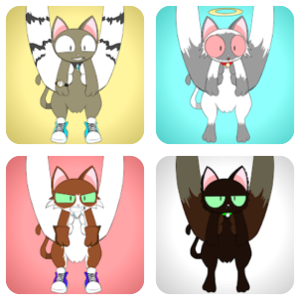
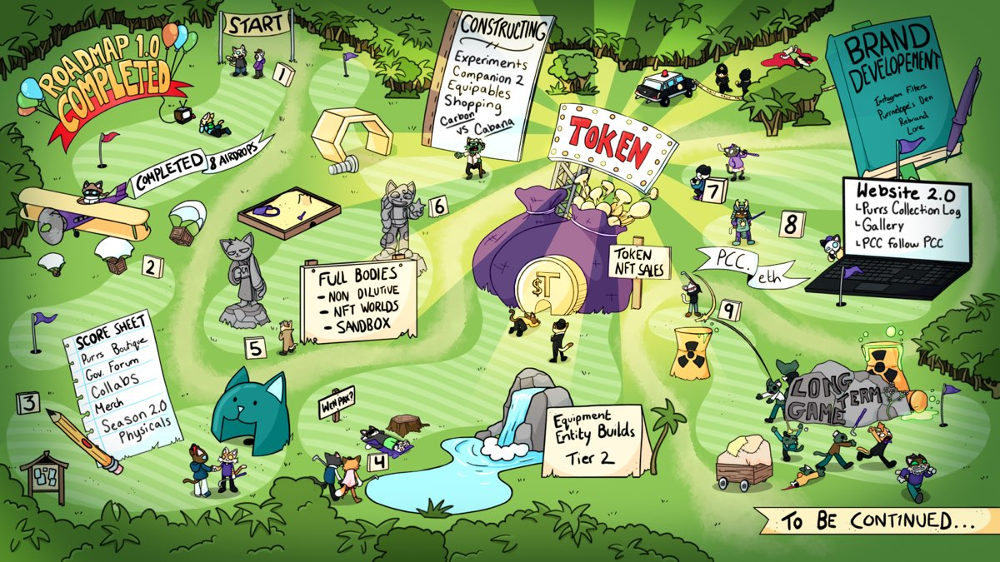

**Purrnelope's Country Club ([purrnelopescountryclub.com](https://purrnelopescountryclub.com/)) was launched in July 2021 with 10,000 Cat PFP NFTs** and a quick and simple comment:

> _“Purrnelope's Country Club is something else entirely. We’re the type of loyal cats that are here to stay.”_ [^1]

[^1]: Quoted from PCC first blog post: [Welcome to Purrnelope’s Country Club](/posts/2021/07/14/post/welcome-to-pcc)

Carlini8 is the founder of PCC. PCC has 3 companies[^2]. One original company in the UK registered back in June 2021 for paying the team's salary and taxes[^3]. Another company in BVI registered in December 2021 for PCC to launch its $TOKEN legally in the coming future[^4]. **[The PCC Team](./team.md)** currently consists of 8 full-time members of staff and 2 part-time members of staff.

[^2]: 3 companies were mentioned in Carlini8's [interview by Lucky Trader](/posts/2022/02/25/3rd-party/lucky-trader).
[^3]: The first company was mentioned many times in Carlini8's [interviews](/posts/tags/interview).
[^4]: BVI company was mentioned in [interview by Lucky Trader](/posts/2022/02/25/3rd-party/lucky-trader), and time was mentioned in [interview by Talkenized](/posts/2022/04/27/3rd-party/talkenized). The $TOKEN has not released yet, "$TOKEN" here is a placeholder for it's to be launched token.

## Collections

**Currently, PCC has 4 main [Collections](../collections/index.md)**: Cats, Kittens, 2nd Companion (TBA), and Tier 2 (TBA). **With 2 other Collections**: KittyVault Purrks and Purrnelope's Gift. The 4 main collections are classified into 3 tiers, which will yield different amounts of $TOKEN per day.

### Cats

**[Purrnelope's Cats](../collections/cats/index.md) is PCC's 1st collection** with 10k unique Cat NFTs that grand the membership to the Country Club. Cats are Tier 1 NFTs.

Cats mint started on 2021-07-17. After Carlini revealed himself behind the PCC project, the cats minted out on 2021-08-12.

### Kittens

**[Purrnelope's Kittens](../collections/kittens/index.md) is the 1st companions to the Cats** with with 10k unique Kitten NFTs. Kittens are Tier 3 NFTs.

Kittens were minted by burning [Kitten Basket](../collections/kittyvault-purrks/2-kitten-basket.md) airdrops.

### 2nd Companions (TBA)

**This will be the 2nd companions to the Cats**, and are Tier 3 NFTs. The detail of the 2nd Companions is likely to be revealed in April or May 2022.

Mint of 2nd Companions is going to be similar to the Kittens: claim by burning KittyVault Purrks 8th airdrop NFT.[^5]

[^5]: Mint was mentioned in [PurrCast of April 27th 2022](https://twitter.com/i/spaces/1jMJgeqZpWAKL).

### Tier 2 (TBA)

**Tier 2 (TBA) is the PCC equivalent of Meebits / Mutants.** It is the second entry to the PCC Universe. And there are potentially 6 different version of Tier 2[^6].

The sale for Tier 2 has not been officially announced yet.

[^6]: Some detail on Tier 2 was mentioned in [interivew by Overpriced JPEGs](/posts/2022/03/30/3rd-party/overpriced-jpegs#purrnelope-token-utility). And detail may change before it announced officially.

### KittyVault Purrks

[**Purrnelope's KittyVault Purrks**](../collections/kittyvault-purrks/index.md) are airdropped NFTs to all holders of the cats.

Start from Sep 2021 to Apr 2022 of a total of 8 airdrops.

### Gifts

[**Purrnelope's Gifts**](../collections/gift/index.md) are a long-term plan to reward PCC's loyal fans.

## Kitty Vault {#kittyvault}

[**The KittyVault**](../kittyvault/index.md) is a community-owned vault of NFTs that backs every PCC cat & first 8 airdrops. **And it is valued at 929.08 ETH** based on the floor price of NFTs inside by Apr 22, 2022.

The whole collection will be fractionalized with @fractional_art 2.0.

## .pcc.eth ENS

**[.pcc.eth ENS subdomains](../ens/index.md) is free for PCC Cat holders to claim.** It is more readable for wallet address, use the cat as PFP on web3, and the brand of PCC Community.

## $TOKEN {#token}

**Purrnelope's Token has not been released yet, "$TOKEN" here is a placeholder.**

NFTs from main [collections](../collections/index.md) will be able to yield $TOKEN. $TOKEN will be used for purchasing packs, community governance, etc. $TOKEN was mentioned a lot during [Carlini8's interview by Overpriced JPEGs](/posts/2022/03/30/3rd-party/overpriced-jpegs).

## Merch

The merchandise was planned since Roadmap V1, and the team is currently working hard on the merch. Some merch will require to redeem using [Purrks](../collections/kittyvault-purrks/index.md) NFTs, e.g. Hoodies, 3D Model, Comic Book, Music Record, Keyboard, and Ledger Nano S.

## Games

**Games are planned in [Roadmap V2](/posts/2022/02/25/post/roadmap-2-0-6-months-on-from-launch). 4 Games are currently planned.** And the Team is working with Entity Builds to develope the first game in the NFT Worlds metaverse. Entity Builds is a best-in-class studio with incredible Minecraft builders, devs, and designers.[^7]

[^7]: The 4 games were mentioned in Carlini8's interview by [Overpriced JPEGs](/posts/2022/03/30/3rd-party/overpriced-jpegs#purrnelope-token-utility). And they may change before the they announced officially.

## Voting

PCC Cats holders can cast votes. See all voting proposals on PCC's Website: [purrnelopescountryclub.com/voting](https://www.purrnelopescountryclub.com/voting)

## Roadmaps

### Roadmap 1.0

Roadmap 1.0 was released with the project launch and [got updated](/posts/2021/08/12/post/roadmap) after the Cats mint was completed.

### Roadmap 1.0 Plus

**KittyVault**, **KittyVault Purrks** Airdrops, 1st companions: **Kittens**, 2nd companions: **TBA**, **Tier 2 Collection**, **$TOKEN**, **.pcc.eth ENS subdomains** were not on the original roadmap 1.0 but added to the project later.

### Roadmap 2.0

[Roadmap 2.0](/posts/2022/02/25/post/roadmap-2-0-6-months-on-from-launch) was released on February 25, 2022, 6 months after Roadmap 1.0.

## Fun Facts

### Change Name to PCC

At the begining, the team was calling themselves the **Cool Cats Country Club**, but changed it to **Purrnelope's Country Club** after the Cool Cats project smashed it out the park.

## Events

### 2021 Q3

- 07-17: [Cats](../collections/cats/index.md) mint started
- 08-11: Carlini revealed himself behind PCC in [his post](/posts/2021/08/11/post/pcc-the-unanon)
- 08-11: Team allocated 200 ETH to the [Community Wallet](../kittyvault/index.md#a-brief-history)
- 08-12: All 10k [Cats](../collections/cats/index.md) are minted
- 08-12: [Roadmap 1.0 updated](/posts/2021/08/12/post/roadmap)
- 08-12: Carbon Offset via Aerial ([Etherscan](https://etherscan.io/tx/0x143e27fed56a3d76e6681a9422aaf7356b6ac8108f2407cee8a9948c0f46b9cc))
- 08-14: Launched Liquidity Pools on [NFTX](https://app.nftx.org/redeem/0xe581f272706581f9dcc362df3c7934e99192c492/) and [NFT20](https://nft20.io/asset/0x54c9e17ad8016a062ffd89d1b53aaee80c0cf43d)
- 08-14: [60% Profile Picture Advertising](/posts/2021/08/13/post/60-profile-picture-advertising) to cat holders event started
- 09-15: Community Wallet funds transferred to [KittyBank](../kittyvault/index.md#a-brief-history)
- 09-24: NFT20 Pool closed.
- 09-24: 1st Episode of [PurrCast](/posts/tags/purr-cast)
- 09-30: [Hoodie Cat](../collections/kittyvault-purrks/1-hoodie-cat.md) airdropped, 1/8 [Purrks](../collections/kittyvault-purrks/index.md) monthly airdrops

### 2021 Q4

- 10-01: Carlini start 31 daily giveaways through the whole October 2021
- 10-24: 1st Official Game Night with Papa(Peter)
- 11-01: [Kitten Basket](../collections/kittyvault-purrks/2-kitten-basket.md) airdropped, 2/8 [Purrks](../collections/kittyvault-purrks/index.md) monthly airdrops
- 11-15: [Kittens](../collections/kittens/index.md) mint started
- 11-27: [Model Cat](../collections/kittyvault-purrks/3-model-cat.md) airdropped, 3/8 [Purrks](../collections/kittyvault-purrks/index.md) monthly airdrops
- 12-05: Community Vote passed on Secondary Market Fees change [snapshot](https://snapshot.org/#/purrnelopescountryclub.eth/proposal/0x46cc3b68385e86388cbb2780aeb82db4bf74da55188d3e3283ebf81f2540979e)
- 12-18: [.pcc.eth ENS Subdomain](../ens/index.md) available for all PCC holders to claim
- 12-31: [Comic Cat](../collections/kittyvault-purrks/4-comic-cat.md) airdropped, 4/8 [Purrks](../collections/kittyvault-purrks/index.md) monthly airdrops

### 2022 Q1

- 02-01: [Record Cat](../collections/kittyvault-purrks/5-record-cat.md) airdropped, 5/8 [Purrks](../collections/kittyvault-purrks/index.md) monthly airdrops
- 02-01: Carlini start 28 daily giveaways through the whole Feb 2022
- 02-25: [Roadmap 2.0 released](/posts/2022/02/25/post/roadmap-2-0-6-months-on-from-launch)
- 03-02: [Keyboard Cat](../collections/kittyvault-purrks/6-keyboard-cat.md) airdropped, 6/8 [Purrks](../collections/kittyvault-purrks/index.md) monthly airdrops
- 03-07: PCC Cats in Times Square [Video](/posts/2022/03/07/post/times-square)
- 03-29: [Ledger Cat](../collections/kittyvault-purrks/7-ledger-cat.md) airdropped, 7/8 [Purrks](../collections/kittyvault-purrks/index.md) monthly airdrops

### 2022 Q2

- 04-15: [.pcc.eth subdomains](../ens/index.md) hit 500 names registration
- 04-19: The Ambassadors role [revamped and leveled up linked with .pcc.eth subdomains](/posts/2022/04/19/post/the-new-ambassadors-role-revamped-and-leveled-up)
