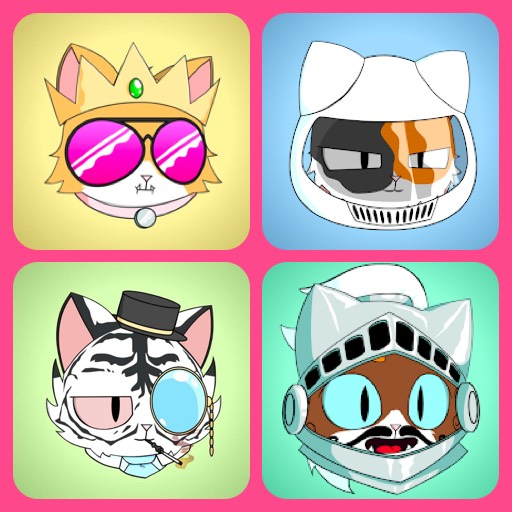
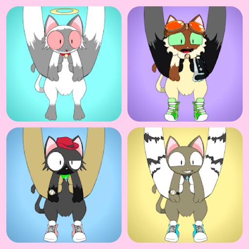
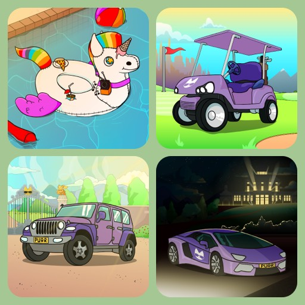
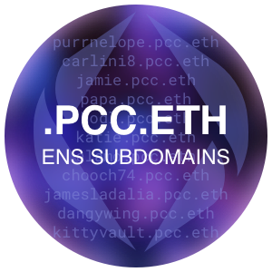

import ReactPlayer from 'react-player'
import Cats from '../collections/\_cats.md';
import Kittens from '../collections/\_kittens.md';
import Grandma from '../collections/\_grandma.md';
import Tier2 from '../collections/\_tier2.md';
import Gift from '../collections/\_gift.md';
import KVPurrks from '../collections/\_kittyvault-purrks.md';

**Purrnelope's Country Club ([purrnelopescountryclub.com](https://purrnelopescountryclub.com/)) was launched in July 2021 with 10,000 Cat PFP NFTs** and a quick and simple comment:

> _“Purrnelope's Country Club is something else entirely. We’re the type of loyal cats that are here to stay.”_ [^1]

[^1]: Quoted from PCC first blog post: [Welcome to Purrnelope’s Country Club](/posts/2021/07/14/post/welcome-to-pcc)

Carlini8 is the founder of PCC. PCC has 3 companies[^2]. One original company in the UK registered back in June 2021 for paying the team's salary and taxes[^3]. Another company in BVI registered in December 2021 for PCC to launch its $TOKEN legally in the coming future[^4]. **[The PCC Team](./team.md)** currently consists of 8 full-time members of staff and 2 part-time members of staff.

[^2]: 3 companies were mentioned in Carlini8's [interview by Lucky Trader](/posts/2022/02/25/3rd-party/lucky-trader).
[^3]: The first company was mentioned many times in Carlini8's [interviews](/posts/tags/interview).
[^4]: BVI company was mentioned in [interview by Lucky Trader](/posts/2022/02/25/3rd-party/lucky-trader), and time was mentioned in [interview by Talkenized](/posts/2022/04/27/3rd-party/talkenized). The $TOKEN has not released yet, "$TOKEN" here is a placeholder for it's to be launched token.

## Collections 😺 {#collections}

**PCC Universe has 4 main [Collections](../collections/index.md): Cats, Kittens, Grandmas, and Tier 2 (TBA). And 3 other [Collections](../collections/index.md): Purrnelope's Exslusives, KittyVault Purrks and Purrnelope's Gift.**

The 4 main collections are classified into 3 tiers, which will yield different amounts of $TOKEN per day. Exclusives collection also yield $TOKEN.

### Cats TIER 1

<Cats />

### Kittens TIER 3

<Kittens />

### Grandmas TIER 3

<Grandma />

### Tier 2 (TBA) TIER 2

<Tier2 />

### Exclusives YIELD

**[Purrnelope's Exclusives](../collections/exclusives/index.md)** are $TOKEN yielding NFTs. There are 5 categories in Exclusives, the higher the rarity, different categories yield different $TOKEN amount.

Exclusives may receive extra perks in PCC Universe.

### KittyVault Purrks

<KVPurrks />

## Kitty Vault 🏦 {#kittyvault}

[**The KittyVault**](../kittyvault/index.md) is a community-owned vault of NFTs that backs every PCC cat & first 8 airdrops. **And it is valued at 929.08 ETH** based on the floor price of NFTs inside by Apr 22, 2022.

The whole collection will be fractionalized with @fractional_art 2.0.

## .pcc.eth ENS 🆔 {#pcc-ens}

**[.pcc.eth ENS subdomains](../ens/index.md) is free for PCC Cat holders to claim.** It is more readable for wallet address, use the cat as PFP on web3, and the brand of PCC Community.

The new PCC Ambassadors role requires to have a .pcc.eth subdomain.

## $TOKEN 💰 {#token}

**Purrnelope's Token has not been released yet, "$TOKEN" here is a placeholder.**

NFTs from main [collections](../collections/index.md) will be able to yield $TOKEN. $TOKEN will be used for purchasing packs, community governance, etc. $TOKEN was mentioned a lot during [Carlini8's interview by Overpriced JPEGs](/posts/2022/03/30/3rd-party/overpriced-jpegs).

## Merch 🛍 {#merch}

**[Merch](../merch/index.md) was planned and activated since [Roadmap 1.0](#roadmap-10)**, the Merch Store has launched on May 13, 2022.

Merches require redeem using [KittyVault Purrks](../collections/kittyvault-purrks/index.md) will launch soon, e.g. Hoodies, 3D Model, Comic Book, Music Record, Keyboard, and Ledger Nano S.

## Games 🎮 {#games}

**Games are planned in [Roadmap 2.0](#roadmap-20). 4 Games are currently planned.** And the Team is working with Entity Builds to develope the first game in the NFT Worlds metaverse. Entity Builds is a best-in-class studio with incredible Minecraft builders, devs, and designers.[^5]

[^5]: The 4 games were mentioned in Carlini8's interview by [Overpriced JPEGs](/posts/2022/03/30/3rd-party/overpriced-jpegs#purrnelope-token-utility). And they may change before the they announced officially.

## Voting 🗳 {#vote}

PCC Cats holders can cast votes on a 1 Cat = 1 Vote basis, $PURR token is also supported.

See all voting proposals on PCC's Website:

[purrnelopescountryclub.com/voting](https://www.purrnelopescountryclub.com/voting)

## Fun Facts 😎 {#fun-facts}

### Change Name to PCC

At the begining, the team was calling themselves the **Cool Cats Country Club**, but changed it to **Purrnelope's Country Club** after the Cool Cats project smashed it out the park.

## Roadmaps 🗺 {#roadmaps}

### Roadmap 1.0

**[Roadmap 1.0 was released](/posts/2021/07/14/post/welcome-to-pcc) with the project launch and [it got updated in a Team post](/posts/2021/08/12/post/roadmap) after the Cats mint out on Aug 12, 2021.**

Displate and Anime Short are still in progress, and these are mentioned in [Roadmap 2.0](#roadmap-20)

- ✅ Discord Boost: completed after Launch
- ✅ Twitter Competition: [2021-Q3](#2021-q3)
- 🛠 Displate Competition
- ✅ Carbon Offset: [2021-Q3](#2021-q3)
- ✅ Merch activated: [2021-Q3](#2021-q3)
- ✅ Community Wallet: [2021-Q3](#2021-q3)
- ✅ Profile Picture Advertisement: [2021-Q3](#2021-q3)
- ✅ Charity Donation: [2021-Q4](#2021-q4) (_Citation Needed_)
- ✅ Community Buy Back: [2021-Q3](#2021-q3)
- ✅ Liquidity Pool: [2021-Q3](#2021-q3)
- 🛠 A short anime video

### Roadmap 1.0 Plus

**KittyVault**, **KittyVault Purrks** Airdrops, 1st companions: **Kittens**, 2nd companions: **TBA**, **Tier 2 Collection**, **$TOKEN**, **.pcc.eth ENS subdomains** were not on the original roadmap 1.0 but added to the project later.

The KittyVault is waiting to be fractionlized once it's ready. KittyVault Purrks airdrops, 2nd companion, Tier 2 Collection, and $TOKEN are mentioned in [Roadmap 2.0](#roadmap-20), and will be tracked in the next Roadmap 2.0 section.

- 😼 KittyVault
- ✅ Kittens: [2021-Q4](#2021-q4)
- ✅ .pcc.eth ENS subdomains: [2021-Q4](#2021-q4)

### Roadmap 2.0

**[Roadmap 2.0 was released on Feb 25, 2022](/posts/2022/02/25/post/roadmap-2-0-6-months-on-from-launch), 6 months after Roadmap 1.0.**

- 🛠 Complete Roadmap 1.0
- ✅ 8 KittyVault Purrks Airdrops [2022-Q2](#2022-q2)
- ✅ 2nd Companion [2022-Q2](#2022-q2)
- ✅ Merch [2022-Q2](#2022-q2)
- 🚙 Redeem for Physicals Completed: 1/6
- 🛠 Tier 2 Collection
- 🛠 $TOKEN

Other items from Roadmap 2.0 will be added to the list upon completion or new updates from the team. Here's a map of Roadmap 2.0:

<ReactPlayer playing muted playsinline loop controls width='' height='' className='w-full aspect-video rounded-xl overflow-hidden hack-safari-overlow' url='https://assets.pcc-archive.org/videos/pcc-roadmap-2.0-720p.mp4'  />

## Events 📝 {#events}

### 2021 Q3

- 07-17: [Cats](../collections/cats/index.md) mint started
- 08-11: Carlini revealed himself behind PCC in [his post](/posts/2021/08/11/post/pcc-the-unanon)
- 08-11: 200 ETH sent to the [Community Wallet](../kittyvault/index.md#a-brief-history)
- 08-12: All 10k [Cats](../collections/cats/index.md) are minted and [Roadmap 1.0 got updated](/posts/2021/08/12/post/roadmap)
- 08-12: Carbon Offset via [Aerial for Cat contract](https://aerial.is/nft/0x9759226B2F8ddEFF81583e244Ef3bd13AAA7e4A1) ([Etherscan](https://etherscan.io/tx/0x143e27fed56a3d76e6681a9422aaf7356b6ac8108f2407cee8a9948c0f46b9cc))
- 08-14: Launched Liquidity Pools on [NFTX](https://app.nftx.org/redeem/0xe581f272706581f9dcc362df3c7934e99192c492/) and [NFT20](https://nft20.io/asset/0x54c9e17ad8016a062ffd89d1b53aaee80c0cf43d)
- 08-14: [60% Profile Picture Advertising](/posts/2021/08/13/post/60-profile-picture-advertising) to cat holders event started
- 08-21: [Bored Ape #5226 fractionalized](../kittyvault/index.md#fractionalize-ape-5226) and airdropped to minters of Cats ID `#1-2000`
- 09-13: NFT Puzzle thing (now defunct) polygon airdrop of [Purrnelope Puzzle pieces](https://opensea.io/collection/npt-purrnelopes-pieces) 10 people won a prize
- 09-15: Community Wallet funds transferred to [KittyBank](../kittyvault/index.md#a-brief-history)
- 09-24: [NFTX](https://app.nftx.org/redeem/0xe581f272706581f9dcc362df3c7934e99192c492/) Pool results better liquidity and was chosen to keep, NFT20 Pool closed.
<!-- - 09-24: 1st Episode of [PurrCast](/posts/tags/purr-cast) -->
- 09-30: [Hoodie Cat](../collections/kittyvault-purrks/1-hoodie-cat.md) airdropped, 1/8 [Purrks](../collections/kittyvault-purrks/index.md) monthly airdrops

### 2021 Q4

- 10-01: Carlini start 31 daily giveaways through the whole October 2021
- 10-18: Carbon Offset updated to 1,522 credits via [Aerial for Cat contract](https://aerial.is/nft/0x9759226B2F8ddEFF81583e244Ef3bd13AAA7e4A1)
- 10-24: 1st Official Game Night with Papa(Peter)
- 11-01: [Kitten Basket](../collections/kittyvault-purrks/2-kitten-basket.md) airdropped, 2/8 [Purrks](../collections/kittyvault-purrks/index.md) monthly airdrops
- 11-07: Community Vote finished for 40 eth charity donation [snapshot](https://snapshot.org/#/purrnelopescountryclub.eth/proposal/0x6d94b1cbcdbf3df263ad046bcbc5a617103ada6f1e3ed6fa899abca924bef1cf)
- 11-15: [Kittens](../collections/kittens/index.md) public mint/claim started
- 11-27: [Model Cat](../collections/kittyvault-purrks/3-model-cat.md) airdropped, 3/8 [Purrks](../collections/kittyvault-purrks/index.md) monthly airdrops
- 12-05: Community Vote passed on Secondary Market Fees change [snapshot](https://snapshot.org/#/purrnelopescountryclub.eth/proposal/0x46cc3b68385e86388cbb2780aeb82db4bf74da55188d3e3283ebf81f2540979e)
- 12-18: [.pcc.eth ENS Subdomain](../ens/index.md) available for all PCC holders to claim
- 12-31: [Comic Cat](../collections/kittyvault-purrks/4-comic-cat.md) airdropped, 4/8 [Purrks](../collections/kittyvault-purrks/index.md) monthly airdrops

### 2022 Q1

- 02-01: [Record Cat](../collections/kittyvault-purrks/5-record-cat.md) airdropped, 5/8 [Purrks](../collections/kittyvault-purrks/index.md) monthly airdrops
- 02-01: Carlini start 28 daily giveaways through the whole Feb 2022
- 02-25: [Roadmap 2.0 released](/posts/2022/02/25/post/roadmap-2-0-6-months-on-from-launch)
- 03-02: [Keyboard Cat](../collections/kittyvault-purrks/6-keyboard-cat.md) airdropped, 6/8 [Purrks](../collections/kittyvault-purrks/index.md) monthly airdrops
- 03-07: PCC Cats in Times Square [Video](/posts/2022/03/07/post/times-square)
- 03-29: [Ledger Cat](../collections/kittyvault-purrks/7-ledger-cat.md) airdropped, 7/8 [Purrks](../collections/kittyvault-purrks/index.md) monthly airdrops

### 2022 Q2

- 04-15: [.pcc.eth subdomains](../ens/index.md) hit 500 names registration
- 04-19: The Ambassadors role [revamped and leveled up linked with .pcc.eth subdomains](/posts/2022/04/19/post/the-new-ambassadors-role-revamped-and-leveled-up)
- 04-30: [Grandma's Nightstand](../collections/kittyvault-purrks/8-grandma-s-nightstand.md) airdropped, All [8 Purrks](../collections/kittyvault-purrks/index.md) monthly airdrops completed
- 05-13: [Merch Store](https://store.purrnelopescountryclub.com) launched
- 05-16: [Grandmas](../collections/grandmas/index.md) public mint/claim started
- 05-18: [Physical Model Cat](../merch/pcc-model-cat.md) Claim Opened
- 06-17: [Quests](quest.md) Started

### 2022 Q3

- 07-19: 1st batch of [Physical Model Cats](../merch/pcc-model-cat.md) started shipping to holders
- 07-22: [Purrnelope's Exclusives](../collections/exclusives/index.md) mint/sale started
- 08-03: [Purrnelope's Exclusives](../collections/exclusives/index.md) mint/sale closed and revealed
