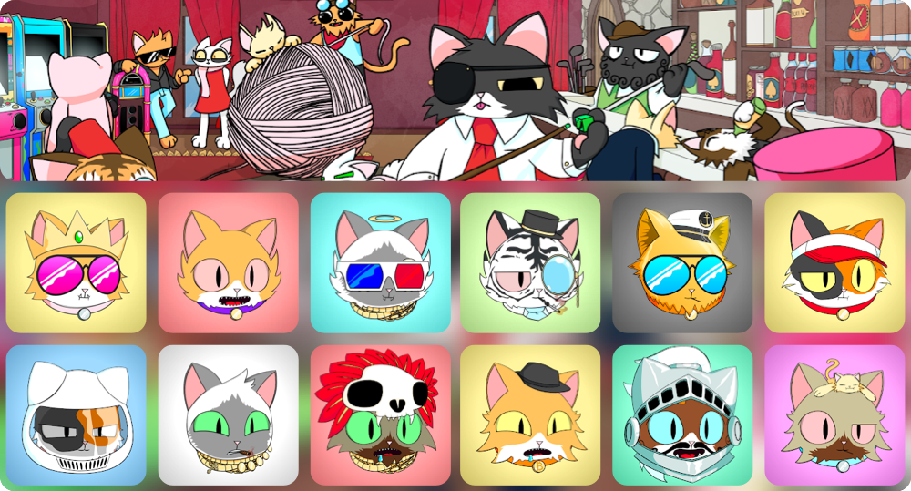

# Purrnelope's Cats

😺
[Contract](https://etherscan.io/address/0x9759226b2f8ddeff81583e244ef3bd13aaa7e4a1) ·
[OpenSea](https://opensea.io/collection/purrnelopes-country-club) ·
[LooksRare](https://looksrare.org/collections/0x9759226B2F8ddEFF81583e244Ef3bd13AAA7e4A1) ·
[NFTX](https://nftx.io/vault/0xe581f272706581f9dcc362df3c7934e99192c492/) ·
[Rarity](https://rarity.tools/purrnelopes-country-club)
😺

## What are Cats [^1]

Cats of Purrnelope's Country Club are 10,000 randomly generated NFTs that exist on the Ethereum Blockchain. Exclusivity is the name, fun is the game.

Purrnelope built her Country Club on the idea of building a club with a strong community feel.

Somewhere Cats can get together over a glass of something and shoot the breeze.

Somewhere Cats can discuss and debate how to help our planet and really do some good.

Somewhere where every Cat is special, and everyone is welcome.

Purchasing a Cat gets you membership to this special Country Club, and helps unlock membership benefits as detailed in our roadmap.

Welcome to Purrnelope's Country Club

## Mint

Mint price was 0.08 ETH. Mint took 26 days: The first cat was minted on [Jul-17-2021 08:00:20 PM +UTC](https://etherscan.io/tx/0x0f4f02694c8e5c6ca9f28657d9068de2bac4d740e51ddd492e31846ed47f7073). The last cat was minted on [Aug-12-2021 12:00:46 AM +UTC](https://etherscan.io/tx/0xbbef40b36f13d1ed7873800eec208f392506c83344d338bd3a48f05850d20104) along with other 16 cats.

## Utilities

### .pcc.eth ENS Subdomains

Cats owners can claim their [.pcc.eth ENS Subdomains](../../ens/index.md) at [Claim Page](https://www.purrnelopescountryclub.com/claim/ens) of PCC Official Website.

### Earn $Token

Cats are Tier 1 NFTs, will earn 10 $TOKENs per day per Cat.

## Events

- Mint: Jul-17-2021

## Meta

#### Token Meta URI

- `ipfs://QmPkmpS7BZU7Vcja3zk9YJyamz83n7LGsBKdnKPrBEhShR`
- To view a particular Cat's meta, replace `1` with the Cat ID:
  [ipfs.io/ipfs/QmPkmpS7BZU7Vcja3zk9YJyamz83n7LGsBKdnKPrBEhShR/1](https://ipfs.io/ipfs/QmPkmpS7BZU7Vcja3zk9YJyamz83n7LGsBKdnKPrBEhShR/1)

#### Cat Image

- `ipfs://QmUfyS4W6cBRRWtWpbW1as4ziaiEHTBD9WVcn1nrEB6xPu`
- To view a particular Cat's image, replace `1` with the Cat ID:
  [ipfs.io/ipfs/QmUfyS4W6cBRRWtWpbW1as4ziaiEHTBD9WVcn1nrEB6xPu/1.png](https://ipfs.io/ipfs/QmUfyS4W6cBRRWtWpbW1as4ziaiEHTBD9WVcn1nrEB6xPu/1.png)

## See Also

### Secondary Markets

- [OpenSea](https://opensea.io/collection/purrnelopes-country-club)
- [LooksRare](https://looksrare.org/collections/0x9759226B2F8ddEFF81583e244Ef3bd13AAA7e4A1)
- [X2Y2](https://x2y2.io/collection/purrnelopes-country-club/items)
- [NFTX PURR Vault](https://nftx.io/vault/0xe581f272706581f9dcc362df3c7934e99192c492/)

### Tools

- [Flip.Finance](https://www.flips.finance/collection/purrnelopes-country-club)

[^1]: Official PCC Website [[link](https://www.purrnelopescountryclub.com)]
