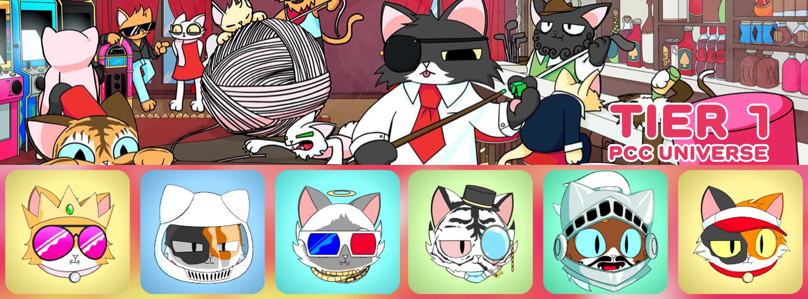
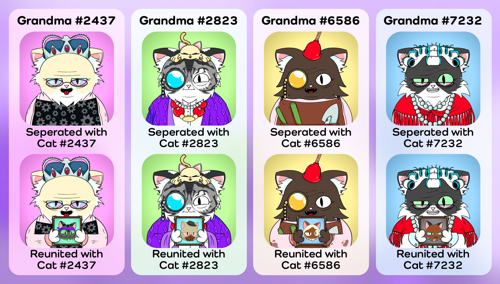

[Contract](https://etherscan.io/address/0x9759226b2f8ddeff81583e244ef3bd13aaa7e4a1) ·
[OpenSea](https://opensea.io/collection/purrnelopes-country-club) ·
[LooksRare](https://looksrare.org/collections/0x9759226B2F8ddEFF81583e244Ef3bd13AAA7e4A1) ·
[NFTX](https://nftx.io/vault/0xe581f272706581f9dcc362df3c7934e99192c492/) ·
[Rarity](https://rarity.tools/purrnelopes-country-club)

## What are Cats

Cats of Purrnelope's Country Club are the first NFT collection in PCC Universe with 10,000 randomly generated NFTs that exist on the Ethereum Blockchain. Cats are Tier 1 NFTs.

Holding a Cat gets you membership to this special Country Club, and helps unlock membership benefits in the PCC Universe.

### Mint / Sale

Cats mint started on Jul 7, 2021, and the price was 0.08 ETH per Cat. All 10k cats were minted publicly and there was no reserve for the team.. The team was being annoymous at the begining of the mint, after Carlini revealed himself with [his post](/posts/2021/08/11/post/pcc-the-unanon), all Cats were minted on Aug 12, 2021.

### Clubhouse Access

Cats owners can access **Clubhouse** channel in [PCC Discord](http://discord.gg/purrnelopescountryclub).

### .pcc.eth ENS Subdomains

Cats owners can claim their [.pcc.eth ENS Subdomains](../../ens/index.md) at [Claim Page](https://www.purrnelopescountryclub.com/claim/ens) of PCC Website.

Cats owner using .pcc.eth subdomain names as Twitter & Discord display names will received **Ambassador** role in [PCC Discord](http://discord.gg/purrnelopescountryclub). 

### Earn $Token

Cats are Tier 1 NFTs, will yield 10 $TOKENs per day per Cat.

### Redeem for KittlyVault Fractions

Once the [KittyVault](../../kittyvault/index.md) is fractionalized, Cats can be redeemed(burned) for [KittyBank Token](../../kittyvault/index.md#kittybank-token-token).

### Cats & Kittens

**[Kittens](../kittens/index.md) are held in arms of Cats, the arms holding the [Kittens](../kittens/index.md) will match with the Cats with the same ID.**

### Cats & Grandmas

**If you reunite the [Grandma](../grandmas/index.md) and the Cat with the same ID by having them in the same wallet**, the image of the Grandma will change, the Grandma will hold a photo frame the Cat! And if they got seperated by not in the same wallet, the image of the Grandma will change back to not holding the photo frame.

## Fun Facts

### The Mock Ups

Carlini created the original mock up like... And thanks to 1rregularCharlie fixed that and created the new Cat Head Base Concept so we are having all those amazing looking cats.

This was told in [Weekly Update: 2022 Week 7](/posts/weekly-update/2022w07)

## Events

- 2021-07-17: Mint Started.
  - The price for minting a cat was 0.08 ETH. All 10k cats are minted publicly and there was no reserve for the team.
  - The first cat was minted on Jul-17-2021 ([Etherscan](https://etherscan.io/tx/0x0f4f02694c8e5c6ca9f28657d9068de2bac4d740e51ddd492e31846ed47f7073)).
- 2021-08-12: All Cats are minted.
  - The last cat was minted on Aug-12-2021 ([Etherscan](https://etherscan.io/tx/0xbbef40b36f13d1ed7873800eec208f392506c83344d338bd3a48f05850d20104)). Mint took totally 26 days.

## Meta

### Meta Reveal During Mint

First token base URI meta was set with opening the sale on Jul 17, 2021 ([Etherscan](https://etherscan.io/tx/0xadabe2454200814f4e9b6f5d26aa7b4d81dff07170227805435ddb998663d7cd)).

The team updated token base URI during the mint to reveal token metadata and the art. And it took 3 updates to reveal all 10k Cat NFTs:

1. 2021-07-23 ([Etherscan](https://etherscan.io/tx/0xbc46da75d7c30069da628f1d787bd4898b523457ba5b072ce034bc96771dc496))
1. 2021-08-11 ([Etherscan](https://etherscan.io/tx/0x1f49bf48f80ab4a8f4b6f277e858545e9a816cecfe51658efbc5f0b74c4e2b16))
1. 2021-08-12 ([Etherscan](https://etherscan.io/tx/0x05b1525043916b5a079fafb46de67fc0c144a81add8ce87d46cec26f1a21020d))

### Final Meta

#### Token Meta URI

- `ipfs://QmPkmpS7BZU7Vcja3zk9YJyamz83n7LGsBKdnKPrBEhShR`
- To view a particular Cat's meta, replace `1` with the Cat ID:
  [ipfs.io/ipfs/QmPkmpS7BZU7Vcja3zk9YJyamz83n7LGsBKdnKPrBEhShR/1](https://ipfs.io/ipfs/QmPkmpS7BZU7Vcja3zk9YJyamz83n7LGsBKdnKPrBEhShR/1)

#### Cat Image

- `ipfs://QmUfyS4W6cBRRWtWpbW1as4ziaiEHTBD9WVcn1nrEB6xPu`
- To view a particular Cat's image, replace `1` with the Cat ID:
  [ipfs.io/ipfs/QmUfyS4W6cBRRWtWpbW1as4ziaiEHTBD9WVcn1nrEB6xPu/1.png](https://ipfs.io/ipfs/QmUfyS4W6cBRRWtWpbW1as4ziaiEHTBD9WVcn1nrEB6xPu/1.png)

## See Also

### Secondary Markets

- [OpenSea](https://opensea.io/collection/purrnelopes-country-club)
- [LooksRare](https://looksrare.org/collections/0x9759226B2F8ddEFF81583e244Ef3bd13AAA7e4A1)
- [X2Y2](https://x2y2.io/collection/purrnelopes-country-club/items)
- [NFTX PURR Vault](https://nftx.io/vault/0xe581f272706581f9dcc362df3c7934e99192c492/)

### Tools

- [Flip.Finance](https://www.flips.finance/collection/purrnelopes-country-club)
- [NFT Bag Check](https://nftbagcheck.com/collection/purrnelopes-country-club)
