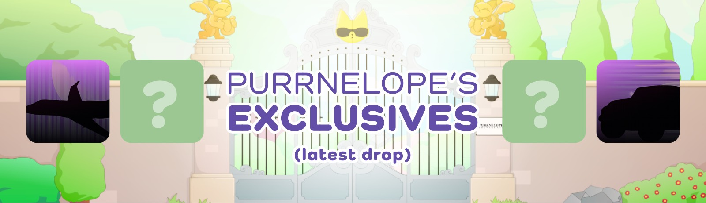
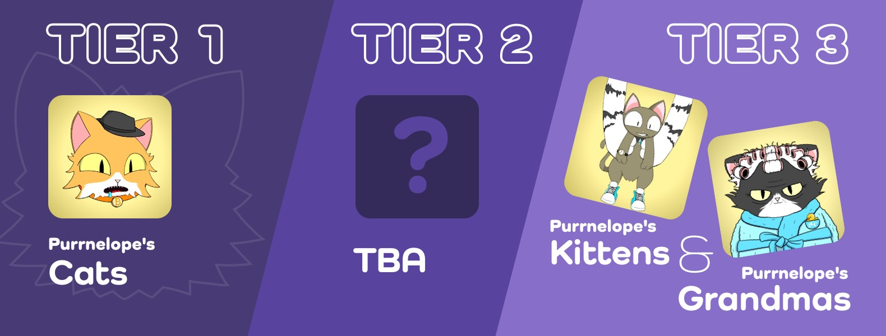
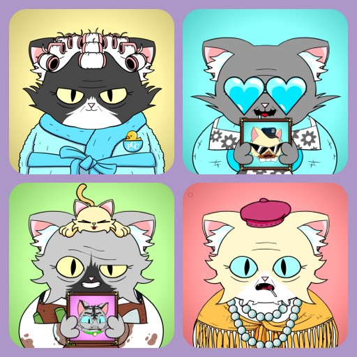
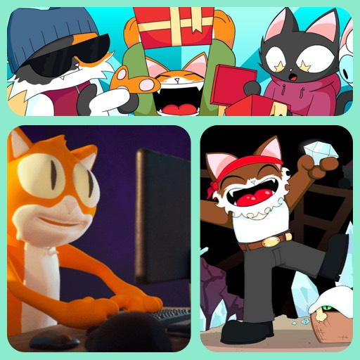

import Cats from './\_cats.md';
import Kittens from './\_kittens.md';
import Grandma from './\_grandma.md';
import Tier2 from './\_tier2.md';
import Gift from './\_gift.md';
import KVPurrks from './\_kittyvault-purrks.md';

**PCC Universe has 4 main collections: Cats, Kittens, Grandmas, and Tier 2 (TBA)** that are cat members of the country club. **And 3 other Collections**: Purrnelope's Exslusives, KittyVault Purrks and Purrnelope's Gift.

The 4 main collections are classified into 3 tiers, which will yield different amounts of $TOKEN per day. Exclusives collection also yield $TOKEN.

## Latest Collection

### Purrnelope's Exclusives

Purrnelope's Exclusives mint started on Jul 22, 2021. Public mint is now open.

Mint is on official PCC website https://www.purrnelopescountryclub.com/claim/purrnelopes-exclusives

There are 5 categories in Exclusives, the higher the rarity, different categories yield different $TOKEN amount.

- Category 1: 5 $TOKENs per day
- Category 2: 10 $TOKENs per day
- Category 3: 25 $TOKENs per day
- Category 4: 50 $TOKENs per day
- Category 5: 100 $TOKENs per day

:::info

More detail for Purrnelope's Exclusives will be updated later on PCC Archive once the team released more detail. Please check official PCC Twitter account [@PurrnelopesCC](https://twitter.com/PurrnelopesCC) for latest info.

:::

## Main Collections

Cats, Kittens, Grandmas, Tier 2s (TBA) are 4 main collections in PCC Universe.

### Tiers

Main collections are classified into 3 tiers, which will yield different amounts of $TOKEN perday.

- Tier 1: will yield 10 $TOKENs per day.
- Tier 2: will yield 5 $TOKENs per day.
- Tier 3: will yield 1 $TOKEN per day.

:::info

Details for Tiers & $TOKEN has not been released yet.

:::

### Cats TIER 1

<Cats />

### Kittens TIER 3

<Kittens />

### Grandmas TIER 3

<Grandma />

### Tier 2 (TBA) TIER 2

<Tier2 />

## KittyVault Collection

### KittyVault Purrks

<KVPurrks />

## Other Collections

### Purrnelope's Gift

<Gift />
