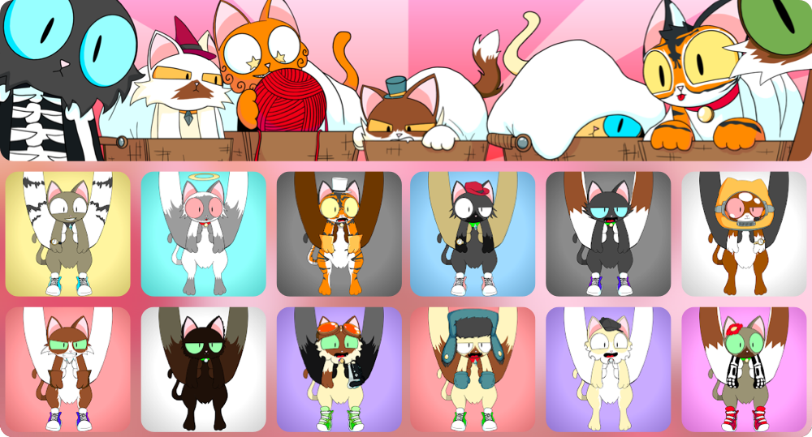
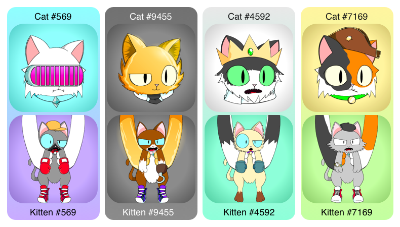

# Purrnelope's Kittens

[
[Contract](https://etherscan.io/address/0x0c6218d95735d3e12ae7c4703106e4b8e0b61010) |
[OpenSea](https://opensea.io/collection/purrnelopes-kittens) |
[LooksRare](https://looksrare.org/collections/0x0c6218D95735d3E12AE7C4703106E4b8e0b61010)
]

## What are Kittens

Purrnelopes Kittens is a collection of 10,000 randomly generated NFTs that exist on the Ethereum Blockchain. Purrnelope's Kittens are the 1st companions.

Kittens are redeemed with [Kitten Basket](../kittyvault-purrks/2-kitten-basket.md).

## Cats & Kittens

As shown in the picture above, the arms holding the kittens will match with the cat with the same Token ID.

## Utilities

### Earn $Token

Kittens are Tier 3 NFTs, will earn 1 $TOKEN per day per Kitten.

## Video

[PCC Kitten Airdrop: Explained](/posts/explained/202112-kitten-airdrop)

## Events

## See Also

### Secondary Markets

- [OpenSea](https://opensea.io/collection/purrnelopes-kittens)
- [LooksRare](https://looksrare.org/collections/0x0c6218D95735d3E12AE7C4703106E4b8e0b61010)
