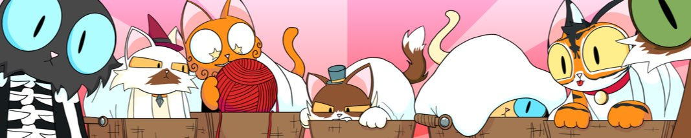

# Purrnelope's Kittens Collection

[
[Contract](https://etherscan.io/address/0x0c6218d95735d3e12ae7c4703106e4b8e0b61010) |
[OpenSea](https://opensea.io/collection/purrnelopes-kittens) |
[LooksRare](https://looksrare.org/collections/0x0c6218D95735d3E12AE7C4703106E4b8e0b61010)
]

Purrnelopes Kittens is a collection of 10,000 randomly generated NFTs that exist on the Ethereum Blockchain. Kittens are a part of the club and will be treated as such.

## What are Kittens

Purrnelope's Kitten are the first companions.

## Events

## See Also

### Secondary Markets

- [OpenSea](https://opensea.io/collection/purrnelopes-kittens)
- [LooksRare](https://looksrare.org/collections/0x0c6218D95735d3E12AE7C4703106E4b8e0b61010)
