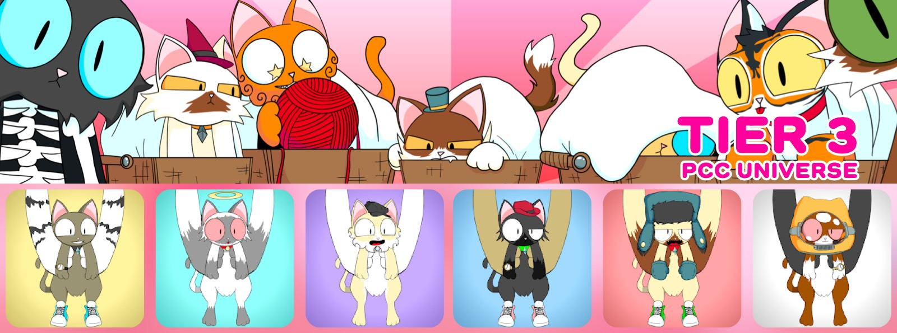
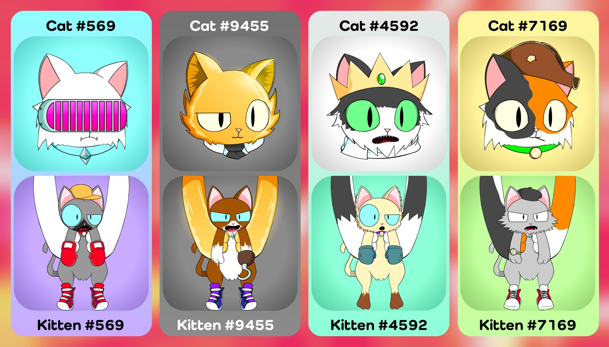

[Contract](https://etherscan.io/address/0x0c6218d95735d3e12ae7c4703106e4b8e0b61010) ·
[OpenSea](https://opensea.io/collection/purrnelopes-kittens) ·
[LooksRare](https://looksrare.org/collections/0x0c6218D95735d3E12AE7C4703106E4b8e0b61010)



## What are Kittens

Purrnelope's Kittens is the 2nd collection in PCC Universe with 10,000 randomly generated NFTs that exist on the Ethereum Blockchain. And Kittens are the 1st companion to the [Cats](../cats/index.md). Kittens are Tier 3 NFTs.

### Mint / Claim


Kittens are claimed with [Kitten Basket](../kittyvault-purrks/2-kitten-basket.md), 1 Kitten Basket for 1 Kitten. Public Kittens Claim opened on Nov 15, 2021. Unredeemed Kitten Baskets were pulled back on Dec 20, 2021. 

All unclaimed Kittens will be minted by the team. And will be used in giveaways. [^1]

Kittens `#1 - #20` are not revealed. They are reserved for The Team for mysterious plan? Maybe.

<iframe src="https://www.youtube.com/embed/Dc2Hb1kT6hk" title="YouTube video player" frameborder="0" allow="accelerometer; autoplay; clipboard-write; encrypted-media; gyroscope; picture-in-picture" allowFullScreen></iframe>

### Clubhouse Access

Kittens owners can access **Clubhouse** channel in [PCC Discord](http://discord.gg/purrnelopescountryclub).

### Earn $Token

Kittens are Tier 3 NFTs, will earn 1 $TOKEN per day per Kitten.

:::info

Details for Tiers & $TOKEN has not been released yet.

:::

### Redeem for KittyVault Fractions

Once the [KittyVault](../../kittyvault/index.md) is fractionalized, Kittens can be redeemed(burned) for [KittyBank Token](../../kittyvault/index.md#kittybank-token-token).

### Cats & Kittens

**Kittens are held in arms of [Cats](../cats/index.md), the arms holding the Kittens will match with the [Cats](../cats/index.md) with the same ID.**



## Learn More

- Video: [PCC Kitten Airdrop: Explained](/posts/explained/202112-kitten-airdrop)

## Events

- 2021-11-13: PCC Team minted Kitten #1 - #20 @ [11:08:44 PM +UTC](https://etherscan.io/tx/0xaccffa89b7df01dd4ea1f0c470644c9cc6f2cb99b2c40ad4a9ffa43732f8cc82)
- 2021-11-15: Public Kitten Claim opened, 1st claim @ [09:31:02 PM +UTC](https://etherscan.io/tx/0xb12b71b890479b9cdd827d14abb5c7f9f0e9667fbb3d07b23b32ffa85f3325d7)
- 2021-12-20: Unredeemed Kitten Baskets are pulled back to purrnelope.pcc.eth [Etherscan](https://etherscan.io/tx/0x2598b855a071a7dc498c20f8768891178aa293034e44db5ac2c10c95d06acac1)

## The Kittens Contract {#contract}

Kittens are ERC-721 NFTs ([Etherscan](https://etherscan.io/address/0x0c6218d95735d3e12ae7c4703106e4b8e0b61010)). And the contract itself is named **PurrnelopesKittens**. And here are some unique features in the Kittens contract:

### Mint Related

#### `devMint` Function <sup>private</sup>

This is a private function and can not be used by anyone after the contract is deployed. Using this function can mint Kittens with sequential ID.

This was used during the contract deployment, Kittens #1 - #20 were minted for the team. ([Etherscan](https://etherscan.io/tx/0xaccffa89b7df01dd4ea1f0c470644c9cc6f2cb99b2c40ad4a9ffa43732f8cc82))

> This function is the same as the [Grandmas Contract](../grandmas/index.md#contract)

<details><summary>See Code</summary>

```js
function devMint(uint256 _quantity, address _to) private {
    uint256 remaining = MaxSupplyCount - CurrentTokenId.current();
    for(uint256 i; i < _quantity; i++){
        CurrentTokenId.increment();
        remaining--;
        _safeMint(_to, CurrentTokenId.current());
        Ids[i] = Ids[remaining] == 0 ? remaining : Ids[remaining];
    }
}

constructor() ERC721("Purrnelopes Kittens", "PK"){
    devMint(20, 0x112E62d5906F9239D9fabAb7D0237A328F128e22);
}
```

</details>

#### `internalMint` Function <sup>private</sup>

This is a private function for minting Kittens using other functions in this contract.

This function makes public Kittens minting have non-sequential token IDs. And it used `getRandomNumber` function defined in this contract to arhieve that.

> This function is the same as the [Grandmas Contract](../grandmas/index.md#contract)

<details><summary>See Code</summary>

```js
function internalMint(address _to, uint256 _quantity) private {
    require(_quantity <= MaxMintCount && _quantity > 0, "Incorrect mint quantity");
    require(_quantity.add(CurrentTokenId.current()) <= MaxSupplyCount, "Cannot exceed max supply");

    uint256 remaining = MaxSupplyCount - CurrentTokenId.current();

    for(uint256 i; i < _quantity; i++){

        remaining--;
        uint256 tokenId = CurrentTokenId.current();
        uint256 index = getRandomNumber(remaining, i * tokenId);

        _safeMint(_to, ((Ids[index] == 0) ? index : Ids[index]) + 1);

        Ids[index] = Ids[remaining] == 0 ? remaining : Ids[remaining];
        CurrentTokenId.increment();
    }
}

//"random" number.... using chainlink for VRF seems overkill
function getRandomNumber(uint256 maxValue, uint256 salt) private view returns(uint256) {
    if (maxValue == 0)
        return 0;
        
    uint256 seed =
        uint256(
            keccak256(
                abi.encodePacked(
                        block.difficulty +	
                        ((uint256(keccak256(abi.encodePacked(tx.origin, msg.sig)))) / (block.timestamp)) +
                        block.number +
                        salt
                )
            )
        );
    return seed.mod(maxValue);
}
```

</details>

#### `mint` Function

This function only accepts Kittens mint by the [KittyVault Purrks](../kittyvault-purrks/index.md) contract, the Purrks contract uses this function to mint Kittens to whom redeemed their [Kitten Basket](../kittyvault-purrks/2-kitten-basket.md) Purrks.

This was used for mint Kittens using the Kitten Basket Purrks.

> This function is the same as the [Grandmas Contract](../grandmas/index.md#contract)


<details><summary>See Code</summary>

```js
function mint(address _to, uint256 _quantity) override public {
    require(msg.sender == AllowedAddress || msg.sender == owner(), "Not allowed minting address");
    internalMint(_to, _quantity);
}
```

</details>

#### `mintKittens` Function

This is for minting Kittens by paying with Ether(ETH).

To use this, the `PublicMintingOpen` toggle needs to be opened. But it is never used since the Kittens now are redeemed with Kitten Basket. But this function leaves possiblities to make that happen. And a price for minting a Kitten was set to 0.1 ETH during the contract deployment, which can be changed later.

> This function is the same as the [Grandmas Contract](../grandmas/index.md#contract)

<details><summary>See Code</summary>

```js
function mintKittens(uint256 _quantity) payable public nonReentrant {
    require(msg.value == _quantity.mul(UnitPrice), "Incorrect ETH amount");
    require(PublicMintingOpen, "Public minting is not currently open");

    internalMint(msg.sender, _quantity);
}
```

</details>

### Token Metadata Related

#### `updateBurnUri` Function {#updateBurnUri}

This is for updating metadata for "\*burned(redeemed)" Kittens.

Kittens contract does not have a function to actually burn the Kittens, the Kittens NFT will always exist on blockchain. But "\*burned" Kittens are transferred to the burn(blackhole) address `0x0000····dEaD`. When querying token uri of a Kitten in the burn(blackhole) address, the contract will return to a unique token uri set by this function.

> This function is the same as the [Grandmas Contract](../grandmas/index.md#contract)

<details><summary>See Code</summary>

```js
function updateBurnUri(string memory _uri) public onlyOwner{
    BurnUri = _uri;
}

function tokenURI(uint256 _tokenId) public view override returns (string memory) {
    require(_exists(_tokenId), "ERC721Metadata: URI query for nonexistent token");

    string memory baseURI = _baseURI();
    string memory uri = bytes(baseURI).length > 0 ? string(abi.encodePacked(baseURI, _tokenId.toString())) : "";
    return (ownerOf(_tokenId) == BurnAddress) ? BurnUri : uri;
}
```

</details>

### KittyVault Fractions Related

#### `redeemKittyBankFractions` Function

This is likely to be used for redeem Kittens for KittyVault Fractions. But it is also possible to create another contract to archive that.

Using this function will transferred the Kittens to the burn(blackhole) address `0x0000····dEaD`, and give back the KittyVault Fractions Token back to the owner that gave up his Kitten. And the Kittens transferred to the burn(blackhole) address will never get their image back, which explained in [`updateBurnUri`](#updateBurnUri) function.

And this function even supports redeeming multiple Kittens at once! What a cruel function!

<details><summary>See Code</summary>

```js
function redeemKittyBankFractions(uint256[] calldata ids) public {
    require(RedeemOpen, "ERC-20 redeem is not currently open");
    require(FractionsPerNFT > 0, "Fractions per NFT currently not set");
    uint256 amount = FractionsPerNFT.mul(ids.length);
    require(FractionsContract.balanceOf(address(this)) >= amount, "Not enough balance of tokens to redeem");

    for(uint256 i; i < ids.length; i++){
        //we don't need to check the owner of the tokens because this is checked in transferFrom method
        this.transferFrom(msg.sender, BurnAddress, ids[i]);
    }

    FractionsContract.transfer(msg.sender, amount);
}
```

</details>

## See Also

### Secondary Markets

- [OpenSea](https://opensea.io/collection/purrnelopes-kittens)
- [LooksRare](https://looksrare.org/collections/0x0c6218D95735d3E12AE7C4703106E4b8e0b61010)

[^1]: Kittens giveaway was mentioned in [PurrCast 2020-04-13](/posts/2022/04/20/purrcast)
