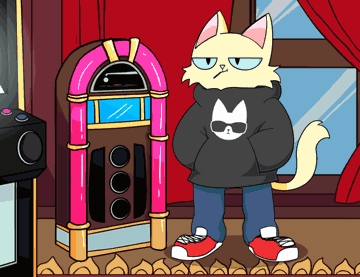

[](https://ipfs.io/ipfs/QmNU1P1fSAWE84eRkgiHtNSPJBJg64PqhAA7NYeBYCSbhf)

[[OpenSea](https://opensea.io/assets/0xda7d42b6167f1497346d7b2336a6d7a603026db1/0)]

This Hoodie Cat NFT can be redeemed for the KittyBank fractional share when the contracts are live Soon™. It can also be redeemed for our Genesis Flex Hoodie. Financial advice is to avoid redeeming ten of these for the Hoodie. The first window will be open shortly to redeem your Hoodie. This NFT will also show in the collection log when that is live on PCC Official Website.

## Redeem

Can be redeemed to a physical hoodie.

10 NFTs will be required to redeem a hoodie.

## Video

[Purrnelope's Country Club Main Airdrop 1 - Explained!](/posts/explained/201109-airdrop-1)

[Hoodie Redemption: Explained!](/posts/explained/202111-hoodie-redemption)

## Meta

Appeared: [Sep-29-2021 08:59:42 PM +UTC](https://etherscan.io/tx/0x46bc5d8257426db66c8153b833da159203d0951651c9a47fb1d3a3cfd41e74b7)

```json
{
  "name": "#1 - Hoodie Cat",
  "description": "This Hoodie Cat NFT can be redeemed for the KittyBank fractional share when the contracts are live Soon™. It can also be redeemed for our Genesis Flex Hoodie. Financial advice is to avoid redeeming ten of these for the Hoodie, but we know we can’t stop all of you. The first window will be open shortly to redeem your Hoodie. This NFT will also show in the collection log when that is live on our website™",
  "image": "ipfs://QmNU1P1fSAWE84eRkgiHtNSPJBJg64PqhAA7NYeBYCSbhf",
  "attributes": {
    "ID": "1",
    "Type": "Hoodie Cat",
    "Artist": "1rregularCharlie",
    "Kitty Bank": "Yes",
    "Physical": "Yes",
    "Year": "1"
  }
}
```
