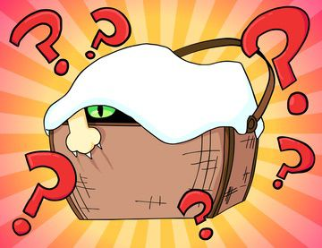

[](https://ipfs.io/ipfs/QmNpB5VxGMu2Ftx8CbyJo7cepgwtmVsj8Tnk4ZQpdHzSzD)

[[OpenSea](https://opensea.io/assets/0xda7d42b6167f1497346d7b2336a6d7a603026db1/1)]

This Kitten Basket NFT can be redeemed for a [Kitten Companion](../kittens/index.md). 1 Kitten per 1 Basket you own. The Kitten will be able to redeem the KittyBank token in the future, not this Basket, the Kitten you can claim with it. For 2 weeks this token can be solely traded or hodl'd. After the two weeks, claiming of the Kittens will be live, this will be live for 1 month. After that 1 month period (6 weeks from dispatch of the Baskets), PCC Team will pull all of these Baskets back. You will miss the opportunity to claim your Kitten after 6 weeks.

## Redeem

Each Kitten Basket can redeem a [Purrnelope's Kitten](../kittens/index.md). Currently the all the unredeemed baskets are pulled back and the public redeem is closed.

## Events

- 2021-12-20: Unredeemed baskets had been pulled back to purrnelope.pcc.eth

## Meta

Appeared: [Oct-30-2021 09:23:20 PM +UTC](https://etherscan.io/tx/0xee6f82b49c85be3f8b8ba8dda9506fea818455da563cfde46ce9bcbb8d7dd05b)

```json title="ipfs://QmdxdSp2cxDR1SXNayAK61uhtwv18FvQQecZ82j7jAYpH7"
{
  "name": "#2 - Kitten Basket",
  "description": "<p>This Kitten Basket NFT can be redeemed for a Kitten Companion. 1 Kitten per 1 Basket you own. The Kitten will be able to redeem the KittyBank token in the future, not this Basket, the Kitten you can claim with it, we want that to be clear.</p><p>For 2 weeks this token can be solely traded or hodl'd. After the two weeks, claiming of the Kittens will be live, this will be live for 1 month. After that 1 month period (6 weeks from dispatch of the Baskets) we will pull all of these Baskets back. You will miss the opportunity to claim your Kitten after 6 weeks. Please remember to claim your Kitten!</p>",
  "image": "ipfs://QmNpB5VxGMu2Ftx8CbyJo7cepgwtmVsj8Tnk4ZQpdHzSzD",
  "attributes": {
    "ID": "2",
    "Type": "Kitten Basket",
    "Artist": "1rregularCharlie",
    "Kitty Bank": "No",
    "Physical": "No",
    "Companion": "Yes",
    "Year": "1"
  }
}
```
