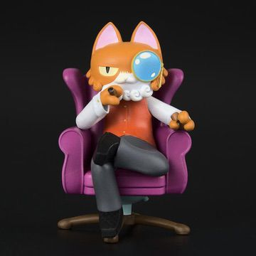

[](https://ipfs.io/ipfs/QmR9DLN7swfwVA7a5hzEvWyfWyZq1fee9fnU72NmjsmdJL)

[[OpenSea](https://opensea.io/assets/0xda7d42b6167f1497346d7b2336a6d7a603026db1/2)]


This Model Cat NFT can be redeemed for a KittyVault fractional share when the contracts are live Soon™. It can also be redeemed for a model version of a cat that you own. You will need to trade in 5 of these NFTs to get your very own Purrnelope’s collectible. Starting in January, 50 spots will be available for this collectible to be redeemed. This NFT will also show in the collection log when that is live on our website™

## Redeem

Can be redeemed to a physical 3D Model Cat. The amount required for redeem is not comfirmed yet.

## Video

[3D Model: Explained!](/posts/explained/202112-3d-model)

## Meta

Appeared: [Nov-26-2021 10:59:52 PM +UTC](https://etherscan.io/tx/0x8764014ecaba68c27de905099ded90e5f35e32bf49599bea711d36058d16ab0a)

```json title="ipfs://QmdzDue3SNFBgBF1YZe2tpPJFwCjLognzSR5mKZ2Hfz5tG"
{
  "name": "#3 - Unknown Airdrop",
  "description": "To be revealed 30-Nov-2021",
  "image": "ipfs://QmX5k6SKnJfKzgKKTwjxrGGd8aoGkReTWjQLNVyA1q7Kc9",
  "attributes": {
    "ID": "3",
    "Type": "?",
    "Artist": "1rregularCharlie",
    "Kitty Bank": "No",
    "Physical": "No",
    "Companion": "No",
    "Year": "1"
  }
}
```


Revealed: [Nov-30-2021 10:43:15 PM +UTC](https://etherscan.io/tx/0x46dc1e6f809aa6ac39ba1401f6f3486a87bd81e5905baa295a541e21d9e254d7)

```json title="ipfs://Qmebg8xRPvMms8VFELWEBXnMVEU2WxBLQdbdmegx5oNgSi"
{
  "name": "#3 – Model Cat",
  "description": "This Model Cat NFT can be redeemed for a KittyVault fractional share when the contracts are live Soon™. It can also be redeemed for a model version of a cat that you own. You will need to trade in 5 of these NFTs to get your very own Purrnelope’s collectible. Starting in January, 50 spots will be available for this collectible to be redeemed. This NFT will also show in the collection log when that is live on our website™",
  "image": "ipfs://QmR9DLN7swfwVA7a5hzEvWyfWyZq1fee9fnU72NmjsmdJL",
  "attributes": {
    "ID": "3",
    "Type": "Model Cat",
    "Artist": "1rregularCharlie",
    "Kitty Bank": "Yes",
    "Physical": "Yes",
    "Companion": "No",
    "Year": "1"
  }
}
```
