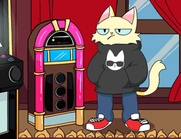

<span className="wikiPostHeadImgR">

[](https://ipfs.io/ipfs/QmNU1P1fSAWE84eRkgiHtNSPJBJg64PqhAA7NYeBYCSbhf)

</span>

[TokenTracker](https://etherscan.io/token/0xda7d42b6167f1497346d7b2336a6d7a603026db1?a=0) ·
[OpenSea](https://opensea.io/assets/0xda7d42b6167f1497346d7b2336a6d7a603026db1/0) ·
[LooksRare](https://looksrare.org/collections/0xDa7D42B6167f1497346D7B2336a6D7A603026Db1/0)

| Physical                                  | KV Fractions |
| ----------------------------------------- | ------------ |
| ✅ [w/ 10 Purrks](../../merch/hoodies.md) | ✅           |

This Hoodie Cat NFT can be redeemed for the KittyBank fractional share when the contracts are live Soon™. It can also be redeemed for our Genesis Flex Hoodie. Financial advice is to avoid redeeming ten of these for the Hoodie. The first window will be open shortly to redeem your Hoodie. This NFT will also show in the collection log when that is live on PCC Official Website.

## Redeem

### Physical Hoodie

For a [Physical Hoodie](../../merch/hoodies.md) with **10 Hoodie Cat NFTs**.

Redeem will open in the future.

### KittyVault Fractions

Redeem for [KittyVault](../../kittyvault/index.md) Fractions will open in the future.

## Leaks

:::info

This section contains leaked information before the final release. Final product may change when it is released.

:::

### IYK Tag

Each hoodie will has an NFT linked to it, only having the physical hoodie can claim the linked NFT. This is done by using IYK tag. [^1]

## Learn more

- Video: [Purrnelope's Country Club Main Airdrop 1 - Explained!](/posts/explained/201109-airdrop-1)
- Video: [Hoodie Redemption: Explained!](/posts/explained/202111-hoodie-redemption)

## Events

- 2021-09-30: Airdropped
  - It cost the team 8.32288423410938 ETH on gas to airdrop to all holders.
  - That's about 23,493 USD during the airdrop.
  - Txns Data: [CSV File](./assets/kvpurrks-1-8-txns.csv)

## Meta

- First appeared: [Sep-29-2021 08:59:42 PM +UTC](https://etherscan.io/tx/0x46bc5d8257426db66c8153b833da159203d0951651c9a47fb1d3a3cfd41e74b7)

  <details><summary>Token Metadata</summary>

  ```json
  {
    "name": "#1 - Hoodie Cat",
    "description": "This Hoodie Cat NFT can be redeemed for the KittyBank fractional share when the contracts are live Soon™. It can also be redeemed for our Genesis Flex Hoodie. Financial advice is to avoid redeeming ten of these for the Hoodie, but we know we can’t stop all of you. The first window will be open shortly to redeem your Hoodie. This NFT will also show in the collection log when that is live on our website™",
    "image": "ipfs://QmNU1P1fSAWE84eRkgiHtNSPJBJg64PqhAA7NYeBYCSbhf",
    "attributes": {
      "ID": "1",
      "Type": "Hoodie Cat",
      "Artist": "1rregularCharlie",
      "Kitty Bank": "Yes",
      "Physical": "Yes",
      "Year": "1"
    }
  }
  ```

  </details>

[^1]: From [2022 with PCC](/posts/2021/12/31/post/2022-with-pcc)
