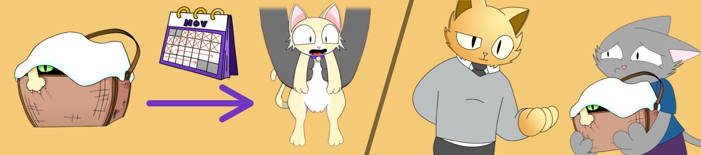

<span className="wikiPostHeadImgR">

[](https://ipfs.io/ipfs/QmNpB5VxGMu2Ftx8CbyJo7cepgwtmVsj8Tnk4ZQpdHzSzD)

</span>

[TokenTracker](https://etherscan.io/token/0xda7d42b6167f1497346d7b2336a6d7a603026db1?a=1) ·
[OpenSea](https://opensea.io/assets/0xda7d42b6167f1497346d7b2336a6d7a603026db1/1) ·
[LooksRare](https://looksrare.org/collections/0xDa7D42B6167f1497346D7B2336a6D7A603026Db1/1)

| Companion                         | Physical | KV Fractions |
| --------------------------------- | -------- | ------------ |
| ✅ [Kittens](../kittens/index.md) | No       | No           |

Kitten Baskets are mint passes to claim [Purrnelope's Kittens](../kittens/index.md), the 1st compaion to PCC Cats. Claimed Kittens represent fractional ownership of the KittyVault.

## Redeem

### PCC Kittens



Each Kitten Basket can redeem a [Purrnelope's Kitten](../kittens/index.md). Holders had 30 days to claim their Kittens by redeeming Kitten Baskets.

Public Kitten Claim opened on Nov 15, 2021. And it is closed now after all the unredeemed baskets were pulled back.

### KittyVault Fractions

Not with this Kitten Basket.

The Kittens will be able to redeem for [KittyVault](../../kittyvault/index.md) Fractions in the future.

## Learn more

- Video: [PCC Kitten Airdrop: Explained](/posts/explained/202112-kitten-airdrop)

## Events

- 2021-11-01: Airdropped
  - It cost the team 15.6316380993464 ETH on gas to airdrop to all holders.
  - That's about 44,124 USD during the airdrop.
  - Txns Data: [CSV File](./assets/kvpurrks-1-8-txns.csv)
- 2021-11-15: Public Kitten Claim opened
- 2021-12-20: Unredeemed Kitten Baskets are pulled back to purrnelope.pcc.eth [Etherscan](https://etherscan.io/tx/0x2598b855a071a7dc498c20f8768891178aa293034e44db5ac2c10c95d06acac1)

## Meta

- Appeared: [Oct-30-2021 09:23:20 PM +UTC](https://etherscan.io/tx/0xee6f82b49c85be3f8b8ba8dda9506fea818455da563cfde46ce9bcbb8d7dd05b)

  <details><summary>Token Metadata</summary>

  ```json title="ipfs://QmdxdSp2cxDR1SXNayAK61uhtwv18FvQQecZ82j7jAYpH7"
  {
    "name": "#2 - Kitten Basket",
    "description": "<p>This Kitten Basket NFT can be redeemed for a Kitten Companion. 1 Kitten per 1 Basket you own. The Kitten will be able to redeem the KittyBank token in the future, not this Basket, the Kitten you can claim with it, we want that to be clear.</p><p>For 2 weeks this token can be solely traded or hodl'd. After the two weeks, claiming of the Kittens will be live, this will be live for 1 month. After that 1 month period (6 weeks from dispatch of the Baskets) we will pull all of these Baskets back. You will miss the opportunity to claim your Kitten after 6 weeks. Please remember to claim your Kitten!</p>",
    "image": "ipfs://QmNpB5VxGMu2Ftx8CbyJo7cepgwtmVsj8Tnk4ZQpdHzSzD",
    "attributes": {
      "ID": "2",
      "Type": "Kitten Basket",
      "Artist": "1rregularCharlie",
      "Kitty Bank": "No",
      "Physical": "No",
      "Companion": "Yes",
      "Year": "1"
    }
  }
  ```

  </details>
