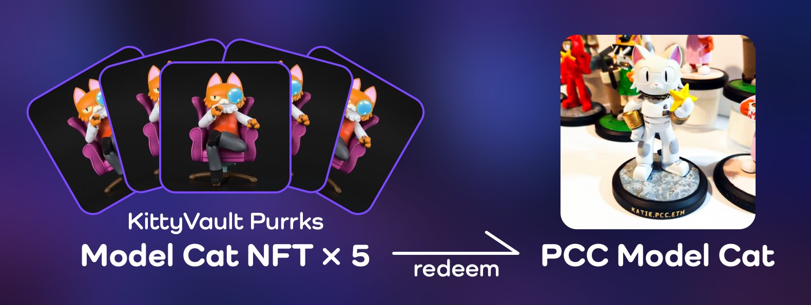

<span className="wikiPostHeadImgR">

[](https://ipfs.io/ipfs/QmR9DLN7swfwVA7a5hzEvWyfWyZq1fee9fnU72NmjsmdJL)

</span>

[TokenTracker](https://etherscan.io/token/0xda7d42b6167f1497346d7b2336a6d7a603026db1?a=2) ·
[OpenSea](https://opensea.io/assets/0xda7d42b6167f1497346d7b2336a6d7a603026db1/2) ·
[LooksRare](https://looksrare.org/collections/0xDa7D42B6167f1497346D7B2336a6D7A603026Db1/2)

| Physical                                       | KV Fractions |
| ---------------------------------------------- | ------------ |
| ✅ [w/ 5 Purrks](../../merch/pcc-model-cat.md) | ✅           |

This Model Cat NFT can be redeemed for a KittyVault fractional share when the contracts are live Soon™. It can also be redeemed for a [Physical 3D printed PCC Model Cat](../../merch/pcc-model-cat.md) of a cat that you own.

## Redeem

### Physical 3D Model



**5 Model Cat NFTs** are required to redeem a [Physical 3D Printed PCC Model Cat](../../merch/pcc-model-cat.md) of your Cat and .pcc.eth subdomain name printed on.

Redeem opened on May 18, 2022. Learn more at [PCC Model Cat](../../merch/pcc-model-cat.md).

### KittyVault Fractions

Redeem for [KittyVault](../../kittyvault/index.md) Fractions will open in the future.

## Learn more

- Video: [3D Model: Explained!](/posts/explained/202112-3d-model)
- PurrCast: [PurrCast: 3D Models, ENS subdomains, $Token, The Future](/posts/2022/01/19/purrcast/)
- Merch: [PCC Model Cat](../../merch/pcc-model-cat.md)

## Events

- 2021-11-27: Airdropped
  - It cost the team 6.69173515450355 ETH on gas to airdrop to all holders.
  - That's about 18,889 USD during the airdrop.
  - Txns Data: [CSV File](./assets/kvpurrks-1-8-txns.csv)
- 2021-11-30: Token Metadata Revealed
- 2022-05-18: Physical Model Cat Redeem Opened

## Meta

- Appeared: [Nov-26-2021 10:59:52 PM +UTC](https://etherscan.io/tx/0x8764014ecaba68c27de905099ded90e5f35e32bf49599bea711d36058d16ab0a)

  <details><summary>Token Metadata</summary>

  ```json title="ipfs://QmdzDue3SNFBgBF1YZe2tpPJFwCjLognzSR5mKZ2Hfz5tG"
  {
    "name": "#3 - Unknown Airdrop",
    "description": "To be revealed 30-Nov-2021",
    "image": "ipfs://QmX5k6SKnJfKzgKKTwjxrGGd8aoGkReTWjQLNVyA1q7Kc9",
    "attributes": {
      "ID": "3",
      "Type": "?",
      "Artist": "1rregularCharlie",
      "Kitty Bank": "No",
      "Physical": "No",
      "Companion": "No",
      "Year": "1"
    }
  }
  ```

  </details>

- Revealed: [Nov-30-2021 10:43:15 PM +UTC](https://etherscan.io/tx/0x46dc1e6f809aa6ac39ba1401f6f3486a87bd81e5905baa295a541e21d9e254d7)

  <details><summary>Token Metadata</summary>

  ```json title="ipfs://Qmebg8xRPvMms8VFELWEBXnMVEU2WxBLQdbdmegx5oNgSi"
  {
    "name": "#3 – Model Cat",
    "description": "This Model Cat NFT can be redeemed for a KittyVault fractional share when the contracts are live Soon™. It can also be redeemed for a model version of a cat that you own. You will need to trade in 5 of these NFTs to get your very own Purrnelope’s collectible. Starting in January, 50 spots will be available for this collectible to be redeemed. This NFT will also show in the collection log when that is live on our website™",
    "image": "ipfs://QmR9DLN7swfwVA7a5hzEvWyfWyZq1fee9fnU72NmjsmdJL",
    "attributes": {
      "ID": "3",
      "Type": "Model Cat",
      "Artist": "1rregularCharlie",
      "Kitty Bank": "Yes",
      "Physical": "Yes",
      "Companion": "No",
      "Year": "1"
    }
  }
  ```

  </details>

[^1]: From [PurrCast: 3D Models, ENS subdomains, $Token, The Future](/posts/2022/01/19/purrcast/)
