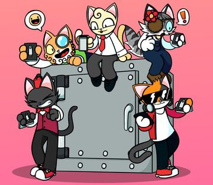

<span className="wikiPostHeadImgR">

[](https://ipfs.io/ipfs/QmckRR7fhjQ1US7eoU1tm6qcE1BWyDxs3wa2RzaV7aYJh8)

</span>

[TokenTracker](https://etherscan.io/token/0xda7d42b6167f1497346d7b2336a6d7a603026db1?a=6) ·
[OpenSea](https://opensea.io/assets/0xda7d42b6167f1497346d7b2336a6d7a603026db1/6) ·
[LooksRare](https://looksrare.org/collections/0xDa7D42B6167f1497346D7B2336a6D7A603026Db1/6)

| Physical       | KV Fractions |
| -------------- | ------------ |
| ✅ w/ 3 Purrks | ✅           |

This Ledger Cat NFT can be redeemed for a KittyVault fractional share when the contracts are live Soon.

It can also be redeemed for a physical Purrnelope's branded Ledger Hardware Wallet delivered to you if you so wish.

## Redeem

### Ledger Hardware Wallet

For a Physical Ledger Nano S Hardware Wallet with **3 Ledger Cat NFTs**.

Redeem will open in the future.

### KittyVault Fractions

Redeem for [KittyVault](../../kittyvault/index.md) Fractions will open in the future.

## Learn more

- Video: [Ledger Cat: Explained!](/posts/explained/202204-ledger-cat)

## Events

- 2022-03-29: Airdropped
  - It cost the team 3.98325942151469 ETH on gas to airdrop to all holders.
  - That's about 11,243 USD during the airdrop.
  - Txns Data: [CSV File](./assets/kvpurrks-1-8-txns.csv)
- 2022-03-31: Token Metadata Revealed

## Meta

- Appeared: [Mar-28-2022 09:54:28 PM +UTC](https://etherscan.io/tx/0x3c94ba360697a8e8e195a4394dc715d2a8612817c0f67e787067e6f31d2e965d)

  <details><summary>Token Metadata</summary>

  ```json title="ipfs://Qmd4wWVY5YeABtq1UusP1Xko1ALiQ2PMnhwVSz3pcH41cJ"
  {
    "name": "#7 - Unknown Airdrop",
    "description": "To be revealed 31-MAR-2022",
    "image": "ipfs://QmUYRN8TBXQUkrhHkhDac36LjdHVaQdrrXFoUQmYCTajRh",
    "attributes": {
      "ID": "7",
      "Type": "?",
      "Artist": "1rregularCharlie",
      "Kitty Bank": "No",
      "Physical": "No",
      "Companion": "No",
      "Year": "1"
    }
  }
  ```

  </details>

- Revealed: [Mar-31-2022 11:51:04 PM +UTC](https://etherscan.io/tx/0x5d2bc436dddaffc8a8eb14cded40ca4860104d3a0958f00ac343ebb2067ec5fe)

  <details><summary>Token Metadata</summary>

  ```json title="ipfs://QmXxfLR55a2totcPwswLUeM5Sxsu9wXFBZBqRNVmFsnuW1"
  {
    "name": "#7 – Ledger Cat",
    "description": "This Ledger Cat NFT can be redeemed for a KittyVault fractional share when the contracts are live SoonTM. It can also be redeemed for a physical Purrnelope's branded Ledger Hardware Wallet delivered to you if you so wish. You will need to trade in a currently TBA number of these NFTs to get your very own Purrnelope’s physical collectible. This NFT will also show in the collection log when that is live on our website™️",
    "image": "ipfs://QmckRR7fhjQ1US7eoU1tm6qcE1BWyDxs3wa2RzaV7aYJh8",
    "attributes": {
      "ID": "7",
      "Type": "Ledger",
      "Artist": "1rregularCharlie",
      "Kitty Bank": "Yes",
      "Physical": "Yes",
      "Companion": "No",
      "Year": "1"
    }
  }
  ```

  </details>

[^1]: PCC Twitter: https://twitter.com/PurrnelopesCC/status/1510236897569910785
