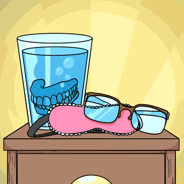
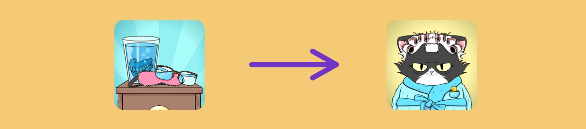

<span className="wikiPostHeadImgR">

[](https://ipfs.io/ipfs/QmS5EWmcth9bkCBRsKfxc47c9KjgERJh9De7yt7BRyDxZ6)

</span>

[TokenTracker](https://etherscan.io/token/0xda7d42b6167f1497346d7b2336a6d7a603026db1?a=7) ·
[OpenSea](https://opensea.io/assets/0xda7d42b6167f1497346d7b2336a6d7a603026db1/7) ·
[LooksRare](https://looksrare.org/collections/0xDa7D42B6167f1497346D7B2336a6D7A603026Db1/7)

| Companion                           | Physical | KV Fractions |
| ----------------------------------- | -------- | ------------ |
| ✅ [Grandmas](../grandmas/index.md) | No       | No           |

Grandma's Nightstands are mint passes to claim Purrnelope's Grandmas, the 2st compaion to PCC Cats. Claimed Grandmas represent fractional ownership of the KittyVault.

## Redeem

### Purrnelope's Grandmas

Each Grandma's Nightstand NFT can redeem for a [Purrnelope's Grandma](../grandmas/index.md).

Grandmas redeem window: May 16 to Jun 13, 2022, and was extended to Jun 23. After that, unredeemed Nightstands were pulled back.



### KittyVault Fractions

Not with this Nightstand.

The Grandma will be able to redeem for [KittyVault](../../kittyvault/index.md) Fractions in the future.

## Learn more

- Video: watch Grandma Katie's [Nightstand Explained! on Twitter](https://twitter.com/PurrnelopesCC/status/1520485640722288641)

## Events

- 2022-04-30: Airdropped
  - It cost the team 4.86591106792732 ETH on gas to airdrop to all holders.
  - That's about 13,576 USD during the airdrop.
  - Txns Data: [CSV File](./assets/kvpurrks-1-8-txns.csv)
- 2022-06-23: Unredeemed Grandma's Nightstands were pulled back to purrnelope.pcc.eth [Etherscan](https://etherscan.io/tx/0xaa7fd0e0a6bdb5154659b4cf6643bb7eb03f6136471988f67e03b2d559b53017)

## Meta

- Appeared: [Apr-29-2022 10:45:17 PM +UTC](https://etherscan.io/tx/0x39de00b7f1990ad17f3303e5142865aa776597cec4ac7b64195026fff8c92fdd)

  And there is a typo in the metadata, the mistake must be made by careless Carlini8.

  <details><summary>Token Metadata</summary>

  ```json title="ipfs://QmYzAK5zaZnhfnkCo1AooV2ox5r8w1GjCArm4wgAmc4qhC"
  {
    "name": "#7 – Ledger Cat",
    "description": "This Grandma's Nightstand NFT can be redeemed for a Cat Grandma Companion. 1 Cat Grandma per 1 Nightstand you own. The Grandma will be able to redeem the KittyBank token in the future, not this Nightstand, the Grandma you can claim with it, we want that to be clear. For 2 weeks this token can be solely traded or hodl'd. After the two weeks, claiming of the Grandma will be live, this will be live for 1 month. After that 1 month period (6 weeks from dispatch of the Nightstand) we will pull all of these Nightstands back. You will miss the opportunity to claim your Grandma after 6 weeks. Please remember to claim your Grandma!",
    "image": "ipfs://QmS5EWmcth9bkCBRsKfxc47c9KjgERJh9De7yt7BRyDxZ6",
    "attributes": {
      "ID": "8",
      "Type": "Grandma's Nightstand",
      "Artist": "1rregularCharlie",
      "Kitty Bank": "No",
      "Physical": "No",
      "Companion": "Yes",
      "Year": "1"
    }
  }
  ```

  </details>

- Updated: [Apr-30-2022 01:16:00 PM +UTC](https://etherscan.io/tx/0xac84a3401f02b28388637bd28f208d100d76f232dd60fa957c5f4b228964a38e)

  The metadata was updated to fix the typo before the airdrop.

  <details><summary>Token Metadata</summary>

  ```json title="ipfs://QmZEiL7gXiR3WvYh4YCtu1pDwJEkxMMbBptMPgZ35uZqBW"
  {
    "name": "#8 – Grandma's Nightstand",
    "description": "This Grandma's Nightstand NFT can be redeemed for a Cat Grandma Companion. 1 Cat Grandma per 1 Nightstand you own. The Grandma will be able to redeem the KittyBank token in the future, not this Nightstand, the Grandma you can claim with it, we want that to be clear. For 2 weeks this token can be solely traded or hodl'd. After the two weeks, claiming of the Grandma will be live, this will be live for 1 month. After that 1 month period (6 weeks from dispatch of the Nightstand) we will pull all of these Nightstands back. You will miss the opportunity to claim your Grandma after 6 weeks. Please remember to claim your Grandma!",
    "image": "ipfs://QmS5EWmcth9bkCBRsKfxc47c9KjgERJh9De7yt7BRyDxZ6",
    "attributes": {
      "ID": "8",
      "Type": "Grandma's Nightstand",
      "Artist": "1rregularCharlie",
      "Kitty Bank": "No",
      "Physical": "No",
      "Companion": "Yes",
      "Year": "1"
    }
  }
  ```

  </details>
