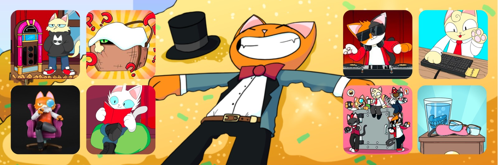
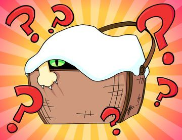

🪂
[Contract](https://etherscan.io/address/0xda7d42b6167f1497346d7b2336a6d7a603026db1) ·
[OpenSea](https://opensea.io/collection/purrnelopes-kittybank-purrks) ·
[LooksRare](https://looksrare.org/collections/0xda7d42b6167f1497346d7b2336a6d7a603026db1)
🪂


## What are Purrks

**KittyVault Purrks are Tickets in PCC Universe and contain a shard from the [KittyVault](../../kittyvault/index.md). They can be used to redeem for NFTs, or redeem for Physical Merchs, or redeem for tokens represent of fractions of the KittyVault.**

KittyVault Purrks were not on the original Roadmap 1.0 but added to the project later. Currently all 8 Purrks in Series 1 airdrops are completed.

## Purrks <sup>Series 1</sup> {#purrks}

Purrks Series 1 contain 8 airdrops to [PCC Cats](../cats/index.md) Holders during Sep 2021 to Apr 2022. Each month a snapshot was taken, and Purrks were airdropped to Cats Holders' wallet addresses, 1 PCC Cat for 1 airdropped KittyVault Purrks NFT.

<span className="wikiPostListImgR">

[](./1-hoodie-cat.md)

</span>

### 1. Hoodie Cat

**[Hoodie Cat](1-hoodie-cat.md) was airdropped on 2021-09-30.**

It can be used to redeem Physical Hoodie.

It also represents fractional ownership of the KittyVault.

<span className="wikiPostListImgR">

[](./2-kitten-basket.md)

</span>

### 2. Kitten Basket

**[Kitten Basket](2-kitten-basket.md) was airdropped on 2021-11-01.**

It can be used to claim [Purrnelope's Kittens](../kittens/index.md).

It does not represents fractional ownership of the KittyVault. Claimed Kitten represents fractional ownership of the KittyVault.

<span className="wikiPostListImgR">

[](./3-model-cat.md)

</span>

### 3. Model Cat

**[Model Cat](3-model-cat.md) was airdropped on 2021-11-27.**

It can be used to redeem physical 3D Model Cat.

It also represents fractional ownership of the KittyVault.

<span className="wikiPostListImgR">

[](./4-comic-cat.md)

</span>

### 4. Comic Cat

**[Comic Cat](4-comic-cat.md) was airdropped on 2021-12-31.**

It can be used to redeem physical Comic Book.

It also represents fractional ownership of the KittyVault.

<span className="wikiPostListImgR">

[](./5-record-cat.md)

</span>

### 5. Record Cat

**[Record Cat](5-record-cat.md) was airdropped on 2022-02-01.**

It can be used to redeem physical Music Record.

It also represents fractional ownership of the KittyVault.

<span className="wikiPostListImgR">

[](./6-keyboard-cat.md)

</span>

### 6. Keyboard Cat

**[Keyboard Cat](6-keyboard-cat.md) was airdropped on 2022-03-02.**

It can be used to redeem physical Purrnelope's branded Keyboard.

It also represents fractional ownership of the KittyVault.

<span className="wikiPostListImgR">

[](./7-ledger-cat.md)

</span>

### 7. Ledger Cat

**[Ledger Cat](7-ledger-cat.md) was airdropped on 2022-03-29.**

It can be used to redeem physical Purrnelope's branded Ledger Hardware Wallet.

It also represents fractional ownership of the KittyVault.

<span className="wikiPostListImgR">

[](./8-grandma-s-nightstand.md)

</span>

### 8. Grandma's Nightstand

**[Grandma's Nightstand](8-grandma-s-nightstand.md) was airdropped on 2022-04-30.**

It can be used to claim Cat Grandma Companion.

It does not represents fractional ownership of the KittyVault. Claimed Grandma represents fractional ownership of the KittyVault.

## The Ticket Contract

KittyVault Purrks are ERC-1155 NFTs ([Etherscan](https://etherscan.io/address/0xda7d42b6167f1497346d7b2336a6d7a603026db1)). And the contract itself is named **Ticket**. It is certainly built for the PCC Universe, and there are some special and interesting features to the contract.

### Managing Tickets

#### `addNewTicket` Function

This is used for add a new Purrks NFT. It also sets the metadata for that Purrks NFT and set the default redeem settings.

Currently 8 Purrks are created and grouped as Series 1. And it is possible for the team to do a Series 2 Purrks in the future.

<details><summary>See Code</summary>

```js
function addNewTicket(string memory hash) public onlyOwner {
    _tokenCounter.increment();
    uint256 tokenId = _tokenCounter.current();
    uriTokenHash[tokenId] = hash;

    FractionRedeemAllowed[tokenId] = false;
    AlternateRedeemAllowed[tokenId] = false;
    ERC721RedeemAllowed[tokenId] = false;

    FractionsPerTicket[tokenId] = 0;
    TicketsPerAlternate[tokenId] = 0;
    TicketsPerERC721[tokenId] = 0;
}
```

</details>

#### `mintbulk` Function

This is used for Purrks airdrops. A total of 71 transactions were made to airdrop Purrks #1 to #8 in Series 1, and 57.88 ETH was paid for gas to the airdrops by PCC Team. (Data: [CSV File](./assets/kvpurrks-1-8-txns.csv)).

The max allowed number for tickets for each Purrk is hardcoded here in the contract, 10,000 editions for each Purrk.

<details><summary>See Code</summary>

```js
function mintbulk(uint256 tokenId, address[] memory addresses, uint256[] memory quantities) public onlyOwner tokenExists(tokenId) {
    require(addresses.length == quantities.length, "Address and quantities need to be equal length");
    require(TotalRedeemed[tokenId].add(quantities.length) <= 10000, "Not enough tokens remaining");
    bytes memory x;
    for(uint256 i; i < quantities.length; i++){
        _mint(addresses[i], tokenId, quantities[i], x);
        TotalRedeemed[tokenId] = TotalRedeemed[tokenId].add(quantities[i]);
        totalCount = totalCount.add(quantities[i]);
    }
}
```

</details>

#### `setTokenHash` Function

This is used for change the metadata of a Purrks NFT. It is used for reveal the [Model Cat](./3-model-cat.md) and [Ledger Cat](./7-ledger-cat.md) Purrks. And onced the design of the PCC branded keyboard is complete, this function can be used to update the image of the [Keyboard Cat Purrks](./6-keyboard-cat.md) NFT.

And it can also be used to correct mistakes made to Purrks metadata. Before the airdrop of [Grandma's Nightstand](8-grandma-s-nightstand.md) Purrks, it was used to correct a mistate probably made by Carlini8 in the metadata.

<details><summary>See Code</summary>

```js
function setTokenHash(uint256 tokenId, string memory hash) public onlyOwner tokenExists(tokenId){
    uriTokenHash[tokenId] = hash;
}
```

</details>

#### `recallTokens` Function

This is unique, which can pull tickets back from the owners wallet.

It was used for pull [Kittens Basket](./2-kitten-basket.md) Purrks back when the redeem period for [Kittens](../kittens/index.md) ended. And may also be used for [Grandma's Nightstand](8-grandma-s-nightstand.md) Purrks.

<details><summary>See Code</summary>

```js
function recallTokens(uint256 tokenId, address[] memory addresses) public onlyOwner{
    bytes memory x;
    for(uint256 i; i < addresses.length; i++){
        _safeTransferFrom(addresses[i], msg.sender, tokenId, balanceOf(addresses[i], tokenId), x);
    }
}
```

</details>

### Redeem Features

#### `burnTokenForFractions` Function

This may be used once the KittyVault is fractionalized. And owners can burn(redeem) their Purrks to receive the [KittyBank Token](../../kittyvault/index.md#kittybank-token-token).

<details><summary>See Code</summary>

```js
function burnTokenForFractions(uint256 numberOfTickets, uint256 tokenId) public tokenExists(tokenId) nonReentrant  {
    require(FractionRedeemAllowed[tokenId], "Kitty Bank fraction redemption is not currently open for this token");
    require(this.balanceOf(msg.sender, tokenId) >= numberOfTickets && numberOfTickets != 0, "You do not have any of these tokens to redeem");

    uint256 fractions = numberOfTickets.mul(FractionsPerTicket[tokenId]);
    require(FractionsContract.balanceOf(address(this)) >= fractions, "Not enough fractions available to redeem");

    //burn the tickets
    this.safeTransferFrom(msg.sender, BURN_ADDRESS, tokenId, numberOfTickets, "0x0");
    totalCount = totalCount.sub(numberOfTickets);
    //send tokens
    FractionsContract.transfer(msg.sender, fractions);

    emit RedeemFractions(msg.sender, tokenId, numberOfTickets);
}
```

</details>

#### `burnTokenForCompanion` Function

This is used for redeem for PCC Companions.

It was used in using [Kitten Basket](2-kitten-basket.md) to redeem [Kittens](../kittens/index.md) Companions. And may also be used for [Grandma's Nightstand](8-grandma-s-nightstand.md) Purrks.

<details><summary>See Code</summary>

```js
function burnTokenForCompanion(uint256 numberOfTickets, uint256 tokenId) public tokenExists(tokenId) nonReentrant {
    require(ERC721RedeemAllowed[tokenId], "NFT redemption is not currently open for this token");
    require(this.balanceOf(msg.sender, tokenId) >= numberOfTickets && numberOfTickets != 0, "You do not have any of these tokens to redeem");
    require(numberOfTickets.mod(TicketsPerERC721[tokenId]) == 0 && numberOfTickets != 0, "Not enough tickets to redeem");

    CurrentNFTContract.mint(msg.sender, numberOfTickets.div(TicketsPerERC721[tokenId]));

    //burn the tickets
    this.safeTransferFrom(msg.sender, BURN_ADDRESS, tokenId, numberOfTickets, "0x0");
    totalCount = totalCount.sub(numberOfTickets);

    emit RedeemNFT(msg.sender, tokenId, numberOfTickets);
}
```

</details>

#### `burnTokenForAlternate` Function

This is not used yet, but likely to be used in redeem for Physicals with [Hoodie Cat](1-hoodie-cat.md), [Model Cat](3-model-cat.md), [Comic Cat](4-comic-cat.md), [Record Cat](5-record-cat.md), [Keyboard Cat](6-keyboard-cat.md) and [Ledger Cat](7-ledger-cat.md) Purrks. Because the event for this function is called `RedeemPhysical`.

The burned Purrks are sent the burn(blackhole) address `0x0000····dEaD`.

<details><summary>See Code</summary>

```js
function burnTokenForAlternate(uint256 numberOfTickets, uint256 tokenId) public tokenExists(tokenId) nonReentrant {
    require(AlternateRedeemAllowed[tokenId], "Alternate redemption is not currently open for this token");
    require(this.balanceOf(msg.sender, tokenId) >= numberOfTickets && numberOfTickets != 0, "You do not have any of these tokens to redeem");
    require(numberOfTickets == TicketsPerAlternate[tokenId] && numberOfTickets != 0, "Not enough tickets to redeem");

    //burn the tickets
    this.safeTransferFrom(msg.sender, BURN_ADDRESS, tokenId, numberOfTickets, "0x0");
    totalCount = totalCount.sub(numberOfTickets);

    emit RedeemPhysical(msg.sender, tokenId, numberOfTickets);
}
```

</details>

## See Also

### Secondary Markets

- [OpenSea](https://opensea.io/collection/purrnelopes-kittybank-purrks)
- [LooksRare](https://looksrare.org/collections/0xda7d42b6167f1497346d7b2336a6d7a603026db1)
