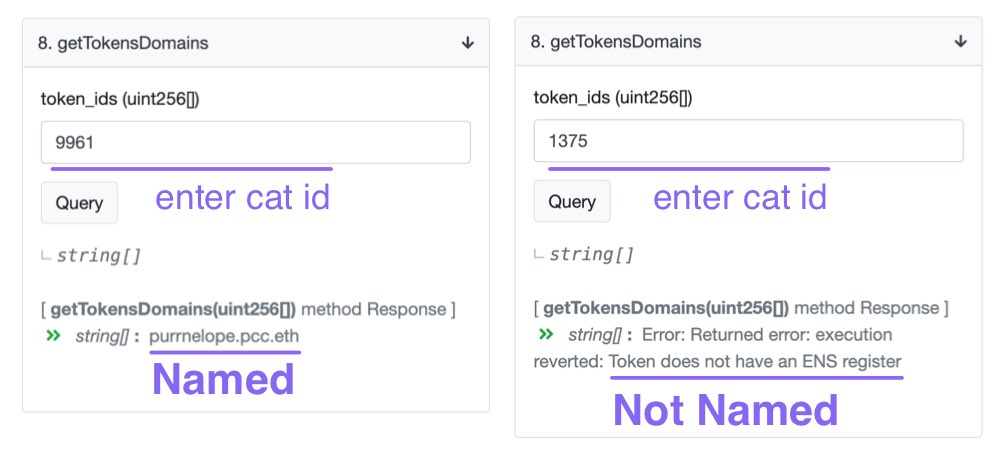
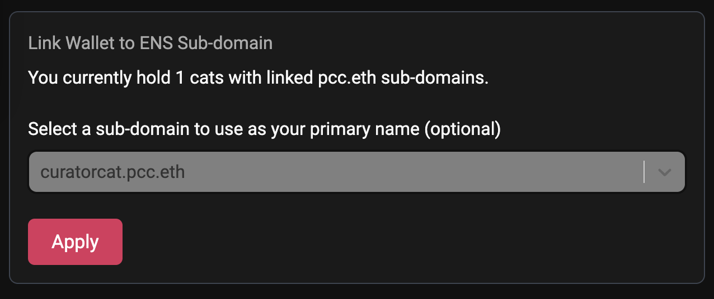

### How do I get mine?

- **You have to own a PCC Cat**, and the cat must not be tied to a .pcc.eth subdomain.

- Official PCC ENS Claim Page: [purrnelopescountryclub.com/claim/ens](https://www.purrnelopescountryclub.com/claim/ens).

### Do I own that .pcc.eth ENS?

- **No, your cat owns it**.

- But you own the cat, so technically you own the .pcc.eth in a way as long as you have the cat.

### Can I transfer a name from a cat to another cat?

- **No**, currently the name is tied to the cat and can not be transferred to another cat.

### Rules and restrictions?

- **The name follows the cat**, if you sell your cat, you'll lose that **.pcc.eth** ENS.

- **The name of the cat can not be transferred to another cat** for now.

- **Each wallet address can only name 1 cat every 12 weeks** for now. It's defined by `reset_period` in the [contract](https://etherscan.io/address/0x9b6d20f524367d7e98ed849d37fc662402dca7fb#readContract).

  If you want to name multiple cats and don't want to wait, name them using different wallet addresses, and send them back to the wallet you'd like to hold them.

- **Name length or special characters?**

  **The name can be any length** e.g. `x.pcc.eth` is possible but it is already taken.

  Well, **only `0-1` and `a-z` are allowed** using the claim page.

  But the contract itself supports more characters and emojis same as the main ENS registry contract. You can interact with the contract using `setDomain` function to set a name with other characters.

### How to know if a Cat has been named? {#faq-check}

- **The correct way is to look up the blockchain.**

  You can look up the PCC ENS Resolver contract on [Etherscan](https://etherscan.io/address/0x9b6d20f524367d7e98ed849d37fc662402dca7fb#readContract):

- Another quicker way is to look up [PCC ENS on Dune Analytics](https://dune.xyz/curatorcat/pcc-ens).

  Enter cat ID in the search box. But it is not always up-to-date on Dune and the name may be removed from the cat. It's just easier and faster than Etherscan.

  And it is also convenient to check for a name that has been used or not. If you want to buy a Cat with no name, use Etherscan.

### Does it override if I have an existing .eth domain?

- **No. You can have as many inbound addresses as you like.**

  An extra subdomain does not remove or replace your .eth domain. However, if you set your subdomain.pcc.eth as your primary address, this will be the address that shows on Uniswap, OpenSea, Snapshot, etc. Your avatar will also be your Purr rather than the generic MetaMask image!

### Why doesn’t it show on UniSwap/OS?

- **You have to set your subdomain.pcc.eth as the primary name.**

  This can be done on the [claim page](https://www.purrnelopescountryclub.com/claim/ens) once you have a cat owns a name:

If it shows on Uniswap but not OpenSea yet, it's most likely (99.9%) that it’s OpenSea being slow! It will sort itself out eventually! You can search your wallet address on [pcc.im](https://pcc.im) to see your primary ENS.

### Can I change a Cat's name? {#faq-change-name}

- **Yes, you can change a cat's name**. You can remove a name from a cat and then give your cat a new name.

- **But once the name is removed from the cat, no cat can be named using that name ever again!**

- You can search cat `6926` on the [PCC ENS Dune Analytics](https://dune.xyz/curatorcat/pcc-ens) page, you will see that cat has been named more than once. Because the name `deliciousgrizzly` was removed from the cat, then the cat has been given a new name.

- If you made spelling mistakes to name a cat, and would like to rename the cat. Follow [Remove Cat's name](guides.md#remove-name) in [Guides Page](guides.md) and give your cat a new name after 30 minutes the name is removed.
