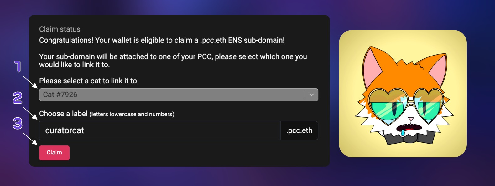
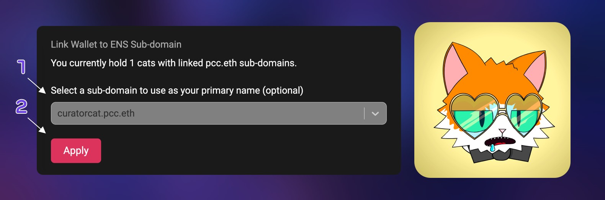
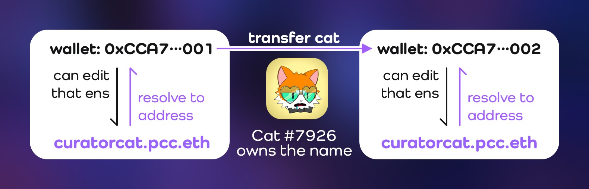
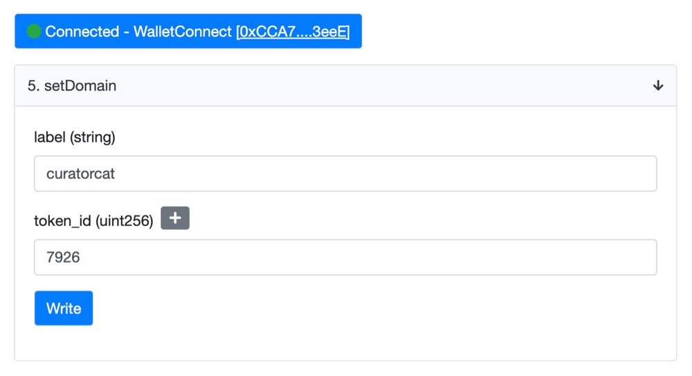
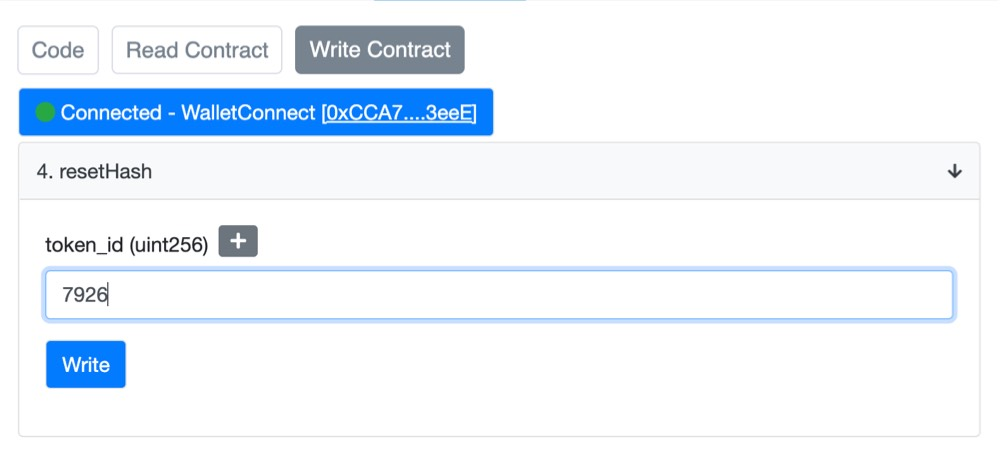
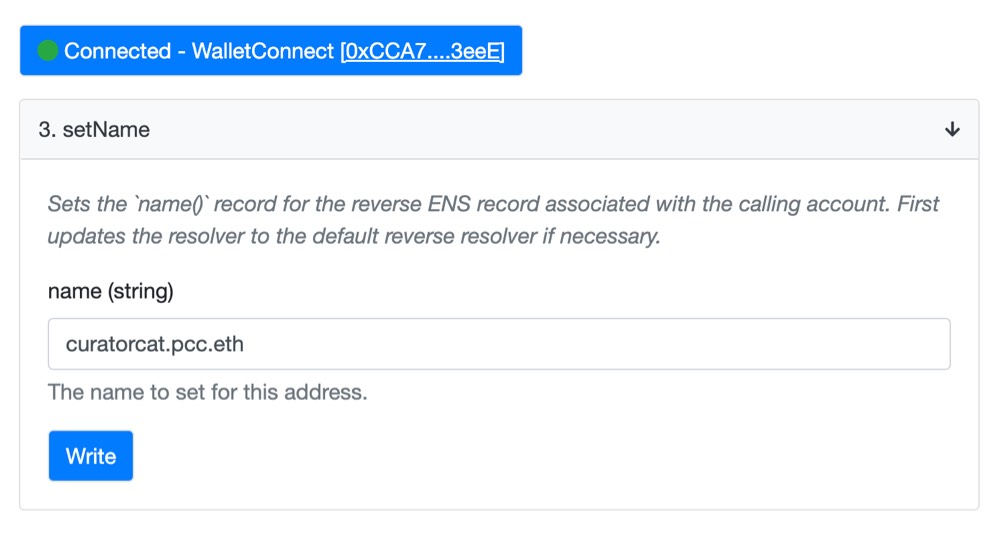
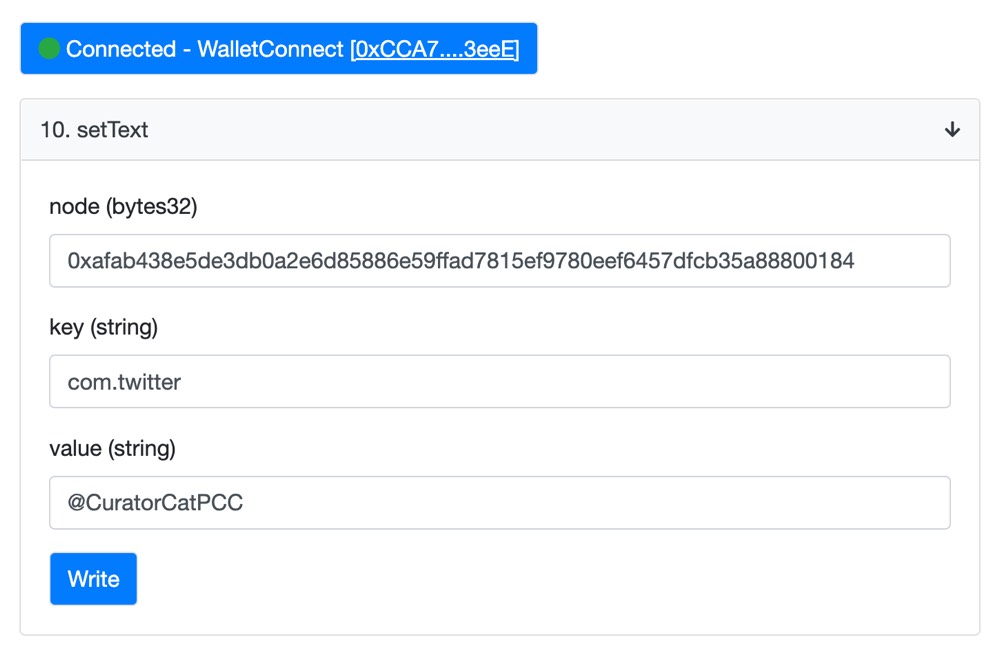
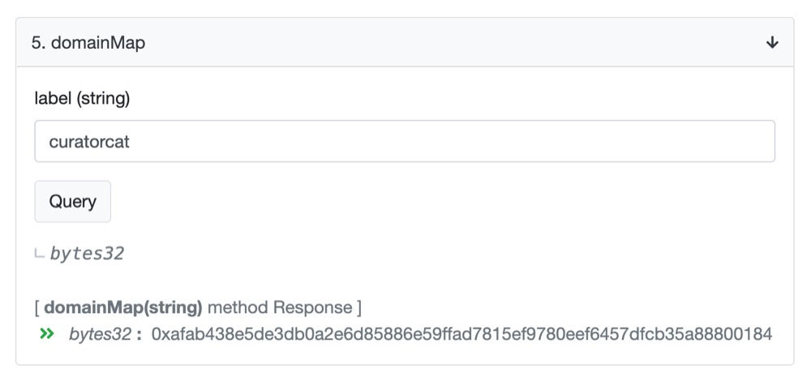

Guides for .pcc.eth ENS Subdomains

## General Guides

### Claim .pcc.eth ENS (name your Cat)

- To claim your .pcc.eth subdomain, you have to own a [PCC Cat](../collections/cats/index.md) without a name.
- Connect your wallet at [purrnelopescountryclub.com/claim/ens](https://www.purrnelopescountryclub.com/claim/ens):

1. Choose a Cat you would like to name;
2. Type a name, 0-1, a-z are allowed;
3. Click Claim, and confirm with your wallet.

- Once the transaction is complete on blockchain, you have your .pcc.eth subdomain with your cat.

### Set Primary ENS Record

- Once you have a cat with a name, you can link your wallet to use that .pcc.eth subdomain.
- Connect your wallet at [purrnelopescountryclub.com/claim/ens](https://www.purrnelopescountryclub.com/claim/ens):

1. Choose a pcc.eth subdomain name;
2. Click Apply, and confirm with your wallet.

### Transfer .pcc.eth ENS to Another Wallet

- **The .pcc.eth subdomain follows the Cat. If you want to transfer your .pcc.eth subdomain to another wallet address, simply transfer the cat has that name to the wallet you want to use.**
- e.g. Cat #7926 has the `curatorcat.pcc.eth` subdomain name. Transfer Cat #7926 to another wallet will make `curatorcat.pcc.eth` resolve to the new wallet address.

- After the transfer, you have to _Set Primary ENS Record_ again if you want to use the name as primary in the new wallet.

## Guides For Advanced Users

:::caution

Guides in this section require knownledges on interact with contracts on blockchain or via Etherscan.Please make sure you understand that and use at your own risk!

:::

### Claim .pcc.eth ENS with Contract

1. Connect your wallet holding the cat you want the name to [**Etherscan** at PCC's EnsMapper Contract Page](https://etherscan.io/address/0x9b6d20f524367d7e98ed849d37fc662402dca7fb#writeContract);
1. In the **Write Contract** section, go to **setDomain**;
1. **Enter the name you want in the `label` field in lowercase without `.pcc.eth`**, it can be any character, even emoji like 😻;
1. Enter the cat's ID in the `token_id` field you would like to have the name;
1. Click **Write** button. Confirm with your wallet. Once the transaction is successful, you got the name with your cat.

- ⛽️ **Gas Limit: `250,000`**. Most txn will pass under 200k gas, but 250k is safer for long names (under 64 charaters).

### Remove Cat's name with Contract {#remove-name}

:::warning

- Removing the name from a cat is dangerous and can not be undone.
- And the name removed can not be used ever again!
- Make sure you want to remove the name before you do that.

:::

1. Connect your wallet holding the cat you want to remove the name to [**Etherscan** at PCC's EnsMapper Contract Page](https://etherscan.io/address/0x9b6d20f524367d7e98ed849d37fc662402dca7fb#writeContract).
1. In the **Write Contract** section, go to **resetHash**.
1. Enter the cat's ID in the `token_id` field, then click the **Write** button. Confirm with your wallet. Once the transaction is successful, the cat is no longer tied to its previous name. Below is an example, `7926` is the ID of the cat and has the name `curatorcat`.

- ⛽️ **Gas Limit: `100,000`**. Most txn will pass under 50k gas.

- There is a 30 minutes of cool down after that, if you plan to make a new name to the cat, you have to wait for 30 minutes. Or transfer the cat to another wallet to make a new name.

### Set Primary ENS Record with Contract

1. Connect your wallet holding the cat have the .pcc.eth name to [**Etherscan** at ENS: Reverse Registrar Contract Page](https://etherscan.io/address/0x084b1c3c81545d370f3634392de611caabff8148#writeContract).
1. In the **Write Contract** section, go to **setName**;
1. Enther the full .pcc.eth subdomain in `name` field;
1. Click **Write**, and confirm with your wallet.

- ⛽️ **Gas Limit: `200,000`**. Most txn will pass under 150k gas.

### Update Social Accounts and Other Records with contract {#setText}

:::info Privacy Notice

All records on Ethereum blockchain is open to public as well as the update histories, those histories can not be ereased!

:::

1. Connect your wallet holding the cat have the .pcc.eth name to [**Etherscan** at PCC's EnsMapper Contract Page](https://etherscan.io/address/0x9b6d20f524367d7e98ed849d37fc662402dca7fb#writeContract).
1. In the **Write Contract** section, go to **setText**;
1. Enther NodeHash for the .pcc.eth subdomain in `node` field. (See [Check .pcc.eth subdomain Node ID](#domainMap) for NodeHash);
1. Enther `key` and `value` field. To remove a record, leave the `value` field empty;
1. Click **Write**, and confirm with your wallet.

- ⛽️ **Gas Limit: `250,000`**. Setting `com.twitter / @CuratorCatPCC` will use about 65k gas, 120 characters `description` will use about 124k gas.

- You can update one record each time, to update multiple records, just repeat what you just did.

  
<strong>Record Examples</strong>

| Record For    | Key Field       | Value Field                        |
| ------------- | --------------- | ---------------------------------- |
| **Bio**       | `description`   | `I'm Curator Cat, #WeLoveThePurrs` |
| **Website**   | `url`           | `https://pcc-archive.org`          |
| **Twitter**   | `com.twitter`   | `@CuratorCatPCC`                   |
| **Instagram** | `com.instagram` | `purrnelopes_country_club`         |
| **GitHub**    | `com.github`    | `CuratorCat`                       |
| **Telegram**  | `org.telegram`  | `https://t.me/username`            |
| **LinkedIn**  | `com.linkedin`  | `https://linkedin.com/in/username` |
| **TikTok**    | `com.tiktok`    | `@purrs_cc`                        |

### Check .pcc.eth subdomain NodeHash {#domainMap}

1. Go to [**Etherscan** at PCC's EnsMapper Contract Page](https://etherscan.io/address/0x9b6d20f524367d7e98ed849d37fc662402dca7fb#readContract);
1. In the **Read Contract** section, go to **domainMap**;
1. Enter the name `label` field, then click the **Query** button.

- In this example, `0xafab438e5de3db0a2e6d85886e59ffad7815ef9780eef6457dfcb35a88800184` is nthe NodeHash of `curatorcat.pcc.eth`
