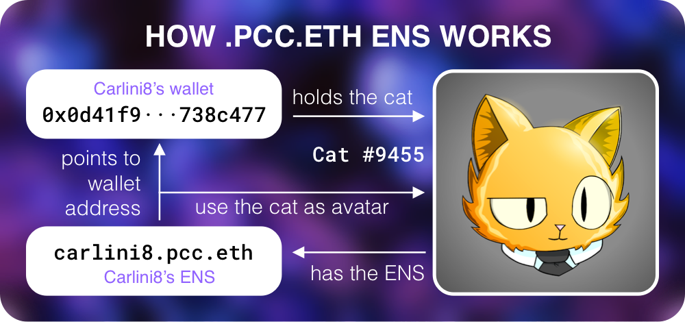

# .pcc.eth ENS Subdomains

You can only have a **.pcc.eth** if you own a Purrnelopes Country Club [Cat](../collections/cats/index.md). The ENS is tied to the cat, not an additional NFT, not your wallet, the cat itself. If you sell your PCC Cat, the **.pcc.eth** goes with it.

It's free for PCC Cats holders to claim on [PCC website](https://www.purrnelopescountryclub.com/claim/ens) beside the gas. As long as you hold the cat tied to it, you will have your **.pcc.eth** ENS, the PCC Team pays the annual fees for the primary **pcc.eth** ENS.

ENS domains is booming, and PCC's wizard `hodl.pcc.eth` created a custom [ENS resolver contract](https://etherscan.io/address/0x9b6d20f524367d7e98ed849d37fc662402dca7fb#code) that made PCC the first project links ERC-721 NFTs to ENS subdomains possible. The contract itself says _feel free to reuse_ for other projects to use!

<iframe width="100%" height="120" src="https://dune.xyz/embeds/318958/949996/1acb0020-e920-4e6a-8d9a-f3f66207dec3" title="pcc.eth counter" frameborder="0" allowtransparency="true" style={{background: "#F3F0FE", borderRadius: "12px"}}></iframe>

## Features

### Wallet Address

A **.pcc.eth** ENS is your wallet address, but more readable compared to 0x09284530···sjdflk9. Carlini's address is `carlini8.pcc.eth` and Papa's address is `papa.pcc.eth`. The **.pcc.eth** ENS subdomain will point to the wallet address holding the cat which has the **.pcc.eth** name.

### ENS PFP Avatar

The magic of **.pcc.eth** will use the cat has the name as ENS avatar automatically! All major standard web3 platforms like uniswap etc. will display your **.pcc.eth** name with the cat as the profile image!

### Follow `.pcc.eth` on Twitter

Follow `.pcc.eth` users on Twitter, use this [Twitter Search](https://twitter.com/search?q=.pcc.eth&src=typed_query&f=user).

### And more

**.pcc.eth** is more than a name and avatar, it's Proof of Ownership, Your Wallet Address, Searchable Profile Picture, Your Community, Proof of Flex, Marketing for your Community, Integrates your Brand, Bot Integratable. Read more on [Carlini8's Tweet Thread On .pcc.eth](/posts/2022/04/14/post/carlini8-tweet-pcc-eth)

## Learn more

- [Claim .pcc.eth](https://www.purrnelopescountryclub.com/claim/ens)

- Video: [PCC Sub Domains: Explained](/posts/explained/202112-ens-subdomains)

## .pcc.eth ENS FAQ {#faq}

### When will I be eligible?

Every Purr holder is now eligible to claim.

### Does it override if I have an existing .eth domain?

You can have as many inbound addresses as you like, so an extra subdomain does not remove or replace your .eth domain. Papa was `peteronfire78.eth` & Papa still is. However, if you set your subdomain.pcc.eth as your primary address, this will be the address that shows on Uniswap, Opens, Snapshot, etc. Your avatar will also be your Purr rather than the generic MetaMask image!

### How do I get mine?

Head to PCC website or this link here: https://www.purrnelopescountryclub.com/claim/ens

### Why doesn’t it show on UniSwap/OS?

If your subdomain.pcc.eth doesn’t show on Uniswap - please ensure you completed the second transaction on our website
If it shows on Uniswap but not OpenSea yet, its most likely (99.9%) that it’s OpenSea being slow! It will sort itself out eventually!

### I still have questions!

Tag Papa `peteronfire78#0016` in the PCC Discord Server or DM Papa - Papa's DMs are open to anyone in PCC Discord Server.

FAQ [^1]

## New pcc.eth

<iframe width="100%" height="315" src="https://dune.xyz/embeds/608635/1136329/1d177c7e-8c88-4907-bd9a-67c45e792a95" title="New pcc.eth" frameborder="0" allowtransparency="true" style={{background: "#F3F0FE", borderRadius: "12px"}}></iframe>

## Other PCC ENS

The PCC owns **purrnelopescountryclub.eth** and **pcc.eth** ENS.

[^1]: From PCC Discord: https://discord.com/channels/856877590592749598/921086339405991996
