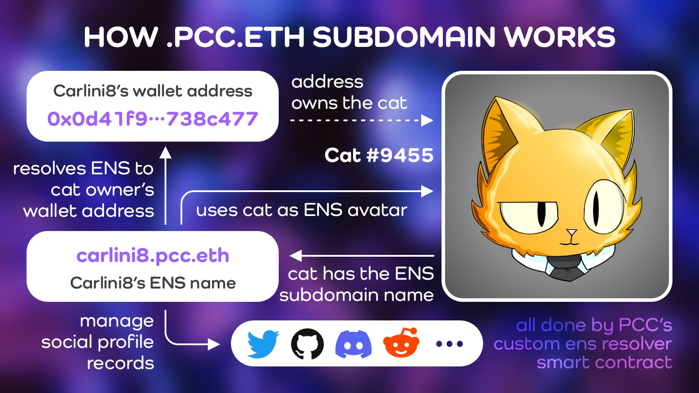
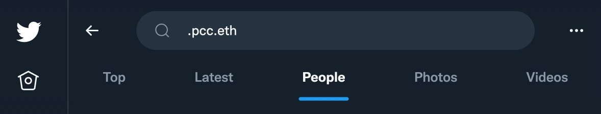

You can only have a **.pcc.eth** if you own a Purrnelopes Country Club [Cat](../collections/cats/index.md). The ENS is tied to the cat, not an additional NFT, not your wallet, the cat itself. If you sell your PCC Cat, the **.pcc.eth** goes with it.

It's free for PCC Cats holders to claim on the [PCC website](https://www.purrnelopescountryclub.com/claim/ens) beside the gas. As long as you hold the cat tied to it, you will have your **.pcc.eth** ENS, the PCC Team pays the annual fees for the primary **pcc.eth** ENS.

ENS domains are booming, and PCC's wizard `hodl.pcc.eth` created a custom [ENS resolver contract](https://etherscan.io/address/0x9b6d20f524367d7e98ed849d37fc662402dca7fb#code) that made PCC the first project that links ERC-721 NFTs to ENS subdomains possible. The contract itself says _feel free to reuse_ it for other projects to use!

<iframe width="100%" height="150" src="https://dune.xyz/embeds/1099635/1878809/0db4156e-6bdd-4d67-834f-2754f1e2087e" title="pcc.eth counter" frameborder="0" style={{background: "#F3F0FE", borderRadius: "12px"}}></iframe>

## Features

### Wallet Address

A **.pcc.eth** ENS is your wallet address, but more readable compared to 0x09284530···ac0bef. Carlini's address is `carlini8.pcc.eth` and Papa's address is `papa.pcc.eth`. The **.pcc.eth** ENS subdomain will point to the wallet address holding the cat which has the **.pcc.eth** name.

You can tell others your `yourname.pcc.eth` subdomain when sending ETH or tokens to you, and ENS is supported by most wallet apps.

### ENS PFP Avatar

The magic of **.pcc.eth** will use the Cat that has the name as the ENS avatar automatically! All major standard web3 platforms like uniswap etc. will display your **.pcc.eth** name with the cat as the profile image!

### Web3 Social Profile

**.pcc.eth subdomains** support ENS Text Records, this means you can add information such as your web social accounts to your .pcc.eth ENS subdomain.

There are some services currently support display web3 profile:

- **[eth.xyz](https://eth.xyz)**: [eth.xyz/curatorcat.pcc.eth](https://eth.xyz/curatorcat.pcc.eth)
- **[pcc.im](https://pcc.im)**: [pcc.im/curatorcat.pcc.eth](https://pcc.im/curatorcat.pcc.eth)
- **[me3.is](https://me3.is)**: [me3.eth.limo/#/curatorcat.pcc.eth](https://me3.eth.limo/#/curatorcat.pcc.eth)
- **[ENS App](https://app.ens.domains/)**: [app.ens.domains/name/curatorcat.pcc.eth/details](https://app.ens.domains/name/curatorcat.pcc.eth/details)

### Follow `.pcc.eth` on Twitter

.pcc.eth is the best way to find members of the PCC community! To follow `.pcc.eth` users on Twitter, use this [Twitter Search](https://twitter.com/search?q=.pcc.eth&src=typed_query&f=user).

### And more

**.pcc.eth** is more than a name and avatar, it's **Proof of Ownership**, **Your Wallet Address**, **Searchable Profile Picture**, **Your Community**, **Proof of Flex, Marketing for your Community**, **Integrates your Brand**, **Bot Integratable**. Read more on [Carlini8's Tweet Thread On .pcc.eth](/posts/2022/04/14/post/carlini8-tweet-pcc-eth)

## Guides {#guides}

See [Guides Page](guides.md) for all Guide for .pcc.eth ENS Subdomains.

### General Guides

- [Claim .pcc.eth ENS (name your Cat)](guides.md#claim-pcceth-ens-name-your-cat)
- [Set Primary ENS Record](guides.md#set-primary-ens-record)
- [Transfer .pcc.eth ENS to Another Wallet](guides.md#transfer-pcceth-ens-to-another-wallet)

### Advanced Guides

- [Claim .pcc.eth ENS with Contract](guides.md#claim-pcceth-ens-with-contract)
- [Remove Cat's name with Contract](guides.md#remove-name)
- [Set Primary ENS Record with Contract](guides.md#set-primary-ens-record-with-contract)
- [Update Social Accounts and Other Records with contract](guides.md#setText)
- [Check .pcc.eth subdomain NodeHash](guides.md#domainMap)

## FAQ {#faq}

See [FAQ Page](faq.md) for all FAQ for .pcc.eth ENS Subdomains.

- [How do I get mine?](./faq.md#how-do-i-get-mine)
- [Do I own that .pcc.eth ENS?](./faq.md#do-i-own-that-pcceth-ens)
- [Can I transfer a name from a cat to another cat?](./faq.md#can-i-transfer-a-name-from-a-cat-to-another-cat)
- [Rules and restrictions?](./faq.md#rules-and-restrictions)
- [How to know if a Cat has been named?](./faq.md#faq-check)
- [Does it override if I have an existing .eth domain?](./faq.md#does-it-override-if-i-have-an-existing-eth-domain)
- [Why doesn’t it show on UniSwap/OS?](./faq.md#why-doesnt-it-show-on-uniswapos)
- [Can I change a Cat's name?](./faq.md#faq-change-name)

## Learn more

- Claim Page: [purrnelopescountryclub.com/claim/ens](https://www.purrnelopescountryclub.com/claim/ens)
- Team Post: [PCC — ENS subdomains](/posts/2021/12/14/post/pcc-ens-subdomains)
- PurrCast: [ENS subdomains with hodl.pcc.eth](/posts/2022/04/20/purrcast/)
- Video: [PCC Sub Domains: Explained](/posts/explained/202112-ens-subdomains)

## Stats

Dune Analytics: https://dune.xyz/curatorcat/pcc-ens

### .pcc.eth Named Cats{#named-cats}

<iframe width="100%" height="315" src="https://dune.xyz/embeds/608635/1136329/1d177c7e-8c88-4907-bd9a-67c45e792a95" title="New pcc.eth" frameborder="0" style={{background: "#F3F0FE", borderRadius: "12px"}}></iframe>

## All PCC ENS {#all-pcc-ens}

All PCC related ENS currently owned by PCC Team.

### Registered by Team

The wallet address of **purrnelope.pcc.eth** is likely managed by carlini8.pcc.eth

- **pcc.eth** on [Nov-25-2021](https://etherscan.io/tx/0x33c8aa697ecf67de868f7c0f557403c7694523cadf436e9582c5375a28ed1964) by purrnelope.pcc.eth
- **purrnelopescountryclub.eth** on [Jul-28-2021](https://etherscan.io/tx/0x8c0e14299483d4d01d293f61c2ce223be66771431f6593eaa4f949157b3b1a19) by purrnelope.pcc.eth
- **purrnelopecommunitywallet.eth** on [Aug-11-2021](https://etherscan.io/tx/0x69efb7dff166fa78d2fc31debf53b04651c5e7da2e3db8fa929c1b808eec40ea) by 0x1F···1Df3
- **kittybank.eth** on [Aug-05-2021](https://etherscan.io/tx/0xe0f4a400bb19e3b93f83f8d1f063424b356e3d96efe777241958238fa9c036aa) by 0x1d···8e93

### Registered by Others

> ENS here are not registered by PCC Team but transferred to the team.

- **purrnelope.eth** on [Apr-06-2022](https://etherscan.io/tx/0xa61fb36464a70da993d6e7ca9be4354db181daab711e96ae7d87608f5ea31dd0) by 0x46···bdb1
- **kittyvault.eth** on [Apr-09-2022](https://etherscan.io/tx/0x948f00e73e012351b18bb39e11e853f9d29be06ab7ac906cafc19f794c4b798e) by 0xf0···E12F
- **purrcast.eth** on [Apr-10-2022](https://etherscan.io/tx/0x50c229f5d5dce3cf306d9c180b754c62fa883a0df33b64d0272842271373eaea) by 0xf0···E12F
- **purrks.eth** on [Apr-10-2022](https://etherscan.io/tx/0x663c6ff36d33c5bd7ce41b31173446ce401707c6e4c5df520db30286aa98dd3b) by 0xf0···E12F
