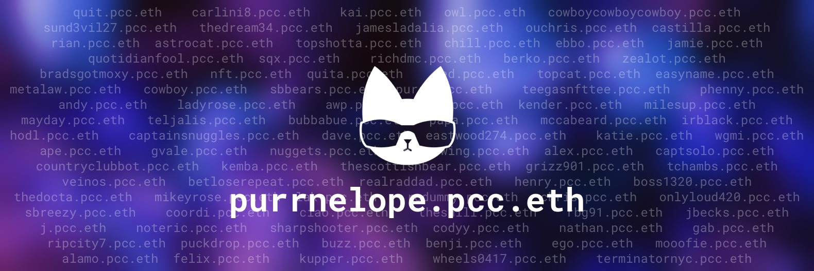

# .pcc.eth ENS Subdomains

You can only have a **.pcc.eth** if you own a Purrnelopes Country Club [Cat](../collections/cats/index.md). The ENS is tied to the cat, not an additional NFT, not your wallet, the cat itself. If you sell your PCC Cat, the **.pcc.eth** goes with it.

It's free for PCC Cats holders to claim on [PCC website](https://www.purrnelopescountryclub.com/claim/ens) beside the gas. As long as you hold the cat tied to it, you will have your **.pcc.eth** ENS, the PCC Team pays the annual fees for the primary **pcc.eth** ENS.

ENS domains is booming, and PCC's wizard `hodl.pcc.eth` created a custom [ENS resolver contract](https://etherscan.io/address/0x9b6d20f524367d7e98ed849d37fc662402dca7fb#code) that made PCC the first project links ERC-721 NFTs to ENS subdomains possible. The contract itself says _feel free to reuse_ for other projects to use!

<iframe width="100%" height="150" src="https://dune.xyz/embeds/318958/949996/1acb0020-e920-4e6a-8d9a-f3f66207dec3" title="pcc.eth counter" frameborder="0" style={{background: "#F3F0FE", borderRadius: "12px"}}></iframe>

## Features

### Wallet Address

A **.pcc.eth** ENS is your wallet address, but more readable compared to 0x09284530···sjdflk9. Carlini's address is `carlini8.pcc.eth` and Papa's address is `papa.pcc.eth`. The **.pcc.eth** ENS subdomain will point to the wallet address holding the cat which has the **.pcc.eth** name.

### ENS PFP Avatar

The magic of **.pcc.eth** will use the cat has the name as ENS avatar automatically! All major standard web3 platforms like uniswap etc. will display your **.pcc.eth** name with the cat as the profile image!

### Follow `.pcc.eth` on Twitter

Follow `.pcc.eth` users on Twitter, use this [Twitter Search](https://twitter.com/search?q=.pcc.eth&src=typed_query&f=user).

### And more

**.pcc.eth** is more than a name and avatar, it's Proof of Ownership, Your Wallet Address, Searchable Profile Picture, Your Community, Proof of Flex, Marketing for your Community, Integrates your Brand, Bot Integratable. Read more on [Carlini8's Tweet Thread On .pcc.eth](/posts/2022/04/14/post/carlini8-tweet-pcc-eth)

## FAQ for .pcc.eth ENS {#faq}

### 1. How do I get mine?

- You have to own a PCC Cat, and the cat must not tied to a .pcc.eth subdomain.
- PCC Official Claim Page: [purrnelopescountryclub.com/claim/ens](https://www.purrnelopescountryclub.com/claim/ens).

### 2. Do I own that .pcc.eth ENS?

- **No, your cat owns it**.

- But you own the cat, so technically you own the .pcc.eth in a way as long as you have the cat.

### 3. Can I transfer a name from a cat to another cat?

**No**, currently the name is tied to the cat and can not be transferred to another cat.

### 3. Rules and restricitons?

- **Then name follows the cat**, if you sell your cat, you'll lose that **.pcc.eth** ENS.

- **The name of the cat can not be transferred to another cat** for now.

- **Each wallet address can only name 1 cat in every 12 weeks** for now. It's defined by `reset_period` in the [contract](https://etherscan.io/address/0x9b6d20f524367d7e98ed849d37fc662402dca7fb#readContract).

  If you want to name multiple cats and don't want to wait, name them using different wallet addresses, and send them back to the wallet you'd like to hold them.

- **Name length or special characters?**

  - Well, **only `0-1` and `a-z` are allowed**.

  - **The name can be any length** e.g. `x.pcc.eth` is possible but it is already taken.

### 4. How to know if a Cat has been named? {#faq-check}

The correct way is to lookup on the blockchain. You can lookup the PCC ENS Resolver contract on [Etherscan](https://etherscan.io/address/0x9b6d20f524367d7e98ed849d37fc662402dca7fb#readContract):

Another quicker way is to lookup on [PCC ENS on Dune Analytics](https://dune.xyz/curatorcat/pcc-ens). Enter cat ID in the search box. But it is not always up-to-date on Dune and the name may be removed from the cat. It's just easier and faster than Etherscan. And it is also a convenient to check for a name has been used or not. If you want to buy a Cat with no name, use Etherscan.

### 5. Does it override if I have an existing .eth domain?

No. You can have as many inbound addresses as you like, so an extra subdomain does not remove or replace your .eth domain. However, if you set your subdomain.pcc.eth as your primary address, this will be the address that shows on Uniswap, OpenSea, Snapshot, etc. Your avatar will also be your Purr rather than the generic MetaMask image!

### 6. Why doesn’t it show on UniSwap/OS?

**You have to set your subdomain.pcc.eth as the primary name**

This can be done on the [claim page](https://www.purrnelopescountryclub.com/claim/ens) once you have a cat owns a name:

If it shows on Uniswap but not OpenSea yet, its most likely (99.9%) that it’s OpenSea being slow! It will sort itself out eventually! You can also connect your wallet on https://app.ens.domains/ to see if it's working.

### 7. Can I change a Cat's name? {#faq-change-name}

**Yes, you can change a cat's name**. You can remove a name from a cat then give your cat a new name.

**But once the name is removed from the cat, no cat can be named using that name ever again!**

You can search cat `6926` on the [PCC ENS Dune Analytics](https://dune.xyz/curatorcat/pcc-ens) page, you will see that cat has been named more than once. Because the name `deliciousgrizzly` was removed from the cat, then the cat has been given a new name.

If you made spelling mistakes to a cat, and would like to rename the cat. Follow [Remove Cat's name](#remove-name) instruction and give your cat a new name after 30 minutes the name removed.

## Remove Cat's name {#remove-name}

- Rmove the name from a cat is dangerous and can not be done.

- And the name removed can not be used ever again!

- Make sure you want to remove the name before you do that.

Click to see <b>Instructions for remove name from a cat</b>

:::warning

**Rmove the name from a cat is dangerous and can not be done.**

**And the name removed can not be used ever again!**

**Also this is not on the offical website and it's not an instruction by the PCC Team**

:::

It is possible to remove the name from a cat by interacting with the ENS Resolver contract:

1. Connect your wallet holding the cat you want to remove the name to [**Etherscan** at ENS Resolver Contract Page](https://etherscan.io/address/0x9b6d20f524367d7e98ed849d37fc662402dca7fb#writeContract).

2. At the **Write Contract** section, go to **resetHash**.

3. Enter the cat's ID in `token_id` field, then click **Write** button. Confirm with your wallet, once the transaction is successfull, the cat is no longer tied to it's previous name. Below is an example, `7926` is ID of the cat has the name `curatorcat`.

4. There is a 30 minutes of cool down after that, if you plan to make a new name to the cat, you have to wait for 30 minutes. Or transfer the cat to another wallet to make a new name.

## Learn more

- Claim Page: [purrnelopescountryclub.com/claim/ens](https://www.purrnelopescountryclub.com/claim/ens)

- Video: [PCC Sub Domains: Explained](/posts/explained/202112-ens-subdomains)

## Stats

Dune Analytics: https://dune.xyz/curatorcat/pcc-ens

### .pcc.eth Named Cats{#named-cats}

<iframe width="100%" height="315" src="https://dune.xyz/embeds/608635/1136329/1d177c7e-8c88-4907-bd9a-67c45e792a95" title="New pcc.eth" frameborder="0" style={{background: "#F3F0FE", borderRadius: "12px"}}></iframe>

## Other PCC ENS

The PCC owns **purrnelopescountryclub.eth** and **pcc.eth** ENS.
