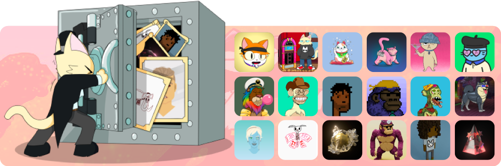
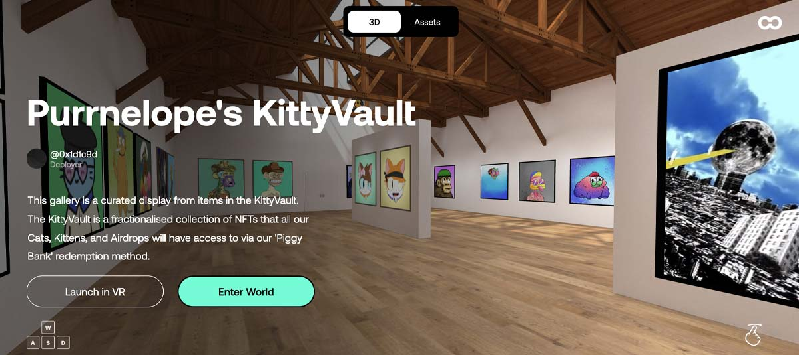

🏦
[OpenSea](https://opensea.io/kittyvault.pcc.eth) ·
[KV's Twitter](https://twitter.com/KittyVault) ·
[onCyber VR](https://oncyber.io/spaces/RKJMFEwiVG8f6V1aPL08)
🏦

## What is KittyVault

**The KittyVault (kittyvault.pcc.eth)** is a vault of NFTs that backs every [**PCC Cat**](../collections/cats/index.md) & [**KV Purrks airdrops**](../collections/kittyvault-purrks/index.md). The idea is that the Vault will operate as a 'Gold Standard' so your PCC collections will always have some inherent worth.

The KittyValut holds many high-value NFTs from many notable "blue chips" collections, e.g. CryptoPunks, CyberKongz, Bored Ape Yacht Club, Cool Cats, etc. **And it is valued at 929.08 ETH** based on the floor price of NFTs inside by Apr 22, 2022. [^2]

The KittyVault used to use the name _Kitty Bank_[^1]. [**A Brief History of KittyVault**](#a-brief-history) is covered later on this page.

### The Fractionalization

The whole KittyVault collection will be fractionalized with [fractional.art](https://fractional.art) 2.0 [^3]. The Team will do this once the team can ensure the fractional.art vault can still receive tokens, airdrops, etc. There are many projects in there that have upcoming companions, airdrops, tokens, etc. and we want those benefits to come to the Vault for everyone's benefit.

The KittyVault is 100,000 fractions, 10,000 held by the team for liquidity, and the other 90,000 in [PCC Cats](../collections/cats/index.md), [Kittens](../collections/kittens/index.md), Cat Grandmas and other 6 [KittyVault Purrks](../collections/kittyvault-purrks/index.md) airdrops

### KittyBank Token {#token}

**The KittyBank Token**, aka KittyVault Token, is different from the $TOKEN.

[PCC Cats](../collections/cats/index.md), [Kittens](../collections/kittens/index.md), Cat Grandmas and other 6 [KittyVault Purrks](../collections/kittyvault-purrks/index.md) will be able to be redeemed for KittyBank Token that represent shares of the KittyVault. That KittyBank Token will be tradable for 1/100,000 of the Vault's value.

:::info

The KittyBank Token has not been released yet, and its formal name, functions, etc. may also change before the release.

:::

**Browse the kittyvault in an immersive gallery on [oncyber.io](https://oncyber.io/spaces/RKJMFEwiVG8f6V1aPL08)!**

## FAQ

### Who lives in the KittyVault?

- **CryptoPunks, CyberKongz, Bored Apes, Cool Cats, Stoner Cats, Purrs and more.**

  You can browse the KittyVault: [on OpenSea](https://opensea.io/kittyvault.pcc.eth), [with VR onyber.io](https://oncyber.io/spaces/RKJMFEwiVG8f6V1aPL08).

### Is the Vault Fractionlized?

- **Not yet.** The Team will do this once the team can ensure the NFTs in KittyVault can still receive tokens, airdrops, etc.

### Which Collections can claim KVCoin?

> 👇 Citation Needed

- **Cats, 8 KV Purrks Airdrops, Kittens, Companion 2**

  However, KV Purrks airdrop No.2's metadata says: `"Kitty Bank": "No"`, because the airdroped Kitten Baskets are used to claim Kittens, and Kittens are fractions of KV.

### How does the KittyVault grow in value?

- The aim is to buy NFTs that we believe are either undervalued or a very solid long-term hold[^4]. Read more on [Deflationary NFTs and Rewarding HODLing](/posts/2021/08/15/post/deflationary-nfts-and-rewarding-hodling-kittybank).

### How is KV funded?

- The KittyVault buys NFT with company ETH, primary and secondary sales.

### How Purchases to the Vault Decided?

- Any Vault purchases will always be ratified by the community via snapshot votes.

  see [all Vote on PCC's Website](https://www.purrnelopescountryclub.com/voting).

### How are the Airdrops received in KV being managed?

- **With Community Vote**. The KittyVault receives airdrops from some of the NFTs it holds, like $Banana, $APE, and ESSENCE Claim.

  How they are used/spent is done by community vote, see [all Vote on PCC's Website](https://www.purrnelopescountryclub.com/voting).

## A Brief History of KittyVault {#a-brief-history}

### Community Wallet

After the Cats sold out, the team allocated 200 ETH to a community wallet on Aug 11, 2021 ([txn 1](https://etherscan.io/tx/0xb5003f2b49eea89d15357f710a3145f13da83d6ceb8daab386c2afbdea787270), [txn 2](https://etherscan.io/tx/0x6fdd6e55f067aed7a5f95ef726b248e2f7dfd126f3cde005b86ea6b8dd71fd61)) with the use of the funds voted on by holders. The community wallet also gets 1.5% of all secondary sales. The community wallet was on the original Roadmap 1.0. And the community wallet address was 0x1F4A···1Df3 ([Etherscan](https://etherscan.io/address/0x1F4A4fdFB5C729DC5D397A3541b38BF13a841Df3)).

`purrnelopecommunitywallet.eth` ENS was registered on the same day the team made the 200 ETH allocation. And the Community Wallet is still operated separately from the KittyBank/KittyVault.

### The KittyBank

After the community wallet was created. There were proposals on how to use the funds in the wallet. Cats hodlers [voted on snapshot](https://snapshot.org/#/purrnelopescountryclub.eth/proposal/QmYPtG4jidGRuixKXHPpFioErxXbe8uhrkthHYQ1VjKztj) to put the funds into a Bank wallet, and buy blue-chip NFTs.

On Sep 5, 2021, the team transferred 199.99 ETH ([txn on Etherscan](https://etherscan.io/tx/0x526676836451a16ca16f200d0ce664f37242dc2a27d32e8294aa3dfa73f843f8)) from the community wallet to a new wallet address 0x1d1c···8e93 ([Etherscan](https://etherscan.io/address/0x1d1c9Dad9A24b1E9324605153906d584520b8e93)). That's the start of the KittyBank.

On Sep 15, 2021, the team posted an article [Deflationary NFTs and Rewarding HODLing](/posts/2021/08/15/post/deflationary-nfts-and-rewarding-hodling-kittybank), explained vault fundings, fractionalized features, and introduced the [8 KittyBank Purrks Airdrops](../collections/kittyvault-purrks/index.md).

`kittybank.eth` ENS was registered on Aug 05, 2021 by the team.

### Fractionalize Bored Ape #5226 {#fractionalize-ape-5226}

Bored Ape Yacht Club #5226 was [fractionalized on fractional.art](https://fractional.art/vaults/0x0441f4355D918d60E59d42E37ebCDF94De2727c3) on Aug 21, 2021 as a result of 1st community vote [on snapshot](https://snapshot.org/#/purrnelopescountryclub.eth/proposal/QmTJ295RrF4rG8Hmr9R2cTp8fKd8vGjbUNcDJM6vZ3CuUW). The fractions were airdropped to minters of Cats #1-2000. That Ape is not part of the KittyVault but as part of community giveback program on Roadmap 1.0. It is also a try for the team and community to use a fractional.art vault.

> 👇 Citation Needed.

During the use of the factional.art vault, it required all the fractions holders to sign on-chain transactions to changes on the vault. That leads problems on receiving airdrops of that Ape and other managing problems. Now the team is focused on factional.art 2.0 for the future fractional of the vault.

### KittyVault Name

> 👇 This section needs to be updated & cited.

It seems the idea to set a collection of NFTs to a vault and fractionalize the vault from fractional.art. But this saying needs to be cited.

Once the KittyVault got fractionalized, there will be a token, and the vault will remain it's name KittyVault, and a new KittyBank will be introduced to act as a bank to let people redeem, exchange the KittyVault fraction shares and the token.

For now, the best to describe what KittyVault is it is the vault holding the NFTs collections. And the address of the vault is kittyvault.pcc.eth.

## Learn More

- Post: [Deflationary NFTs and Rewarding HODLing](/posts/2021/08/15/post/deflationary-nfts-and-rewarding-hodling-kittybank)
- Video: [What even is the Purrnelope's Country Club Kitty Bank?](/posts/learn/what-is-pcc-kitty-bank)

[^1]: KittyVault was using the name Kitty Bank when it was introduced.
[^2]: From KittyVault Newsletter Vol. 17, [tweet](https://twitter.com/PurrnelopesCC/status/1517586538695061504)
[^3]: Carlini8's [tweet](https://twitter.com/Carlini8N/status/1479861487380443140)
[^4]: [Deflationary NFTs and Rewarding HODLing](/posts/2021/08/15/post/deflationary-nfts-and-rewarding-hodling-kittybank)
