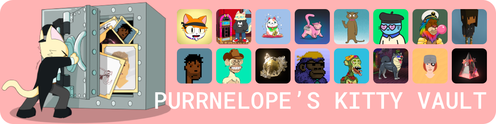

[
[OpenSea](https://opensea.io/kittyvault.pcc.eth) |
[Kitty Vault Twitter](https://twitter.com/KittyVault) |
[onCyber](https://oncyber.io/spaces/RKJMFEwiVG8f6V1aPL08)
]

## What is Kitty Vault?

The Kitty Vault is a vault of NFTs that backs every PCC cat & first 8 airdrops. It is the 'Gold Standard' that keeps your PCC NFTs secured.

Ownership of this vault is split between all PCC holders and all airdrops as well as the team. The whole collection will be fractionalized with [@fractional_art](https://twitter.com/fractional_art) 2.0 [^1]

## Who lives in the Kitty Vault?

CryptoPunks, CyberKongs, Bored Apes, Cool Cats, Stoner Cats, Purrs and more.

See [Kitty Vault on OpenSea](https://opensea.io/kittyvault.pcc.eth).

#### In 3D & VR

Browse the kitty vault in an immersive gallery on [oncyber.io](https://oncyber.io/spaces/RKJMFEwiVG8f6V1aPL08)!

[^1]: Carlini8's [tweet](https://twitter.com/Carlini8N/status/1479861487380443140)
