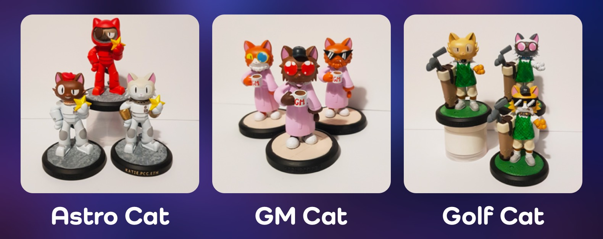
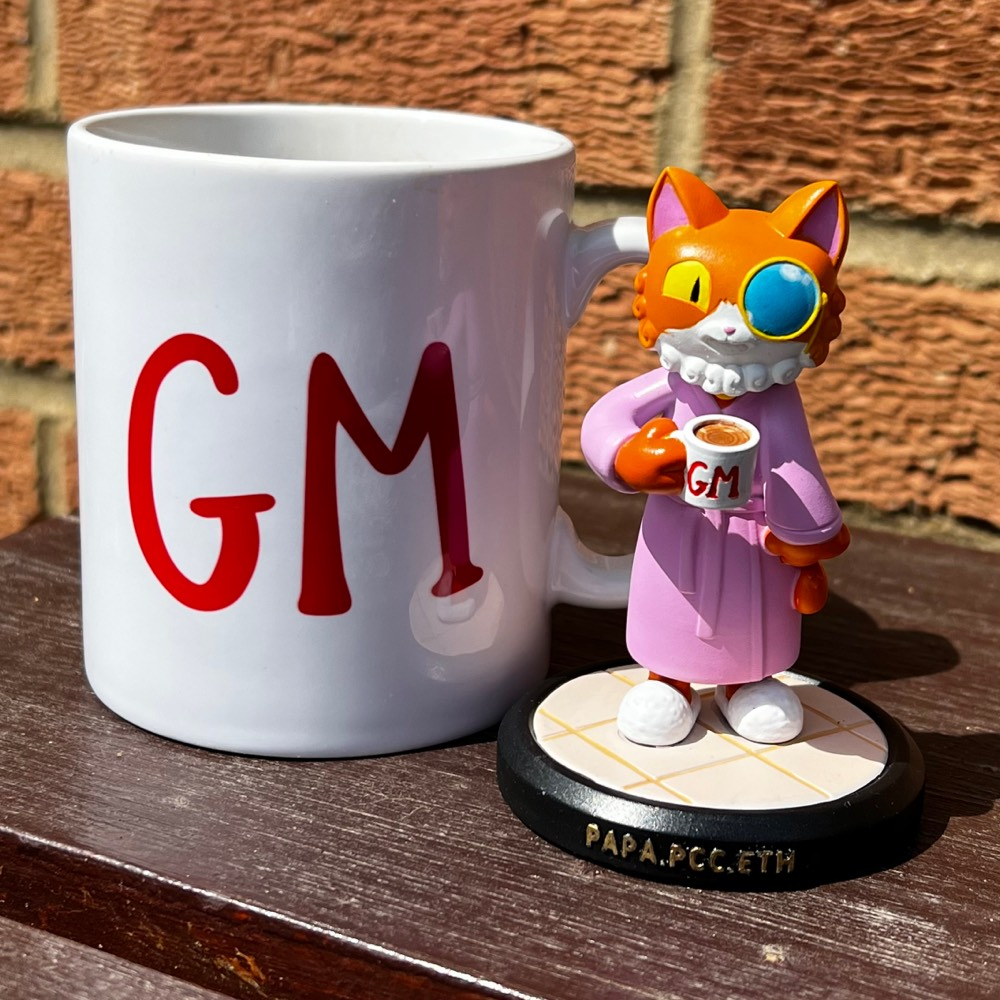
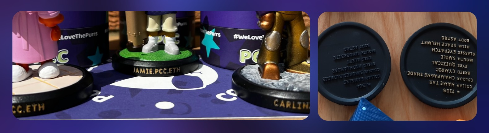
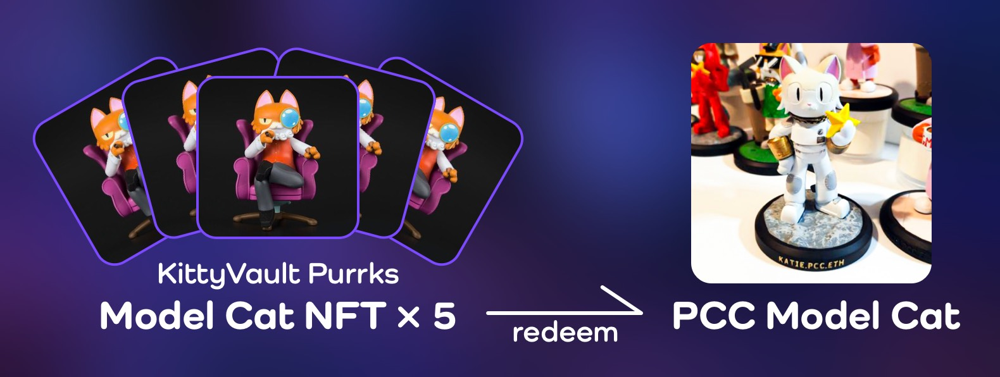
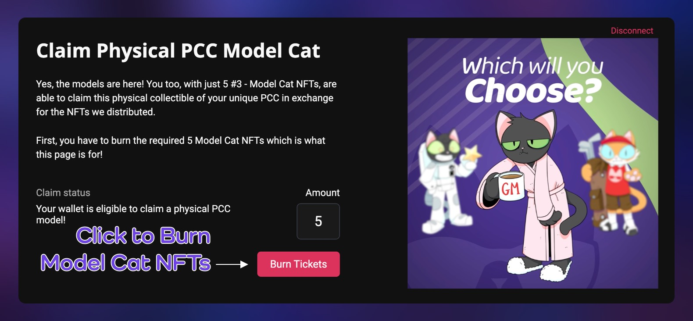
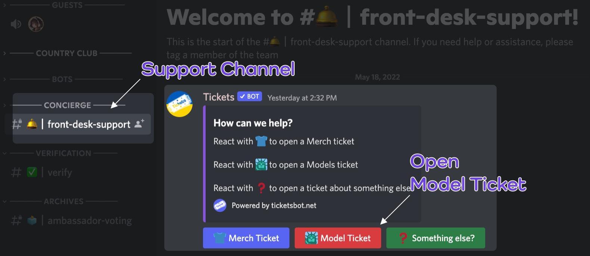
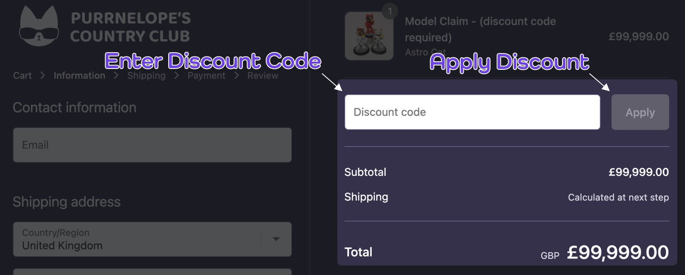

### Model Types

1. Astro Cat
1. GM Cat
1. Golf Cat

### Size

The Model Cat is about the same height as the GM Cup:

### Base

Astro Cat, GM Cat, Golf Cat Models have different floors on the base. You can choose to have your .pcc.eth name can be printed on the base.

Cat ID and traits and body type will also be printed at the bottom of the base.

## Claim with Model Cat NFT

Please read claim description on https://store.purrnelopescountryclub.com/products/model-2 carefully, the followings are simple demo for the claim.

### 1. Redeem for Merch Coupon

- 5 [Model Cat NFTs](../collections/kittyvault-purrks/3-model-cat.md) will be required to redeem 1 coupon for 1 Physical Cat Model.
- Burn your Model Cat NFTs for Merch Coupon: https://www.purrnelopescountryclub.com/claim/model

  

- After the redeem successful, go to `#front-desk-support` channel in PCC Discord and submit **Model Ticket** for Physical Cat Model merch Merch Coupon.
- Provide your redeem transaction the Cat #ID you would like to have for the model cat, and also .pcc.eth name if you would like in the Ticket Support.

  

### 2. Claim on Merch Store

- Claim on Merch Store: https://store.purrnelopescountryclub.com/products/model-2
- During checkout, enter the Discount Code and click **Apply** button, the subtotal will be changed to 0. And you can proceed the checkout.
- Communications and Claim support will be done with your Model Ticket submited in `#front-desk-support` channel in PCC Discord.

  

